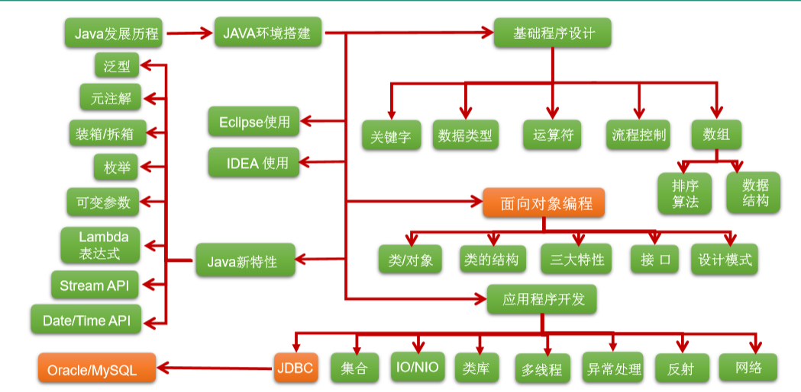
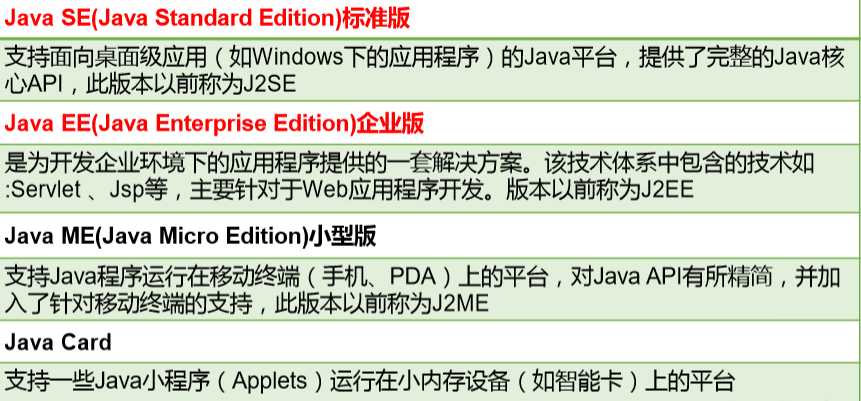
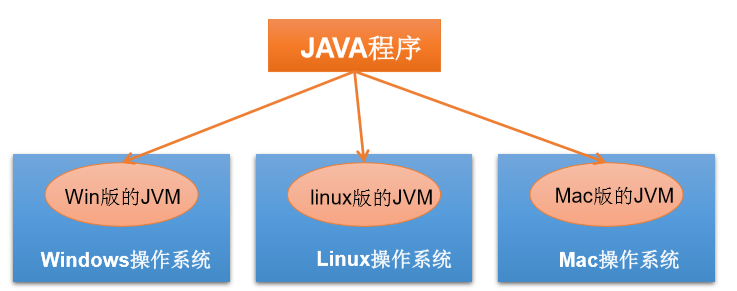
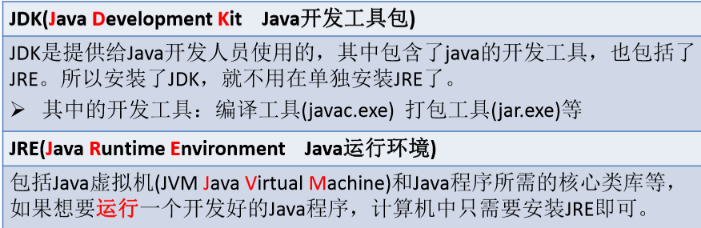
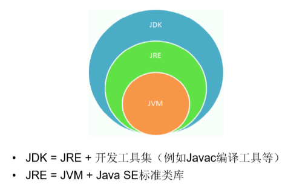
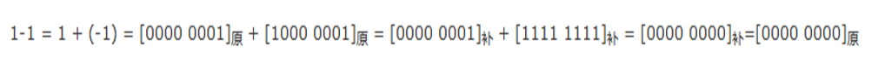

## 一、认识Java

### 1、概述
是SUN(Stanford University Network，斯坦福大学网络公司 ) 1995年推出的一 门高级编程语言。是一种面向Internet的编程语言。
### 
### 2、历史
1991年 Green项目，开发语言最初命名为Oak (橡树)
2004年，发布里程碑式版本：JDK 1.5，为突出此版本的重要性，更名为JDK 5.0
2005年，J2SE -\> JavaSE，J2EE -\> JavaEE，J2ME -\> JavaME
2009年，Oracle公司收购SUN，交易价格74亿美元
2014年，发布JDK 8.0，是继JDK 5.0以来变化最大的版本

### 3、技术体系

### 
### 4、和C语言关系
Java从C语言和C++语言继承了许多成份。
Java是一个纯粹的面向对象的程序设计语言，它继承了C++语言面向对象技术的核心。Java舍弃了C语言中容易引起错误的指针（以引用取代）、运算符重载（operator overloading）、多重继承（以接口取代）等特性，**增加了垃圾回收器功能用于回收不再被引用的对象所占据的内存空间**。JDK1.5又引入了泛型编程（Generic Programming）、类型安全的枚举、不定长参数和自动装/拆箱

### 5，语言特点
特点一：面向对象
特点二：健壮性
特点三：跨平台性 “Write once , Run Anywhere” 原理：只要在需要运行 java 应用程序的操作系统上，先安装一个Java虚拟机 (JVM Java Virtual Machine) 即可。

### 6、Java虚拟机 &垃圾收集机制
Java两种核心机制
-- Java虚拟机 (Java Virtal Machine)
-- 垃圾收集机制 (Garbage Collection)

（1）核心机制—Java虚拟机
JVM是一个虚拟的计算机，具有指令集并使用不同的存储区域。负责执行指 令，管理数据、内存、寄存器。
对于不同的平台，有不同的虚拟机。
只有某平台提供了对应的java虚拟机，java程序才可在此平台运行 lJava虚拟机机制屏蔽了底层运行平台的差别，实现了“一次编译，到处运行”
（2）不再使用的内存空间应回收—— 垃圾回收。
在C/C++等语言中，由程序员负责回收无用内存。Java 语言消除了程序员回收无用内存空间的责任：它提供一种系统级线程跟踪存储空 间的分配情况。并在JVM空闲时，检查并释放那些可被释放的存储空间。
垃圾回收在Java程序运行过程中自动进行，程序员无法精确控制和干预。
但是Java程序还会出现内存泄漏和内存溢出问题吗。

### 7、JDK&JRE

总结：使用JDK的开发工具完成的java程序，交给JRE去运行。

<table>
<colgroup>
<col style="width: 100%" />
</colgroup>
<thead>
<tr class="header">
<th>
JDK = JRE + 开发工具集（例如Javac编译工具等）

JRE = JVM + Java SE标准类库
</th>
</tr>
</thead>
<tbody>
</tbody>
</table>

### 8、工具
常用的Java开发工具
| [Jbuilder](http://edn.embarcadero.com/cn/jbuilder)   | <http://edn.embarcadero.com/cn/jbuilder>   |
|------------------------------------------------------|--------------------------------------------|
| [NetBeans](https://netbeans.org/features/index.html) | <https://netbeans.org/features/index.html> |
| [Eclipse](https://eclipse.org/)                      | <https://eclipse.org/>                     |

## 二、进制
1、概述
所有数字在计算机底层都以二进制形式存在。
2、分类
对于整数，有四种表示方式：
二进制(binary)：0,1 ，满2进1.以**0b或0B开头**。
十进制(decimal)：0-9 ，满10进1。
八进制(octal)：0-7 ，满8进1. **以数字0开头表示**。
十六进制(hex)：0-9及A-F，满16进1. **以0x或0X开头表示**。此处的A-F不区分大小写。 如：0x21AF +1= 0X21B0

Java整数常量默认是int类型，当用二进制定义整数时，其第32位是符号位； 当是long类型时，二进制默认占64位，第64位是符号位
二进制的整数有如下三种形式：
原码：直接将一个数值换成二进制数。最高位是符号位
负数的反码：是对原码按位取反，只是最高位（符号位）确定为1。
负数的补码：其反码加1。
计算机以二进制补码的形式保存所有的整数。
正数的原码、反码、补码都相同 Ø负数的补码是其反码+1

## 
## 三、注解
1、定义
用于注解说明解释程序的文字就是注释。
对于单行和多行注释，被注释的文字，**不会被JVM（java虚拟机）解释执行**。 编译以后生成的.class结尾的字节码文件中不包含注释掉的信息
2，三种分类
···qqq
<table>
<colgroup>
<col style="width: 100%" />
</colgroup>
<thead>
<tr class="header">
<th>
单行注释：//注释文字

多行注释：/* 注释文字 */ 多行注释里面不允许有多行注释嵌套

文档注释 (java特有)

/**

@author 指定java程序的作者

@version 指定源文件的版本

*/

// 注释内容可以被JDK提供的工具 javadoc 所解析，生成一套以网页文件形 式体现的该程序的说明文档。

// 操作方式

javadoc -d myHello -author -version HelloJava.java
</th>
</tr>
</thead>
<tbody>
</tbody>
</table>
## 
## 四、第一个Java程序
1、java程序编写-编译-运行的过程
编写：我们将编写的java代码保存在以"**.java**"结尾的源文件中
编译：使用javac.exe命令编译我们的java源文件。格式：**javac 源文件名.java**
运行：使用java.exe命令解释运行我们的字节码文件。 格式：**java 类名**

2、注意
在一个java源文件中可以声明多个class。但是，只能最多有一个类声明为public的。
而且要求声明为public的类的类名必须与源文件名相同。

3、程序的入口是main()方法。格式是固定的。

4、输出语句：
<table>
<colgroup>
<col style="width: 100%" />
</colgroup>
<thead>
<tr class="header">
<th>
System.out.println();//先输出数据，然后换行

System.out.print();//输出数据
</th>
</tr>
</thead>
<tbody>
</tbody>
</table>

5、每一行执行语句都以";"结束。

6、编译的过程：编译以后，会生成一个或多个字节码文件。字节码文件的文件名与java源文件中的类名相同。

