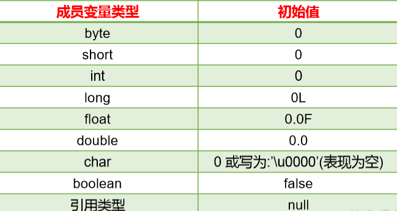
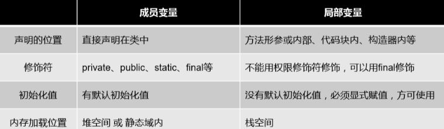
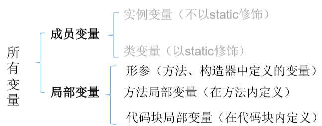

## 属性
### 一、属性
1、语法
| 修饰符 数据类型 属性名 = 初始化值 ; |
|-------------------------------------|
修饰符：常用的权限修饰符有：**private、缺省、protected、public**；其他修饰符：**static、final**
数据类型：任何**基本数据类型**和任何**引用数据类型**。
2、对象属性的默认初始化赋值

### 
### 二、成员变量与局部变量
1、区分
在**方法体外，类体内**声明的变量称为**成员变量**。
在**方法体内部**声明的变量称为**局部变量**。
不同点：

2、内存

