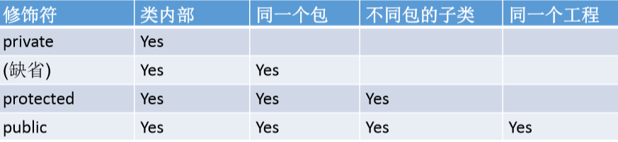
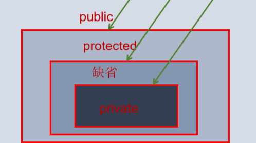
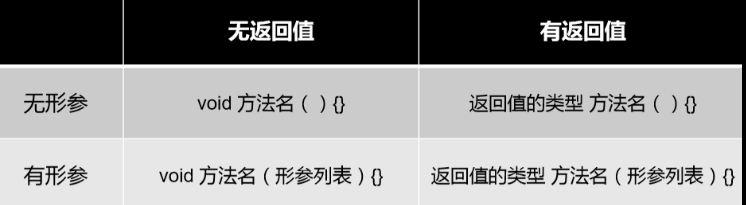
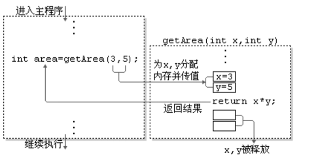
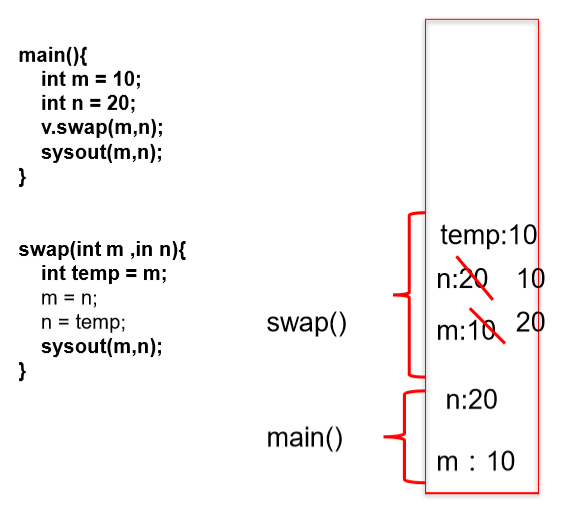
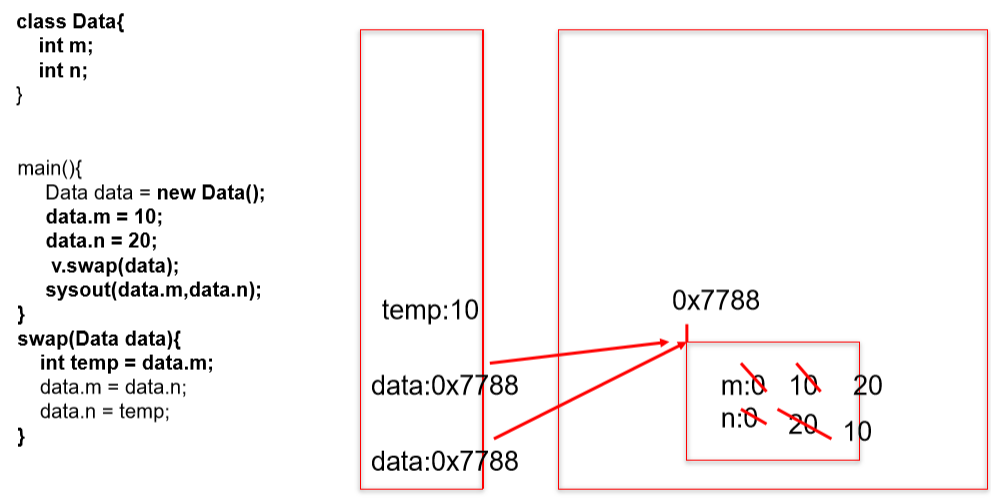

## 方法（函数）
### 一、方法
1、概述：方法是类或对象行为特征的抽象，用来完成某个功能操作。
目的：可以实现代码重用，简化代码
Java里所有的方法必须定义在类里。
<table>
<colgroup>
<col style="width: 100%" />
</colgroup>
<thead>
<tr class="header">
<th>
public class Person{

private int age;

public int getAge() { //声明方法getAge()

return age;

}

public void setAge(int i) {

//声明方法

setAge age = i;

//将参数i的值赋给类的成员变量age

}

}
</th>
</tr>
</thead>
<tbody>
</tbody>
</table>

### 二、格式
<table>
<colgroup>
<col style="width: 100%" />
</colgroup>
<thead>
<tr class="header">
<th>
修饰符 返回值类型 方法名（参数类型 形参1, 参数类型 形参2, ….）｛

方法体程序代码

return 返回值

}
</th>
</tr>
</thead>
<tbody>
</tbody>
</table>
<table>
<colgroup>
<col style="width: 100%" />
</colgroup>
<thead>
<tr class="header">
<th>
public void eat(){}

public void sleep(int hour){}

public String getName(){}

public String getNation(String nation){}
</th>
</tr>
</thead>
<tbody>
</tbody>
</table>
#### *1、修饰符*
Java权限修饰符public、protected、(缺省)、private置于类的成员定义前， 用来限定对象对该类成员的访问权限。

#### *2、返回值类型*

有返回值 vs 没有返回值
如果方法有返回值，则必须在**方法声明时，指定返回值的类型**。同时，方法中，需要使用**return关键字来返回指定类型的变量或量**：“return 数据”。
如果方法没有返回值，则方法声明时，**使用void来表示**。通常，没有返回值的方法中，就不需要return，如果使用的话，只能“**return;**”表示结束此方法的意思。
<table>
<colgroup>
<col style="width: 100%" />
</colgroup>
<thead>
<tr class="header">
<th>
return关键字的使用：

1.使用范围：使用在方法体中

2.作用：① 结束方法

<blockquote>

② 针对于有返回值类型的方法，使用"return 数据"方法返回所要的数据。

</blockquote>

3.注意点：return关键字后面不可以声明执行语句。
</th>
</tr>
</thead>
<tbody>
</tbody>
</table>
#### *3、方法名*
遵循标识符的规则和规范
#### *4、参数列表*
形参列表： 方法可以声明0个，1个，或多个形参。
#### *5、调用*
方法通过方法名被调用，且只有被调用才会执行

## 三、方法的重载(overload）
1、概念
在同一个类中，允许存在一个以上的同名方法，只要它们的参数个数或者参数类型不同即可。
2、特点
与返回值类型无关，**只看参数列表，且参数列表必须不同**。调用时，根据方法参数列表的不同来区别。
3、案例
<table>
<colgroup>
<col style="width: 100%" />
</colgroup>
<thead>
<tr class="header">
<th>
public class OverloadExer {

//定义三个重载方法max()

public int max(int i,int j){

return (i &gt; j)? i : j;

}

public double max(double d1,double d2){

return (d1 &gt; d2)? d1 : d2;

}

public double max(double d1,double d2,double d3){

double max = (d1 &gt; d2)? d1 : d2;

return (max &gt; d3)? max : d3;

}

}

</th>
</tr>
</thead>
<tbody>
</tbody>
</table>
### 四、可变形参
1、JavaSE 5.0 中提供了Varargs(variable number of arguments)机制，允许直接定 义能和多个实参相匹配的形参。
<table>
<colgroup>
<col style="width: 100%" />
</colgroup>
<thead>
<tr class="header">
<th>
//JDK 5.0以前：采用数组形参来定义方法，传入多个同一类型变量

public static void test(int a ,String[] books);

//JDK5.0：采用可变个数形参来定义方法，传入多个同一类型变量

public static void test(int a ,String…books);
</th>
</tr>
</thead>
<tbody>
</tbody>
</table>
2、说明：
声明格式：**方法名(参数的类型名 ...参数名)**
可变参数：方法参数部分指定类型的参数个数是可变多个：0个，1个或多个 3. 可变个数形参的方法与同名的方法之间，彼此构成重载
3、注意
可变参数方法的使用与方法参数部分使用数组是一致的
方法的参数部分有可变形参，**需要放在形参声明的最后**
在一个方法的形参位置，**最多只能声明一个**可变个数形参
<table>
<colgroup>
<col style="width: 100%" />
</colgroup>
<thead>
<tr class="header">
<th>
public void show(String ... strs){

System.out.println("show(String ... strs)");

for(int i = 0;i &lt; strs.length;i++){

System.out.println(strs[i]);

}

}

</th>
</tr>
</thead>
<tbody>
</tbody>
</table>
### 五、方法参数的值传递
1、
形参：方法声明时的参数
实参：方法调用时实际传给形参的参数值
2、值传递
Java里方法的参数传递方式只有一种：值传递。 即将实际参数值的副本 （复制品）传入方法内，而参数本身不受影响。
<table>
<colgroup>
<col style="width: 100%" />
</colgroup>
<thead>
<tr class="header">
<th>
如果变量是<strong>基本数据类型</strong>，此时赋值的是变量所保存的<strong>数据值</strong>。

如果变量是<strong>引用数据类型</strong>，此时赋值的是变量所保存的数据的<strong>地址值</strong>。
</th>
</tr>
</thead>
<tbody>
</tbody>
</table>

<table>
<colgroup>
<col style="width: 100%" />
</colgroup>
<thead>
<tr class="header">
<th>
public static void main(String[] args) {

int x = 5;

System.out.println("修改之前x = " + x);// 5

// x是实参

change(x);

System.out.println("修改之后x = " + x);// 5

}

public static void change(int x) {

 x = 3;

}
</th>
</tr>
</thead>
<tbody>
</tbody>
</table>

<table>
<colgroup>
<col style="width: 100%" />
</colgroup>
<thead>
<tr class="header">
<th>
public static void main(String[] args) {

Person obj = new Person();

obj.age = 5;

System.out.println("修改之前age = " + obj.age);// 5

// x是实参

change(obj);

System.out.println("修改之后age = " + obj.age);// 3

}

public static void change(Person obj) {

System.out.println("change:修改之前age = " + obj.age);

obj.age = 3;

System.out.println("change:修改之后age = " + obj.age);

}

//其中Person类定义为：

class Person{

int age;

}
</th>
</tr>
</thead>
<tbody>
</tbody>
</table>

### 六、递归
递归方法：一个方法体内调用它自身。
方法递归包含了一种隐式的循环，它会重复执行某段代码，但这种重复执 行无须循环控制。
**递归一定设计结束条件**
<table>
<colgroup>
<col style="width: 100%" />
</colgroup>
<thead>
<tr class="header">
<th>
public class RecursionTest {

public static void main(String[] args) {

}

// 例1：计算1-n之间所有自然数的和

public int getSum(int n) {// 3

if (n == 1) {

return 1;

} else {

return n + getSum(n - 1);

}

}

// 例2：计算1-n之间所有自然数的乘积:n!

public int getSum1(int n) {

if (n == 1) {

return 1;

} else {

return n * getSum1(n - 1);

}

}

//例3：已知有一个数列：f(0) = 1,f(1) = 4,f(n+2)=2*f(n+1) + f(n),

//其中n是大于0的整数，求f(10)的值。

public int f(int n){

if(n == 0){

return 1;

}else if(n == 1){

return 4;

}else{

return 2*f(n - 1) + f(n - 2);

}

}

//例4：斐波那契数列

//例5：汉诺塔问题

}
</th>
</tr>
</thead>
<tbody>
</tbody>
</table>
