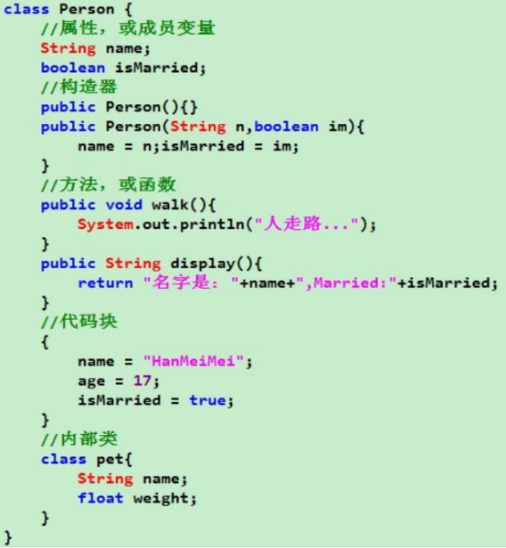
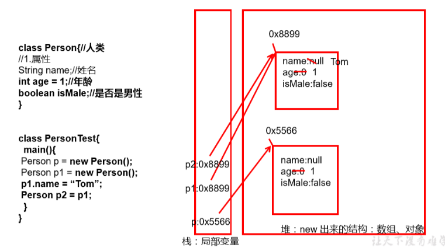
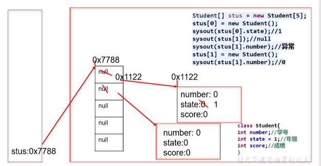

## 一、类和对象
类(Class)和对象(Object)是面向对象的核心概念。
类是对一类事物的描述，是抽象的、概念上的定义。
对象是实际存在的该类事物的每个个体，也称为实例(instance)。

## 二、Java类及类的成员
### 1、类
类的格式
<table>
<colgroup>
<col style="width: 100%" />
</colgroup>
<thead>
<tr class="header">
<th>
修饰符 class 类名 {

属性声明;

方法声明;

}
</th>
</tr>
</thead>
<tbody>
</tbody>
</table>
创建Java自定义类
(1)定义类（考虑修饰符、类名）
(2)编写类的属性（考虑修饰符、属性类型、属性名、初始化值）
(3)编写类的方法（考虑修饰符、返回值类型、方法名、形参等）
### 2、类的成员
**属性 = 成员变量** = field = 域、字段
**方法 = 成员方法** = 函数 = method
创建类的对象 = 类的实例化 = 实例化类

## 三、对象的创建和使用
### 1、创建和使用
| 类名 对象名 = new 类名(); |
|---------------------------|
使用“**对象名.对象成员**”的方式访问对象成员（包括属性和方法）
<table>
<colgroup>
<col style="width: 100%" />
</colgroup>
<thead>
<tr class="header">
<th>
public class PersonTest {

public static void main(String[] args) {

//创建Person类的对象

Person p1 = new Person();

//调用对象的结构：属性、方法

//调用属性：“对象.属性”

p1.name = "Tom";

p1.isMale = true;

System.out.println(p1.name);//Tom

//调用方法：“对象.方法”

p1.eat();//人可以吃饭

p1.sleep();//人可以睡觉

p1.talk("Chinese");//人可以说话,使用的是：Chinese

}

}

class Person{

String name;

int age = 1;

boolean isMale;

public void eat(){

System.out.println("人可以吃饭");

}

public void sleep(){

System.out.println("人可以睡觉");

}

public void talk(String language){

System.out.println("人可以说话,使用的是：" + language);

}

}
</th>
</tr>
</thead>
<tbody>
</tbody>
</table>

**一个Java文件只能有一个public修饰的class**
对于class的权限修饰**只可以用public和default(缺省)**： public类可以在任意地方被访问；default类只可以被**同一个包内部的类**访问。
### 2、访问机制
在一个类中的访问机制：类中的方法可以直接访问类中的成员变量。 （**例外：static方法访问非static，编译不通过**。）
在不同类中的访问机制：先创建要访问类的对象，再用对象访问类中定义的成员。**先创建，再访问。**

### 3、内存

### 
## 四、匿名对象
1、定义
**直接调用这个对象的方法**。这 样的对象叫做匿名对象
2、使用情况
如果对一个对象只需要进行一次方法调用，那么就可以使用匿名对象。
我们经常将匿名对象作为实参传递给一个方法调用。
<table>
<colgroup>
<col style="width: 100%" />
</colgroup>
<thead>
<tr class="header">
<th>
public class InstanceTest {

public static void main(String[] args) {

//匿名对象

//new Phone().sendEmail();

new Phone().price = 1999;

new Phone().showPrice();//0.0

PhoneMall mall = new PhoneMall();

//mall.show(p);

//匿名对象的使用

mall.show(new Phone());

}

}

class PhoneMall{

public void show(Phone phone){

phone.sendEmail();

phone.playGame();

}

}

class Phone{

double price;

public void sendEmail(){

System.out.println("发送邮件");

}

public void playGame(){

System.out.println("玩游戏");

}

public void showPrice(){

System.out.println("手机价格为：" + price);

}

}
</th>
</tr>
</thead>
<tbody>
</tbody>
</table>

