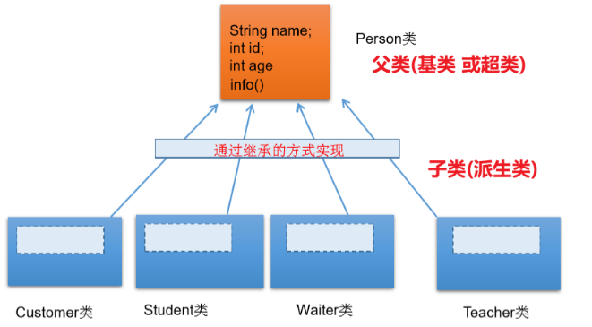

## 继承性inheritance
### 一、继承inheritance
1、多个类中存在相同属性和行为时，将这些内容抽取到单独一个类中， 那么多个类无需再定义这些属性和行为，只要继承那个类即可。
在Java 中，继承的关键字用的是“extends”，即**子类是对父类的“扩展”**。

2、类继承语法规则:
| class A extends B{} |
|---------------------|
A:子类、派生类、subclass
B:父类、超类、基类、superclass
体现：一旦子类A继承父类B以后，子类A中就获取了父类B中声明的所有的属性和方法。
特别的，**父类中声明为private的属性或方法**，子类继承父类以后，仍然认为获取了父类中私有的结构，**子类无法获取**
子类继承父类以后，还可以声明自己特有的属性或方法：实现功能的拓展。

3、作用：
① 减少了代码的冗余，提高了代码的复用性
② 便于功能的扩展
③ 为之后多态性的使用，提供了前提

4、注意
Java只支持单继承和多层继承，不允许多重继承
一个子类只能有一个父类
一个父类可以派生出多个子类

5、
如果我们没有显式的声明一个类的父类的话，则此类继承于java.lang.Object类
**所有的java类**（除java.lang.Object类之外）都**直接或间接的继承于java.lang.Object**类
|    |
|-----|
