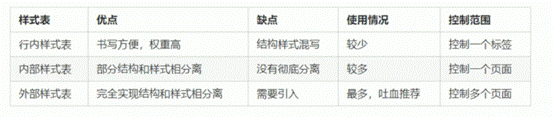

CSS基本知识
2020年6月4日
9:17
# CSS基本知识
## 一、CSS--美化网页
### 1.HTML局限性
只关注内容语义
### 2.CSS
层叠样式表、标记语言，设置文本内容，图像外形，版面布局
使结构样式分离
### 3.CSS组成
<table>
<colgroup>
<col style="width: 100%" />
</colgroup>
<thead>
<tr class="header">
<th>
&lt;!DOCTYPE html&gt;

&lt;html lang="en"&gt;

&lt;head&gt;

&lt;meta charset="UTF-8"&gt;

&lt;meta name="viewport" content="width=device-width, initial-scale=1.0"&gt;

&lt;title&gt;Document&lt;/title&gt;

&lt;style&gt;

p {

color: red;

font-size: 12px;

}

&lt;/style&gt;

&lt;/head&gt;

&lt;body&gt;

&lt;p&gt;认识css&lt;/p&gt;

&lt;/body&gt;

&lt;/html&gt;
</th>
</tr>
</thead>
<tbody>
</tbody>
</table>

a.规则主要由两个主要部分构成：选择器以及一条或多条声明

==b.写在\<head\>\</head\>里的\<style\>\</style\>中。（结构样式相分离）==
c.**选择器{样式}**
**给谁改样式{改什么样式；}**
d\.
属性和属性值以键值对形式出现
属性是对指定的对象设置的样式属性
属性和属性值用==：==分开
多个键值对用==；==分开
### 4．代码风格
A,样式格式
1，紧凑型
2，展开型（佳）
B,样式大小写
用小写佳
C,空格风范
冒号后边保留一个空格

选择器和 { 保留一个空格
写完后用ctrl+s保存，也格式化了代码
## 二、Emmet语法
### 1、快速生成HTML结构语法
生成标签，直接输入标签名，按tab键即可
如果想要生成多个标签，加上 ==\*== 即可。Eg. div\*3
父子级关系用==\>==即可。Eg，ul\>li
兄弟关系，用==+== ，eg：div+p
生成带有类名，直接写.demo
或者id名字，#demo tab键就可以
生成的div类名有顺序，用自增符号&
.demo&\*5
标签内容写在{}里
### 2、快速生成CSS样式语法
简写快速生成
### 3、快速格式化代码
==ctrl+s==
## 三、CSS三种引入方式
# 1．行内样式表（行内式引入）【\[网络\]Inline Style Sheet】
直接修改
\
\<div\>
双引号
控制当前
## 2、内部样式表（嵌入式）【internal style sheet】
把代码放在\<sytle\>\</style\>中
放在html里面即可，一般放在\<head\>里
但是没有完全分离
## 3、外部样式表（佳）
单独写到CSS文件中，之后再引入HTML中
1，新建后缀名.css文件
直接写样式，没有表情
2，在HTML页面中，使用\<link\>标签引入文件
在head里
\<link rel=”stylesheet” href=”css文件路径\>

