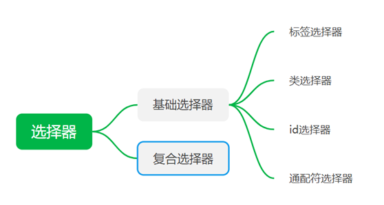
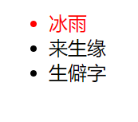
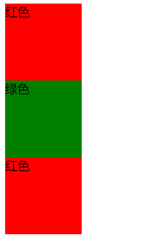

# CSS基础选择器

## 一、基础选择器
**基础选择器—单个选择器构成**
### 1.、标签选择器
把HTML标签名作为选择器，制定统一格式

标签名 {

属性1 ：属性值1；

属性2 ： 属性值2；

……

}

快速把页面里同类型一起设置，但是不能分别改同类中的某个地方
### 2.类选择器
利用class属性来调用

差异化设置

. 类名{

属性1： 属性值1；

属性2： 属性值2;

......

}

口诀：样式点定义，结构类调用，一个或多个，开发最常用

案例：

<table>
<colgroup>
<col style="width: 100%" />
</colgroup>
<thead>
<tr class="header">
<th>
&lt;head&gt;

...

&lt;style&gt;

.red {

color: red;

}

&lt;/style&gt;

&lt;/head&gt;

&lt;body&gt;

&lt;ul&gt;

&lt;li class="red"&gt;冰雨&lt;/li&gt;

&lt;li&gt;来生缘&lt;/li&gt;

&lt;li&gt;生僻字&lt;/li&gt;

&lt;/ul&gt;

&lt;/body&gt;

</th>
</tr>
</thead>
<tbody>
</tbody>
</table>
注意
1.  类名自己定义，标签名字不能做类名
2.  长名字用-连接
3.  不要用纯数字、中文命名，尽量英文
4.  命名规范

案例

<table>
<colgroup>
<col style="width: 100%" />
</colgroup>
<thead>
<tr class="header">
<th>
&lt;head&gt;

......

&lt;style&gt;

.box {

width: 100px;

height: 100px;

}

.red {

background-color: red;

}

.green {

background-color: green;

}

&lt;/style&gt;

&lt;/head&gt;

&lt;body&gt;

&lt;div class="red box"&gt;红色&lt;/div&gt;

&lt;div class="green box"&gt;绿色&lt;/div&gt;

&lt;div class="red box"&gt;红色&lt;/div&gt;

&lt;/body&gt;
</th>
</tr>
</thead>
<tbody>
</tbody>
</table>
多类名：达到更多选择的目的：一个标签多个类名，多个类名必须用空格分开
### 3.id选择器
可以为标有特定id的HTML元素指定特定样式

HTML元素以id属性来设置id选择器,CSS中 id 选择器以”#”来定义

语法
<table>
<colgroup>
<col style="width: 100%" />
</colgroup>
<thead>
<tr class="header">
<th>
#id {

属性1： 属性值1；

…

}
</th>
</tr>
</thead>
<tbody>
</tbody>
</table>

==样式#定义，结构id调用,只能调用一次，别人切勿使用==

用于页面上为一线元素

与类选择器区别：**类选择器多次使用，id选择器一次使用**

案例

<table>
<colgroup>
<col style="width: 100%" />
</colgroup>
<thead>
<tr class="header">
<th>
&lt;head&gt;

...

&lt;style&gt;

#yes {

color: pink;

}

&lt;/style&gt;

&lt;/head&gt;

&lt;body&gt;

&lt;div id="yes"&gt;我帅气&lt;/div&gt;

&lt;/body&gt;
</th>
</tr>
</thead>
<tbody>
</tbody>
</table>
### 4、通配符选择器
使用“\*”定义，选取页面里所有元素，不需要调用，自动给所有

格式
<table>
<colgroup>
<col style="width: 100%" />
</colgroup>
<thead>
<tr class="header">
<th>
*{

操作；

}
</th>
</tr>
</thead>
<tbody>
</tbody>
</table>
## 5、总结
| 基础选择器   | 作用                   | 特点                               | 使用情况     | 用法                 |
|--------------|------------------------|------------------------------------|--------------|----------------------|
| 标签选择器   | 可以选出所有相同的标签 | 不能差异化选择                     | 较多         | p { color: red; }    |
| 类选择器     | 可以选出一个或多个标签 | 可以根据需求选择                   | 非常多       | .nav { color: red; } |
| id选择器     | 一次只能选择1个标签    | ID属性只能在每个HTML文档中出现一次 | 一般和js搭配 | \#nav { color: red;} |
| 通配符选择器 | 选择所有的标签         | 选择的太多，有部分不需要           | 特殊情况使用 | \*{ color: red;}     |
