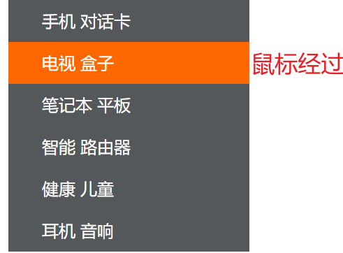

# CSS的元素显示模式
## 一、元素显示模式
更好布局网页，元素以什么样方式进行显示
两类：HTML分块元素和行内元素
### 1、块元素
A.常见：\<h1\>-\<h6\>、 \<p\>、\<div\>、\<ul\>、\<ol\>、\<li\>、\<div\>
B.特点
==比较霸道，自己独占一行==
高度宽度内外边距都可以设置
宽度默认是容器的百分之百
是一个容器盒子，里面可以放行内元素或者块元素
C.注意
文字类元素不能使用块元素
**\<p\>主要用于存放文字，\<p\>里面不能放块元素，特别不能\<div\>**
同理\<h1-h6\>等都是文字类块元素标签，里面也不能放其他块元素
### 2.行内元素（内联元素）
A.常见\<a\> \<strong\> \<b\> \<em\> \<i\> \<del\> \<s\> \<ins\> \<u\> **\<span\>**
B.特点：
==相邻的元素一行，一行可以放多个==
==高宽设置无效==
==默认宽度是内容宽度==
行内元素只能放文本或其他行内元素
C.注意
链接里面不能放链接
特殊情况\<a\>里面可以放块级元素，但是给\<a\>转换一下块级模式更安全
### 3.行内块元素
==同时具有块元素和行内元素的特点==
常见\ \<input/\>\<td\>
特点
和相邻的行内元素在一行上，**但是之间有空白缝隙**，一行可以显示多个（行内元素特点）
默认宽度是他本身内容宽度（行内元素特点）
行高高度内外边距可控（块级元素特点）
### 4 显示模式的转换
特殊情况下，需要元素模式转换（一个元素需要另外一种模式的特性）
转换为块元素： ==display:block;(常用)==
转换行内元素： ==display:inline;==
转换行内块元素： ==display:inline-block;（常用）==

### 5.单行文字垂直居中
让文字的行高等于盒子的高度
line-height=height
行高小于盒子高度，文字上，反之下
**二、总结**
**1，小米搜索栏**

<table>
<colgroup>
<col style="width: 100%" />
</colgroup>
<thead>
<tr class="header">
<th>
&lt;!DOCTYPE html&gt;

&lt;html lang="en"&gt;

&lt;head&gt;

…

&lt;style&gt;

a {

display: block;

width: 230px;

height: 40px;

background-color: #55585a;

text-decoration: none;

font-style: 14px;

color: #fff;

line-height: 40px;

text-indent: 2em;

}

a:hover {

background-color: #ff6700;

}

&lt;/style&gt;

&lt;/head&gt;

&lt;body&gt;

&lt;a href="#"&gt;手机 对话卡&lt;/a&gt;

&lt;a href="#"&gt;电视 盒子&lt;/a&gt;

&lt;a href="#"&gt;笔记本 平板&lt;/a&gt;

&lt;a href="#"&gt;智能 路由器&lt;/a&gt;

&lt;a href="#"&gt;健康 儿童&lt;/a&gt;

&lt;a href="#"&gt;耳机 音响&lt;/a&gt;

&lt;/body&gt;

&lt;/html&gt;
</th>
</tr>
</thead>
<tbody>
</tbody>
</table>
**2，总结**
| 元素模式   | 元素排列               | 设置样式           | 默认宽度 | 包含                     |
|------------|------------------------|--------------------|----------|--------------------------|
| 块级元素   | 一行只能放一个块级元素 | 可以设置高度宽度   | 容器100% | 任何                     |
| 行内元素   | 一行能放多个块级元素   | 不可以设置高度宽度 | 本身内容 | 容纳文本或者其他行内元素 |
| 行内块元素 | 一行能放多个行内块元素 | 可以设置高度宽度   | 本身内容 |                         |
