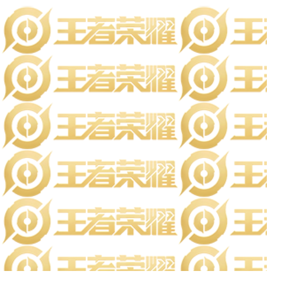
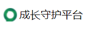

# CSS的背景
<table>
<colgroup>
<col style="width: 8%" />
<col style="width: 47%" />
<col style="width: 44%" />
</colgroup>
<thead>
<tr class="header">
<th>背景颜色</th>
<th>Background-color: color||transparent</th>
<th>
半透明

Background: rgba(0,0,0,x);
</th>
</tr>
</thead>
<tbody>
<tr class="odd">
<td>背景图片</td>
<td>background-iamge : none| url (url)</td>
<td></td>
</tr>
<tr class="even">
<td>背景平铺</td>
<td>background-repeat: no-repeat | repeat | repeat-x | repeat-y</td>
<td></td>
</tr>
<tr class="odd">
<td>背景位置</td>
<td>background-position：方位名词||x,y</td>
<td>
指定两个都是方位名词，顺序没关系

只指定一个，另一个默认居中

参数是精确单位x y，严格xy顺序

如果只指定一个数值，那该数值一定是x坐标，另一个是默认垂直居中
</td>
</tr>
<tr class="even">
<td>背景固定</td>
<td>background-attachment: scroll | fixed</td>
<td></td>
</tr>
</tbody>
</table>

便于控制位置，应用于小logo
## 一、背景颜色
### 1、background-color
<table>
<colgroup>
<col style="width: 100%" />
</colgroup>
<thead>
<tr class="header">
<th>
transparent透明（默认）

color
</th>
</tr>
</thead>
<tbody>
</tbody>
</table>
### 2.背景颜色半透明
| Background: rgba(0,0,0,x); |
|----------------------------|
一般,background: rgba(0,0,0,0.3); 最后一个是alpha透明度，取值在0-1之间
## 二、背景图片
| background-iamge : none\| url (url) |
|-------------------------------------|
Log装饰性图片,便于控制位置

| none | 无背景图片                       |
|------|----------------------------------|
| url  | 使用绝对或者相对地址指定背景图片 |

<table>
<colgroup>
<col style="width: 100%" />
</colgroup>
<thead>
<tr class="header">
<th>
&lt;head&gt;

…

&lt;title&gt;背景图片&lt;/title&gt;

&lt;style&gt;

div {

width: 300px;

height: 300px;

/* 不要落下 url() */

background-image: url(images/logo.png);

}

&lt;/style&gt;

&lt;/head&gt;

&lt;body&gt;

&lt;div&gt;&lt;/div&gt;

&lt;/body&gt;
</th>
</tr>
</thead>
<tbody>
</tbody>
</table>
## 三、背景平铺
| background-repeat: no-repeat \| repeat \| repeat-x \| repeat-y |
|----------------------------------------------------------------|

| 参数值    | 作用           |
|-----------|----------------|
| repeat    | 纵向，横向平铺 |
| no-repeat | 不平铺         |
| repeat-x  | 横向平铺       |
| repeat-y  | 纵向平铺       |
## 四、背景图片位置
| background-position: x y; |
|---------------------------|
x,y是坐标，

可以精确单位或方位名词
| 参数值   | 说明                                                   |
|----------|--------------------------------------------------------|
| length   | 百分数 \| 由浮点数字和单位标识符组成的长度值           |
| position | top \| center \|bottom \|left \|center \|right方位名词 |

### 1.方位名词
指定两个都是方位名词，顺序没关系
只指定一个，另一个默认居中
<table>
<colgroup>
<col style="width: 100%" />
</colgroup>
<thead>
<tr class="header">
<th>
background-position:top;

background-position:centerright;
</th>
</tr>
</thead>
<tbody>
</tbody>
</table>
案例

<table>
<colgroup>
<col style="width: 100%" />
</colgroup>
<thead>
<tr class="header">
<th>
&lt;head&gt;

...

&lt;title&gt;背景位置方位名词应用一&lt;/title&gt;

&lt;style&gt;

h3 {

width: 118px;

height: 40px;

/* background-color: pink; */

font-size: 14px;

font-weight: 400;

line-height: 40px;

background-image: url(images/icon.png);

background-repeat: no-repeat;

background-position: left center;

text-indent: 1.5em;

}

&lt;/style&gt;

&lt;/head&gt;

&lt;body&gt;

&lt;h3&gt;

成长守护平台

&lt;/h3&gt;

&lt;/body&gt;
</th>
</tr>
</thead>
<tbody>
</tbody>
</table>
### 2.精确参数
A.参数是精确单位x y，严格xy顺序
如果只指定一个数值，那该数值一定是x坐标，另一个是默认垂直居中
### 3混合单位，注意顺序x y
### 4.超大背景图片
<table>
<colgroup>
<col style="width: 100%" />
</colgroup>
<thead>
<tr class="header">
<th>
&lt;style&gt;

body {

background-image: url(images/bg.jpg);

background-repeat: no-repeat;

background-position: center 40px;

}

&lt;/style&gt;
</th>
</tr>
</thead>
<tbody>
</tbody>
</table>
## 五、背景图像固定
**1.背景图像固定（背景附着）**
| background-attachment: scroll \| fixed |
|----------------------------------------|
| scroll | 滚动 |
|--------|------|
| fixed  | 固定 |
## 六、背景属性固定写法
无顺序固定，有约定俗成的写法
background：颜色 图片地址 平铺 滚动 位置

