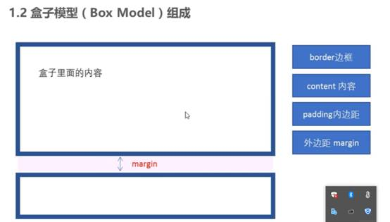
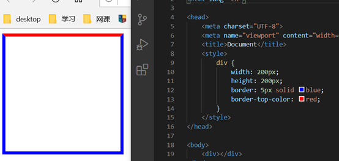
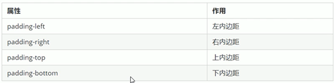
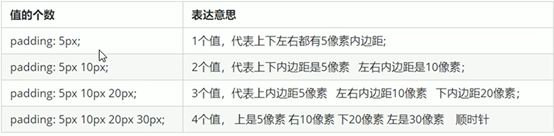
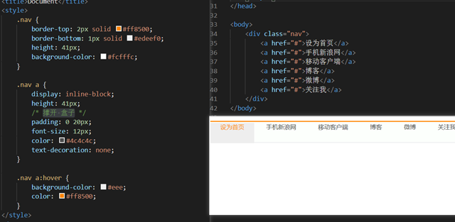
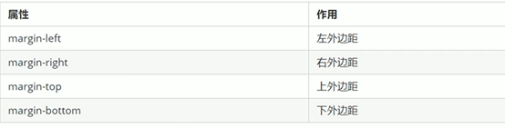
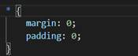
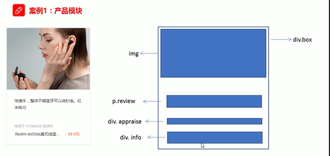

**CSS盒子模型学习**

**一、盒子模型**
1.  看透网页布局本质
布局过程：

1先准备好相关的页面元素，网页元素基本都是box

2利用CSS设置好的盒子样式，然后摆放到相应的位置

3往盒子里面装东西

本质：利用CSS盒子装东西

**二、盒子模型**

盒子模型组成

**A边框border**

三种粗细、样式、颜色
| border: border-width\|\|border-stytle\|\|border-color |
|-------------------------------------------------------|
**1.粗细border-width**

单位px

**2.样式border-stytle**

solid实线边框

dashed虚线

dotted点线

**3.颜色border-color**

**4复合简写 ==粗细 样式 颜色==**

Border: 1px solid red

**5边框分开写法**

border-top

border-bottom

border-left/right

**6表格的细线边框border-collapse: collapse;**

把相邻的边框合并到一起
1.  边框会影响盒子的实际大小
两种方案

测量盒子大小的时候不要量边框

Weight和height减去边框长度

B内边距padding

用于设置内边距，边框与内容之间的距离

**B．内边距padding**

设置边框和内容距离

内边距简写

padding会影响盒子实际大小

weight、height减去padding的数值

==padding不会撑开盒子的情况,没有指定宽度或者高度属性==

**C外边距margin**

控制盒子与盒子的距离

Margin简写和padding一样、

外边距典型应用-块元素水平居中

必须满足：指定宽度，左右外边距为auto

常见写法
<table>
<colgroup>
<col style="width: 100%" />
</colgroup>
<thead>
<tr class="header">
<th>
Margin： 0 auto

Margin: auto
</th>
</tr>
</thead>
<tbody>
</tbody>
</table>

==以上是让块元素水平居中的方法==

行内元素或者行内块级元素水平居中给其父元素添加text-align:center 即可

嵌套块元素垂直边距的塌陷

对于两个嵌套关系（父子关系）的块元素，父元素有上边距的同时子元素也有上边距，此时父元素会塌陷比较大的外边距值

解决方案

为父元素定义上边框

可以为父类元素指定内边距

==为父类元素添加overflow:hidden==

清除内外边距

很多浏览器都带有默认的内外边距，而且不同的浏览器默认的不一致，因此布局前，首先要清除下网页元素的内外边距

也是CSS第一行代码

行内元素为了照顾兼容性，尽量只设置左右内外边距，不要设置上下内外边距。但是转化为块级和行内块元素就可以

案例

