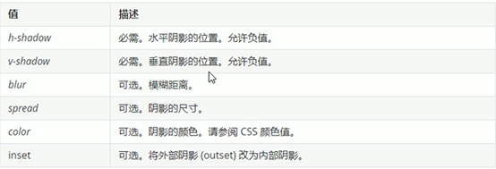
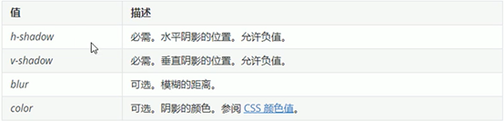
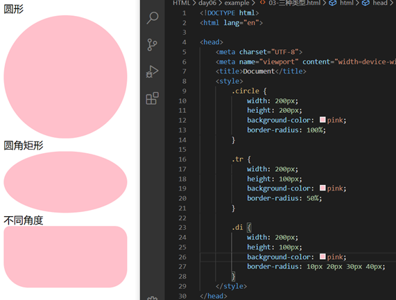
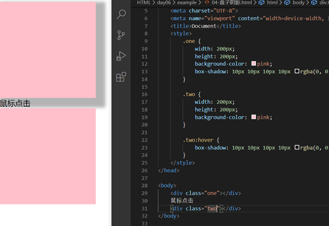

<table>
<colgroup>
<col style="width: 10%" />
<col style="width: 20%" />
<col style="width: 68%" />
</colgroup>
<thead>
<tr class="header">
<th>盒子变成圆角</th>
<th>

border-radius: length;
</th>
<th>

变成圆形=正方形+50%

圆角矩形设为高度的一半

设置不同圆角border-radius：四个数值
</th>
</tr>
</thead>
<tbody>
<tr class="odd">
<td>盒子阴影</td>
<td>box-shadow: h-shadow v-shadow blur spread color inset;</td>
<td>

</td>
</tr>
<tr class="even">
<td>文字阴影</td>
<td>text-shadow</td>
<td></td>
</tr>
</tbody>
</table>

**盒子变成圆角==border-radius: length;==**
参数值可以数字或者百分比
**1变成圆形**
步骤：1.做一个正方形
2．把border-radius设置成圆形的一半，50%
**2圆角矩形**
border-radius设为高度的一半
**3设置不同圆角**
==border-radius：四个数值==
==左上开始，顺时针==
或者border-top-left-radius

**盒子阴影box-shadow**
box-shadow: h-shadow v-shadow blur spread color inset;

一般外阴影默认
盒子不占用空间，不会影响其他盒子的排列
阴影尺寸大小=阴影大小
大多数阴影颜色rgba(0,0,0,0.3)

**文字阴影==text-shadow==**

