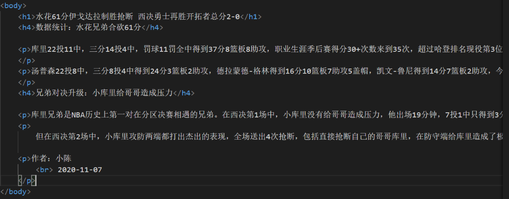
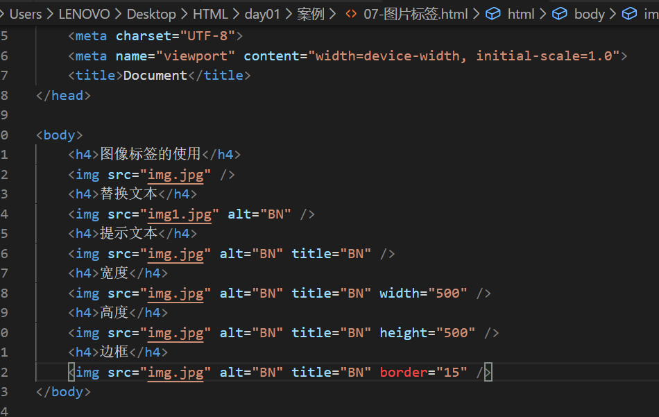
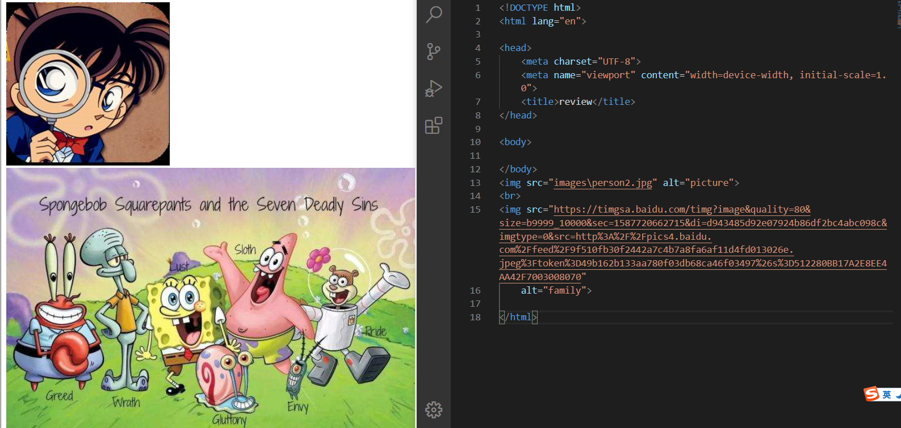

常用标签
2020年5月23日
9:44
# 常用标签
## 一、HTML常用标签
**在body内加**
### 1）标题标签 \<h1\>-\<h6\>
### 2）段落标签 \<p\>\</p\>
在body中分段和空格无效，要标签
### 3）换行标签 \<br/\>

单标签，与段落不同

案例：体育新闻

### 4）文本格式化标签
#### a)加粗 \<strong\>\</strong\>
\<strong\>\</strong\>或者\<b\>\</b\>
#### b)倾斜 \<em\>\</em\>
\<em\>\</em\>或者\<i\>\</i\>
#### c)删除线 \<del\>\</del\>
\<del\>\</del\>或者\<s\>\</s\>
#### *d)下划线 \<ins\>*
\<ins\>\</ins\>或者\<u\>\</u\>

案例

我是**加粗**标签 我是**加粗**标签 我是*倾斜*标签 我是*倾斜*标签 我是删除线标签 我是~~删除线~~标签 我是下划线标签 我是<u>下划线</u>标签
<table>
<colgroup>
<col style="width: 100%" />
</colgroup>
<thead>
<tr class="header">
<th>
&lt;body&gt;

我是 &lt;strong&gt;加粗&lt;/strong&gt;标签 我是

&lt;b&gt;加粗&lt;/b&gt;标签 我是

&lt;em&gt;倾斜&lt;/em&gt;标签 我是

&lt;i&gt;倾斜&lt;/i&gt;标签 我是

&lt;del&gt;删除线&lt;/del&gt;标签 我是

&lt;s&gt;删除线&lt;/s&gt;标签 我是

&lt;ins&gt;下划线&lt;/ins&gt;标签 我是

&lt;u&gt;下划线&lt;/u&gt;标签

&lt;/body&gt;
</th>
</tr>
</thead>
<tbody>
</tbody>
</table>
### 5、\<div\>和\<span\>标签
二者无语义，都是盒子，用来装内容

\<div\>用来布局，一行只能放一个，大盒子,\<span\>，一行可以有多个，小盒子
## 二、图像标签和路径
### A、图像标签(文本，像素)
单标签

\

Eg.\<imgsrc="img.jpg"/\>

scr是该标签的必须属性，指定图像文件的路径和文件名

图片和网页文件放在一起，同文件夹下

| src    | 图片路径 | 必须属性                           |
|--------|----------|------------------------------------|
| alt    | 文本     | 替换文本，当图像不能显示的时候出现 |
| title  | 文本     | 提示文本，鼠标放在图像上显示文字   |
| width  | 像素     | 设置图像的宽度                     |
| height | 像素     | 设置图像高度                       |
| border | 像素     | 设置图像的边框粗细                 |

高度和宽度一般只设定一个，另一个按比例自动变

注意

1、标签可以有多个属性，必须写在标签名的后面

2、属性间不分先后顺序， 空格分开

3、格式： key=”value”
### B 路径
#### 1、目录文件夹和根目录
目录文件夹：普通文件

根目录：打开的最外面一层
#### 2、相对路径和绝对路径
A.相对路径，图片相对于HTML页面的位置

| 分类       | 符号 | 说明                           |
|------------|------|--------------------------------|
| 同一级路径 |     | \         |
| 下一级路径 | \\   | \ |
| 上一级路径 | ..\\ | \       |
B．绝对路径 直接输入网址或者文件所在具体位置

## 三、超链接标签（重点）
### \<a\>\</a\>标签
\<a\>\</a\>标签用于定义超链接，作用是从一个页面到另一个页面

\<a href=”目标” target=”目标窗口的弹出方式”\> 文本或图像名字\</a\>

==href==必须属性，target打开方式
| target打开窗口方式 | 默认当前打开     |
|--------------------|------------------|
| target=”\_self”    | 当前窗口打开页面 |
| target=”\_blank”   | 在新窗口打开     |
### A.外部链接
必须以<http://开头>
### B.内部链接
内部链接不用<u>http://， 有名字就可以</u>

这里是同级文件
### C.空链接#
用#代替

\<a href="#"\>空链接\</a\>
### D.下载链接
如果href里地址是一个文件或者压缩包，会下载这个文件

\<a href="img.zip"\>下载包\</a\>
### E.网页元素链接
网页中各自元素，都可以添加超链接

\<a href="https://www.baidu.com/"\>\</a\>
### F.锚点链接
1.可以快速定位到页面中某个位置

Step1:在链接文本的href属性中，设置属性值为 \#名字的形式

\<ahref="#two"\>第二集\</a\>

Step2:找到目标位置标签，里面添加一个id属性=名字

\<h3id="two"\>第二集介绍\</h3\>

2.回到顶部

定义链接\<a href="#top"\>ToTop\</a\>

定义锚点\<a name="top\>\</a\>

案例：圣诞老人的百度百科

