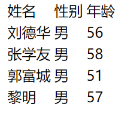
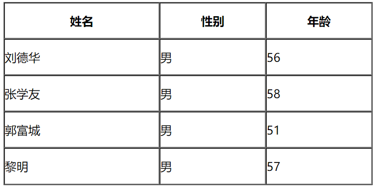
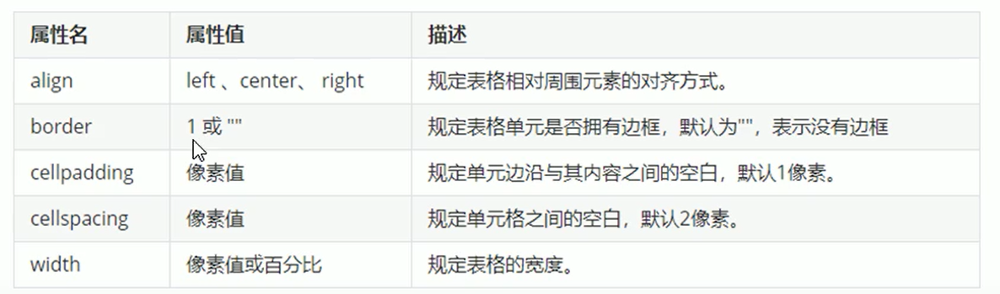
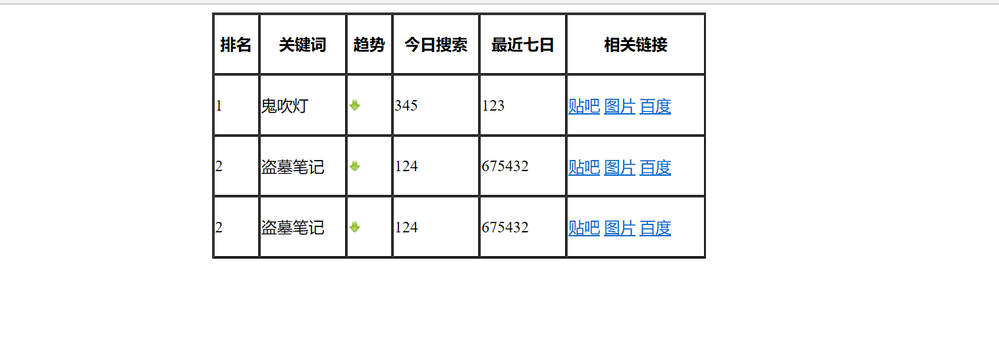
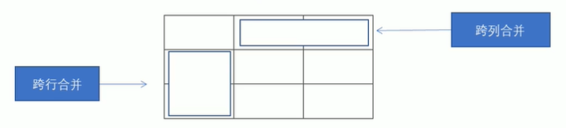
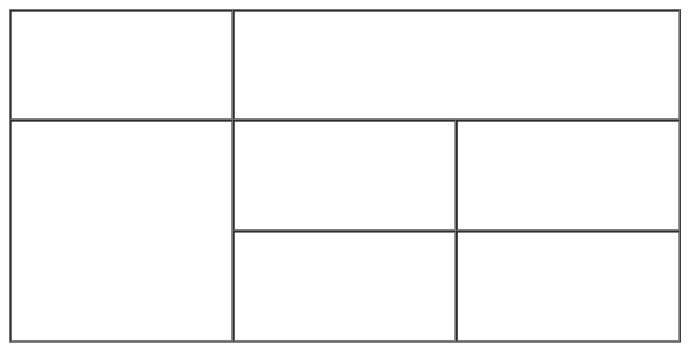

# 表格标签
表格主要作用：显示、展示数据
## 一、基本格式
```
<table>
        <tr>
                <td>单元格内容</tr>
        </tr>
</table>
```


1．\<table\>\</table\>是用于定义表格的标签．
2．\<tr\>\</tr\>标签于定义表格中的行，必须嵌套在\<table\>\</table\>标签中
3．\<td\>\</td\>用于定义表格中的单元格，必须嵌套在\<tr\>\<／tr\>标签中。
4 . 字母td指表格数据(tabledata），即数单元格的内容
案例，写出表格


<table>
<colgroup>
<col style="width: 100%" />
</colgroup>
<thead>
<tr class="header">
<th><p>&lt;body&gt;</p>
<p>&lt;table&gt;</p>
<p>&lt;tr&gt;&lt;td&gt;姓名&lt;/td&gt; &lt;td&gt;性别&lt;/td&gt; &lt;td&gt; 年龄 &lt;/td&gt;&lt;/tr&gt;</p>
<p>&lt;tr&gt;&lt;td&gt;刘德华&lt;/td&gt; &lt;td&gt;男&lt;/td&gt; &lt;td&gt; 56 &lt;/td&gt;&lt;/tr&gt;</p>
<p>&lt;tr&gt;&lt;td&gt;张学友&lt;/td&gt; &lt;td&gt;男&lt;/td&gt; &lt;td&gt; 58 &lt;/td&gt;&lt;/tr&gt;</p>
<p>&lt;tr&gt;&lt;td&gt;郭富城&lt;/td&gt; &lt;td&gt;男&lt;/td&gt; &lt;td&gt; 51 &lt;/td&gt;&lt;/tr&gt;</p>
<p>&lt;tr&gt;&lt;td&gt;黎明&lt;/td&gt; &lt;td&gt;男&lt;/td&gt; &lt;td&gt; 57 &lt;/td&gt;&lt;/tr&gt;</p>
<p>&lt;/table&gt;</p>
<p>&lt;/body&gt;</p></th>
</tr>
</thead>
<tbody>
</tbody>
</table>
## 二、表头单元格
\<th\>\</th\> 一般位于表格第一行，居中并加粗


<table>
<colgroup>
<col style="width: 100%" />
</colgroup>
<thead>
<tr class="header">
<th><p>&lt;body&gt;</p>
<p>&lt;!-- 这些属性要写到表格标签table 里面去 --&gt;</p>
<p>&lt;table align="center" border="1" cellpadding="0" cellspacing="0" width="500" height="249"&gt;</p>
<p>&lt;tr&gt;&lt;th&gt;姓名&lt;/th&gt; &lt;th&gt;性别&lt;/th&gt; &lt;th&gt; 年龄 &lt;/th&gt;&lt;/tr&gt;</p>
<p>&lt;tr&gt;&lt;td&gt;刘德华&lt;/td&gt; &lt;td&gt;男&lt;/td&gt; &lt;td&gt; 56 &lt;/td&gt;&lt;/tr&gt;</p>
<p>&lt;tr&gt;&lt;td&gt;张学友&lt;/td&gt; &lt;td&gt;男&lt;/td&gt; &lt;td&gt; 58 &lt;/td&gt;&lt;/tr&gt;</p>
<p>&lt;tr&gt;&lt;td&gt;郭富城&lt;/td&gt; &lt;td&gt;男&lt;/td&gt; &lt;td&gt; 51 &lt;/td&gt;&lt;/tr&gt;</p>
<p>&lt;tr&gt;&lt;td&gt;黎明&lt;/td&gt; &lt;td&gt;男&lt;/td&gt; &lt;td&gt; 57 &lt;/td&gt;&lt;/tr&gt;</p>
<p>&lt;/table&gt;</p>
<p>&lt;/body&gt;</p></th>
</tr>
</thead>
<tbody>
</tbody>
</table>
## 三、表格属性
(不常用，后用CSS)


案例：小说排行榜


<table>
<colgroup>
<col style="width: 100%" />
</colgroup>
<thead>
<tr class="header">
<th><p>&lt;body&gt;</p>
<p>&lt;table align="center" width="500" height="249" border="1" cellspacing="0"&gt;</p>
<p>&lt;thread&gt;</p>
<p>&lt;tr&gt;</p>
<p>&lt;th&gt;排名&lt;/th&gt;</p>
<p>&lt;th&gt;关键词&lt;/th&gt;</p>
<p>&lt;th&gt;趋势&lt;/th&gt;</p>
<p>&lt;th&gt;今日搜索&lt;/th&gt;</p>
<p>&lt;th&gt;最近七日&lt;/th&gt;</p>
<p>&lt;th&gt;相关链接&lt;/th&gt;</p>
<p>&lt;/tr&gt;</p>
<p>&lt;thread&gt;</p>
<p>&lt;tr&gt;</p>
<p>&lt;td&gt;1&lt;/td&gt;</p>
<p>&lt;td&gt;鬼吹灯&lt;/td&gt;</p>
<p>&lt;td&gt;&lt;img src="down.jpg" /&gt;&lt;/td&gt;</p>
<p>&lt;td&gt;345&lt;/td&gt;</p>
<p>&lt;td&gt;123&lt;/td&gt;</p>
<p>&lt;td&gt;&lt;a href="#"&gt;贴吧&lt;/a&gt; &lt;a href="#"&gt;图片&lt;/a&gt; &lt;a href="#"&gt;百度&lt;/a&gt;&lt;/td&gt;</p>
<p>&lt;/tr&gt;</p>
<p></p>
<p>&lt;tr&gt;</p>
<p>&lt;td&gt;2&lt;/td&gt;</p>
<p>&lt;td&gt;盗墓笔记&lt;/td&gt;</p>
<p>&lt;td&gt;&lt;img src="down.jpg" /&gt;&lt;/td&gt;</p>
<p>&lt;td&gt;124&lt;/td&gt;</p>
<p>&lt;td&gt;675432&lt;/td&gt;</p>
<p>&lt;td&gt;&lt;a href="#"&gt;贴吧&lt;/a&gt; &lt;a href="#"&gt;图片&lt;/a&gt; &lt;a href="#"&gt;百度&lt;/a&gt;&lt;/td&gt;</p>
<p>&lt;/tr&gt;</p>
<p></p>
<p>&lt;tr&gt;</p>
<p>&lt;td&gt;2&lt;/td&gt;</p>
<p>&lt;td&gt;盗墓笔记&lt;/td&gt;</p>
<p>&lt;td&gt;&lt;img src="down.jpg" /&gt;&lt;/td&gt;</p>
<p>&lt;td&gt;124&lt;/td&gt;</p>
<p>&lt;td&gt;675432&lt;/td&gt;</p>
<p>&lt;td&gt;&lt;a href="#"&gt;贴吧&lt;/a&gt; &lt;a href="#"&gt;图片&lt;/a&gt; &lt;a href="#"&gt;百度&lt;/a&gt;&lt;/td&gt;</p>
<p>&lt;/tr&gt;</p>
<p></p>
<p>&lt;/table&gt;</p>
<p>&lt;/body&gt;</p></th>
</tr>
</thead>
<tbody>
</tbody>
</table>
## 四、表格结构标签
更好分清表格结构
\<thead\>标签 表格的头部区域
\<tbody\>标签 表格的主体区域
## 五、合并单元格
## 1、方式
跨行合并 rowspan=”合并单元格的个数’
跨列合并 colspan=”合并单元格的个数”



目标单元格
**跨行：最上侧，写合并代码**
**跨列：最左侧，写合并代码**
**2）步骤**
1、确定行列
2、招目标单元格
3、删除多余


<table>
<colgroup>
<col style="width: 100%" />
</colgroup>
<thead>
<tr class="header">
<th><p>&lt;body&gt;</p>
<p>&lt;table width="500" height="249" border="1" cellspacing="0"&gt;</p>
<p>&lt;tr&gt;</p>
<p>&lt;td&gt;&lt;/td&gt;</p>
<p>&lt;td colspan="2"&gt;&lt;/td&gt;</p>
<p>&lt;/tr&gt;</p>
<p>&lt;tr&gt;</p>
<p>&lt;td rowspan="2"&gt;&lt;/td&gt;</p>
<p>&lt;td&gt;&lt;/td&gt;</p>
<p>&lt;td&gt;&lt;/td&gt;</p>
<p>&lt;/tr&gt;</p>
<p>&lt;tr&gt;</p>
<p>&lt;td&gt;&lt;/td&gt;</p>
<p>&lt;td&gt;&lt;/td&gt;</p>
<p>&lt;/tr&gt;</p>
<p></p>
<p>&lt;/table&gt;</p>
<p>&lt;/body&gt;</p></th>
</tr>
</thead>
<tbody>
</tbody>
</table>
