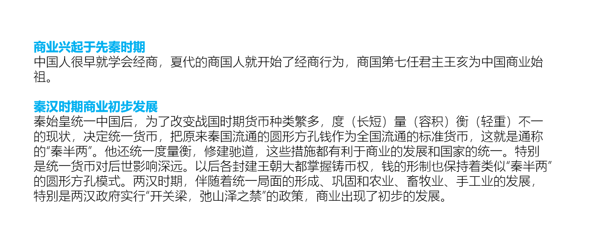
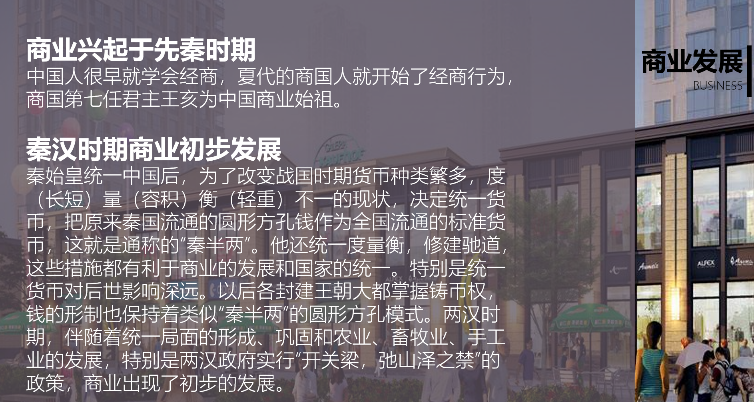
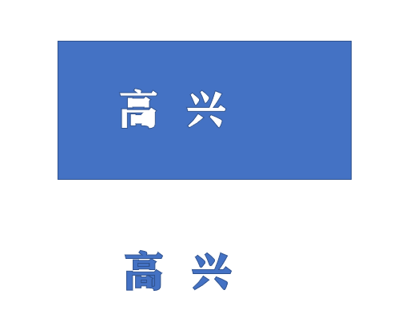
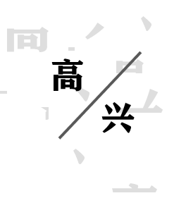

2、字体
2020年7月20日
9:28
# 2、字体
2.1 不同场合用不同字体
粗狂的字体有冲击力，突出重点，商务场合，黑体，微软雅黑加粗（黑体比宋体更易于识别和观看，常用商务）
纤细的字体优雅，用于演讲，和大型发布会，阅读舒适，--微软雅黑Light，方正兰超细黑简体
中国风：楷体，宋体，历史课件，古色古香
特殊场合特殊字体
2.2 字体下载
[模板模板王：](http://fonts.mobanwang.com)[http://fonts.mobanwang.com](http://fonts.mobanwang.com/)
font.chinaz.com[（站长素材）](http://font.chinaz.com)
*2.3、字体边框*
刷黑点击设置形状格式，点击文本轮廓
2.4、字体特效
最好自己设置，视情况而定
2.5、字体注意
1）外边框修饰
2）图文结合
3）镂空字（用于重点语句特出）
7，排版注意
1）分段
2）提炼关键字
3）配色
4）加图标
5）修改版面
举例子
商务-微软雅黑
关键字标题-微软雅黑，加粗
正文-微软雅黑light字体
商务是蓝色标题
可以加英文修饰
2.6 例子

全图形加入

取矩形，填充图片里的深色，无边框
图片透明度调整至20%-30%
选取文字至于顶层
更改文字颜色，取反差大的颜色

右侧可以加一个标题修饰

2.7 拆分字体
写好字体后，字体最好空格一点，用较大矩形框住，格式-合并形状-拆分字体

拆分得不像字，选用深色，透明度改90%左右

