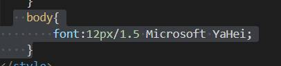
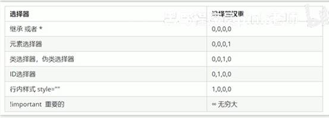
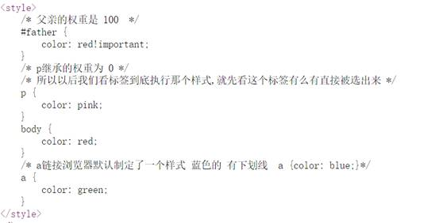
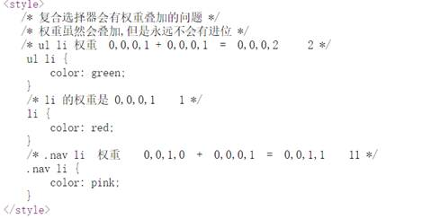
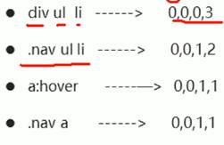
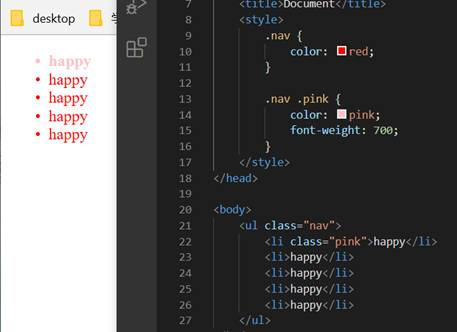

# CSS的三大特性
## 一、层叠性
相同选择器给设置了相同样式，此时一个样式会覆盖另一个样式

原则

**样式冲突，就近原则，那个离结构近就执行哪个**

样式不冲突，不层叠
## 二、继承性
1.子标签继承父标题某些的样式

简化代码

子元素可以继承父标签的样式（与文字有关的样式继承）

2.特殊情况—行高继承

行高可以跟单位也可以不跟

此时子元素的行高是当前子元素的文字大小的1.5倍
## 三、优先级
指定多个选择器的时候，优先级

选择器相同，执行层叠性

注意
1.  权重四个数字组成，不会有进位
2.  可以理解为类选择器永远大于元素这学期，id选择器永远大于类选择器
3.  等级判断从左到右，如果某一位数值相同，则判断下一位数值
4.  简单记忆：通配符和继承权重是0；标签选择器权重1，类（伪类）选择器为10，id选择器为100，行内样式表为1000，！important无穷大
5.  ==继承权重0==，如果该元素没有被直接选中，不管父类元素权重多高，子元素得到的权重都是0

权重叠加

复合选择器有权重叠加问题，不会有进位问题

