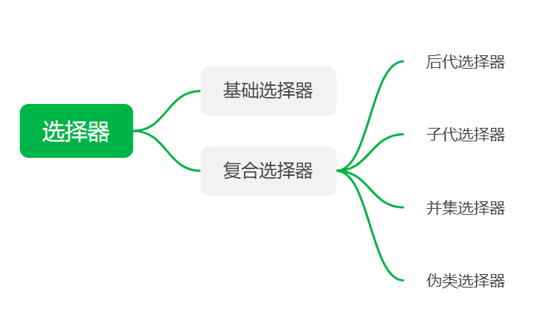
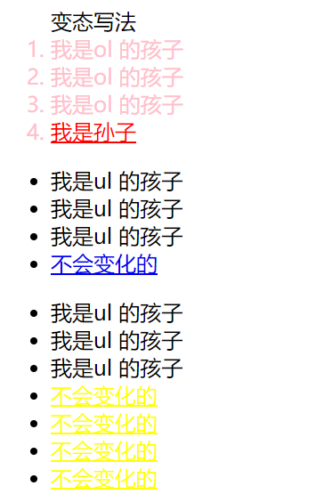
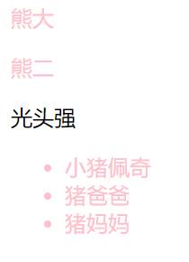
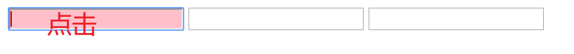

# CSS的复合选择器
复合选择器建立在基础选择器之上，对基本选择器进行组合形成

<table>
<colgroup>
<col style="width: 17%" />
<col style="width: 21%" />
<col style="width: 19%" />
<col style="width: 10%" />
<col style="width: 29%" />
</colgroup>
<thead>
<tr class="header">
<th>选择器</th>
<th>作用</th>
<th>特征</th>
<th>隔开符号</th>
<th>用法</th>
</tr>
</thead>
<tbody>
<tr class="odd">
<td>后代选择器</td>
<td>用来选择后代元素</td>
<td>可以选择低于这一级别的</td>
<td>空格</td>
<td>.nav a{}</td>
</tr>
<tr class="even">
<td>子代选择器</td>
<td>选择最近一级元素</td>
<td>只选择下一级别</td>
<td>大于</td>
<td>.nav&gt;p{}</td>
</tr>
<tr class="odd">
<td>并集选择器</td>
<td>选择某些相同样式的元素</td>
<td>可以用于集体声明</td>
<td>逗号</td>
<td>.nav,.header{}</td>
</tr>
<tr class="even">
<td>链接伪类选择器</td>
<td>选择不同状态的链接</td>
<td>和链接相关</td>
<td></td>
<td>
a{}

a:hover
</td>
</tr>
<tr class="odd">
<td>:focus选择器</td>
<td>选择获得光标的表单</td>
<td>和表单相关</td>
<td></td>
<td>Input:focus</td>
</tr>
</tbody>
</table>

## 
## 一、后代选择器（包含选择器）
元素1 元素2 {样式声明；}

对元素2操作
选择元素1里面的所有元素2（后代元素）
注意：
1，元素1和元素2 空格分开
2，元素1父级，元素2子集，最终选择的是元素2
3，元素2只要是元素1后代即可
4，元素1，元素2可以是任意基础选择器

<table>
<colgroup>
<col style="width: 100%" />
</colgroup>
<thead>
<tr class="header">
<th>
&lt;head&gt;

&lt;style&gt;

/* 我想要把ol里面的小li选出来改为pink */

ol li {

color: pink;

}

/* 中国 山东 济南 蓝翔 */

ol li a {

color: red;

}

.nav li a {

color: yellow;

}

&lt;/style&gt;

&lt;/head&gt;

&lt;body&gt;

&lt;ol&gt;

变态写法

&lt;li&gt;我是ol 的孩子&lt;/li&gt;

&lt;li&gt;我是ol 的孩子&lt;/li&gt;

&lt;li&gt;我是ol 的孩子&lt;/li&gt;

&lt;li&gt;&lt;a href="#"&gt;我是孙子&lt;/a&gt;&lt;/li&gt;

&lt;/ol&gt;

&lt;ul&gt;

&lt;li&gt;我是ul 的孩子&lt;/li&gt;

&lt;li&gt;我是ul 的孩子&lt;/li&gt;

&lt;li&gt;我是ul 的孩子&lt;/li&gt;

&lt;li&gt;&lt;a href="#"&gt;不会变化的&lt;/a&gt;&lt;/li&gt;

&lt;/ul&gt;

&lt;ul class="nav"&gt;

&lt;li&gt;我是ul 的孩子&lt;/li&gt;

&lt;li&gt;我是ul 的孩子&lt;/li&gt;

&lt;li&gt;我是ul 的孩子&lt;/li&gt;

&lt;li&gt;&lt;a href="#"&gt;不会变化的&lt;/a&gt;&lt;/li&gt;

&lt;li&gt;&lt;a href="#"&gt;不会变化的&lt;/a&gt;&lt;/li&gt;

&lt;li&gt;&lt;a href="#"&gt;不会变化的&lt;/a&gt;&lt;/li&gt;

&lt;li&gt;&lt;a href="#"&gt;不会变化的&lt;/a&gt;&lt;/li&gt;

&lt;/ul&gt;

&lt;\body&gt;
</th>
</tr>
</thead>
<tbody>
</tbody>
</table>
## 二．子代选择器
元素1 \> 元素2 {样式声明；}

元素2是元素1的直接后代，选择最近一级的子元素
Eg。div\>p{样式声明}
注意
1，元素1和元素2中间大于号隔开
2，元素1父级，元素2子集，最终选择元素2
## 三、并集选择器
元素1，元素2{样式声明；}

可以选择多组标签，同时为他们定义相同样式，集体声明

<table>
<colgroup>
<col style="width: 100%" />
</colgroup>
<thead>
<tr class="header">
<th>

&lt;head&gt;

….

&lt;style&gt;

/* 要求: 请把熊大和熊二改为粉色 还有 小猪一家改为粉色 */

div,

p,

.pig li {

color: pink;

}

&lt;/style&gt;

&lt;/head&gt;

&lt;body&gt;

&lt;div&gt;熊大&lt;/div&gt;

&lt;p&gt;熊二&lt;/p&gt;

&lt;span&gt;光头强&lt;/span&gt;

&lt;ul class="pig"&gt;

&lt;li&gt;小猪佩奇&lt;/li&gt;

&lt;li&gt;猪爸爸&lt;/li&gt;

&lt;li&gt;猪妈妈&lt;/li&gt;

&lt;/ul&gt;

&lt;/body&gt;
</th>
</tr>
</thead>
<tbody>
</tbody>
</table>

注意
1，约定的语法规范,我们并集选择器喜欢竖着写
2，一定要注意,最后一个选择器 不需要加逗号

## 四、伪类选择器
用于给某类选择器添加特殊效果
==最大特点是用冒号表示==
有很多种，重点看链接伪类、结构伪类
### 1、链接伪类选择器
| a:link    | 选择所有未被访问的链接               |
|-----------|--------------------------------------|
| a:visited | 选择所有已被访问的链接               |
| a: hover  | 选择鼠标指针位于其上的链接           |
| a: active | 选择活动链接（鼠标按下未弹起的链接） |

<table>
<colgroup>
<col style="width: 100%" />
</colgroup>
<thead>
<tr class="header">
<th>
/* 1.未访问的链接 a:link 把没有点击过的(访问过的)链接选出来 */

a:link {

color: #333;

text-decoration: none;

}

/*2. a:visited 选择点击过的(访问过的)链接 */

a:visited {

color: orange;

}

/*3. a:hover 选择鼠标经过的那个链接 */

a:hover {

color: skyblue;

}

/* 4. a:active 选择的是我们鼠标正在按下还没有弹起鼠标的那个链接 */

a:active {

color: green;

}
</th>
</tr>
</thead>
<tbody>
</tbody>
</table>

注意
==1：严格按照LVHA顺序书写 link-visited-hover-active==
2给链接指定样式要单独指定
3.实际开发写法
<table>
<colgroup>
<col style="width: 100%" />
</colgroup>
<thead>
<tr class="header">
<th>
&lt;style&gt;

a {

color: #333;

text-decoration: none;

}

a:hover {

color: #369;

text-decoration: underline;

}

&lt;/style&gt;
</th>
</tr>
</thead>
<tbody>
</tbody>
</table>
### 2.：focus伪类选择器
用于获取获得焦点的的表单元素
焦点就是光标，一般情况\<input\>类表单元素才能获取，因此这个选择器也主要针对表单元素来说

<table>
<colgroup>
<col style="width: 100%" />
</colgroup>
<thead>
<tr class="header">
<th>
&lt;head&gt;

...

&lt;title&gt;focus伪类选择器&lt;/title&gt;

&lt;style&gt;

/* // 把获得光标的input表单元素选取出来 */

input:focus {

background-color: pink;

color: red;

}

&lt;/style&gt;

&lt;/head&gt;

&lt;body&gt;

&lt;input type="text"&gt;

&lt;input type="text"&gt;

&lt;input type="text"&gt;

&lt;/body&gt;
</th>
</tr>
</thead>
<tbody>
</tbody>
</table>
## 五、总结
<table>
<colgroup>
<col style="width: 17%" />
<col style="width: 21%" />
<col style="width: 19%" />
<col style="width: 10%" />
<col style="width: 29%" />
</colgroup>
<thead>
<tr class="header">
<th>选择器</th>
<th>作用</th>
<th>特征</th>
<th>隔开符号</th>
<th>用法</th>
</tr>
</thead>
<tbody>
<tr class="odd">
<td>后代选择器</td>
<td>用来选择后代元素</td>
<td>可以选择低于这一级别的</td>
<td>空格</td>
<td>.nav a{}</td>
</tr>
<tr class="even">
<td>子代选择器</td>
<td>选择最近一级元素</td>
<td>只选择下一级别</td>
<td>大于</td>
<td>.nav&gt;p{}</td>
</tr>
<tr class="odd">
<td>并集选择器</td>
<td>选择某些相同样式的元素</td>
<td>可以用于集体声明</td>
<td>逗号</td>
<td>.nav,.header{}</td>
</tr>
<tr class="even">
<td>链接伪类选择器</td>
<td>选择不同状态的链接</td>
<td>和链接相关</td>
<td></td>
<td>
a{}

a:hover
</td>
</tr>
<tr class="odd">
<td>:focus选择器</td>
<td>选择获得光标的表单</td>
<td>和表单相关</td>
<td></td>
<td>Input:focus</td>
</tr>
</tbody>
</table>
