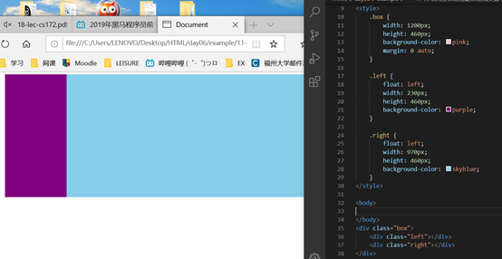
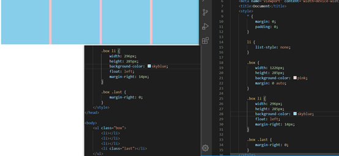
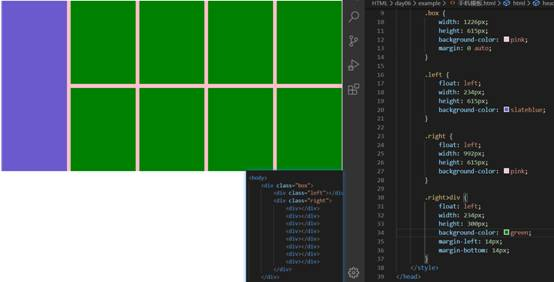
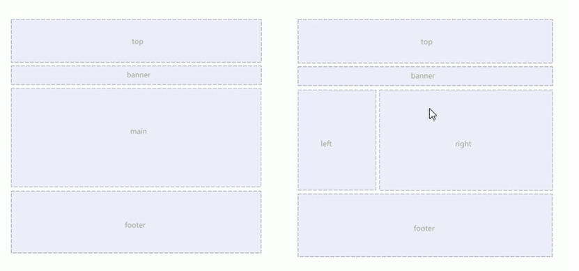
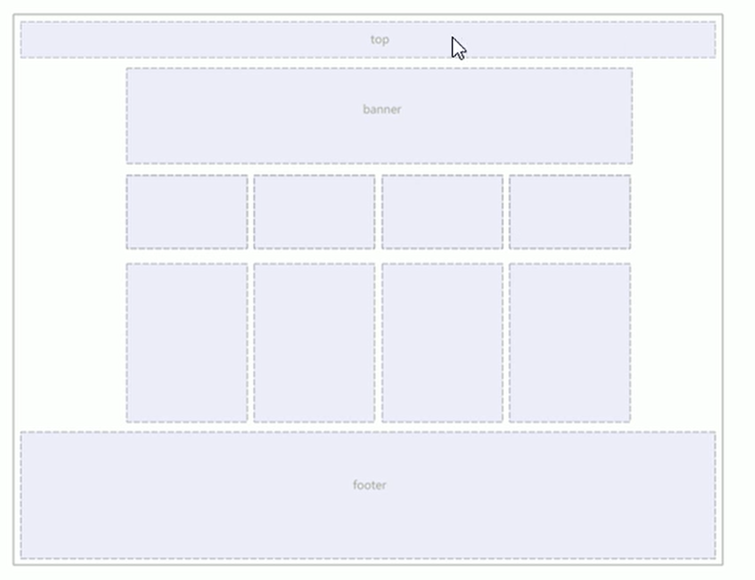
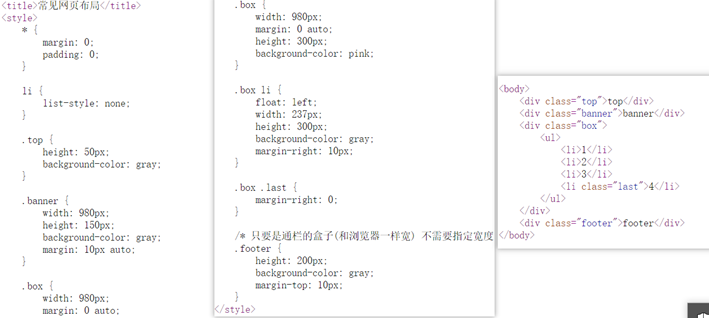
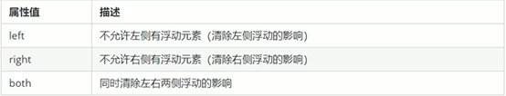
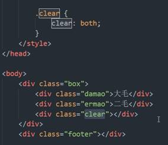
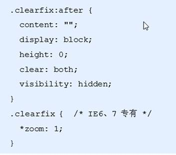
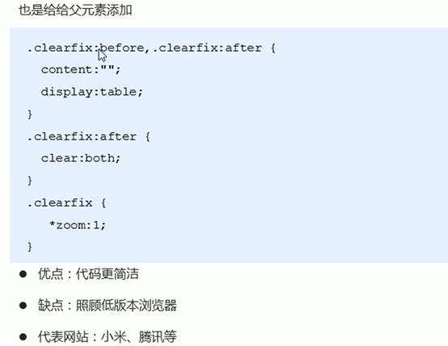

**浮动float**

## **一.传统网页布局三种方式**

**1普通流（标准流）**
按照默认规定好的方式
1块元素独占一行,行内元素左到右
2浮动
3定位

## **二，浮动**

**1.为什么要浮动**
浮动最经典应用：==可以让多个块级元素一行内排列显示==
网页布局第一准则：多个块级元素纵向排列找标准流，多个块级元素横向排列找浮动
**2.什么是浮动**

```
选择器{ float:属性值；}
none 不浮动（默认
left 左浮动
right 右浮动
```


**3.浮动的特性**
**A浮动元素会脱离标准流（脱标**
浮动元素脱离标准流
脱标的元素不再保留原先的位置
**B浮动元素会一行内显示并且元素顶部对齐**
贴到一起，无空隙
如果父级宽度装不下这些浮动的盒子，多出的盒子会另起一行对齐
**C浮动元素会具有行内块元素的特性**
任何元素都可以添加浮动，添加浮动之后都具有行内块元素特性
如果行内元素有浮动，则不用转换，可以直接给高度宽度
**4.浮动元素经常和标准流父级搭配使用**
网页布局一般策略
先使用标准流的父元素排列位置，之后内部子元素采用浮动排列左右位置，符合网页布局第一准则
网页布局第二准则：先设置盒子大小，再设置盒子位置
,

5



**三种最常见的布局方式**







**浮动布局两个注意点**
1浮动和标准流的父盒子搭配
先用标准流的父元素排列上下位置，之后内部子元素采取浮动排列左右位置
2==浮动的盒子只会影响盒子后面的标准流，不影响前面标准流==
**清除浮动**
**清除浮动**
一、很多父盒子不方便给高度，但是自盒子浮动又不占位置，最后父级盒子高度为0的时候，就会影响下面的标准流盒子
让子盒子撑开父盒子
二、本质
清除浮动元素脱离标准流造成的影响
三策略
闭合浮动，只让浮动在父盒子内部影响，不影响父盒子外面的其他盒子
**两种清除浮动方式**
==一选择器{clear：属性值；}==

实际开发只用clear both
清除浮动的方法：闭合浮动
**一额外标签法也称为隔离法，是W3C推荐 （）不推荐**
在浮动元素末尾添加一个空标签，或者其他标签eg.\<br/\>
新添加的必须是块级元素
优点：通俗易懂
缺点结构化较差

**二父级添加overflow属性**
给父级添加overflow:hidden或者auto或者scroll;
代码简介
但是无法显示溢出部分
**三父级添加:after伪元素**
给父元素添加


**四父级添加双伪水元素**

