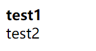
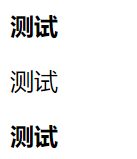

# 字体
<table>
<colgroup>
<col style="width: 100%" />
</colgroup>
<thead>
<tr class="header">
<th>
p {

font: font-style font-weight <strong>font-size</strong>/line-height <strong>font-family</strong>;

}
</th>
</tr>
</thead>
<tbody>
</tbody>
</table>
文本
| 属性            | 表示     | 注意点                                                     |
|-----------------|----------|------------------------------------------------------------|
| color           | 文本颜色 | 通常用十六进制                                             |
| text-align      | 文本对齐 | 可以设定文字水平的对齐方式                                 |
| text-indent     | 文本缩进 | 通常用于段落首行缩进2个字的距离 text-index: 2em;           |
| text-decoration | 文本修饰 | 记住underline添加下划线；none取消下划线                    |
| line-height     | 行高     | 控制行和行之间的距离（设置值和高度的值相等可以让文本居中） |

## 一、设置字体样式
### 1.文字样式front-style
<table>
<colgroup>
<col style="width: 100%" />
</colgroup>
<thead>
<tr class="header">
<th>
p {

font-style: normal;

}
</th>
</tr>
</thead>
<tbody>
</tbody>
</table>
| normal | 默认值，标准 |
|--------|--------------|
| italic | 斜体         |

### 2.字体粗细font-weight
| bold   | 加粗            |
|--------|-----------------|
| normal | 正常字体（400） |
用number加粗，不跟单位 实际开发提倡用数字

<table>
<colgroup>
<col style="width: 100%" />
</colgroup>
<thead>
<tr class="header">
<th>
&lt;head&gt;

...

&lt;style&gt;

.bold {

font-weight: 700;

}

&lt;/style&gt;

&lt;/head&gt;

&lt;body&gt;

&lt;div class="bold"&gt;test1&lt;/div&gt;

&lt;div class="normal"&gt;test2&lt;/div&gt;

&lt;/body&gt;
</th>
</tr>
</thead>
<tbody>
</tbody>
</table>

### 3.字体大小font-size
谷歌浏览器默认16px
<table>
<colgroup>
<col style="width: 100%" />
</colgroup>
<thead>
<tr class="header">
<th>
P {

font-size: 16px;

}
</th>
</tr>
</thead>
<tbody>
</tbody>
</table>
标题标签比较特殊要另外指定

<table>
<colgroup>
<col style="width: 100%" />
</colgroup>
<thead>
<tr class="header">
<th>
&lt;head&gt;

&lt;metacharset="UTF-8"&gt;

&lt;metaname="viewport"content="width=device-width,initial-scale=1.0"&gt;

&lt;title&gt;Document&lt;/title&gt;

&lt;style&gt;

body{

font-size:16px;

}

h2{

font-size:16px;

}

&lt;/style&gt;

&lt;/head&gt;

&lt;body&gt;

&lt;h2&gt;测试&lt;/h2&gt;

&lt;p&gt;测试&lt;/p&gt;

&lt;h2&gt;测试&lt;/h2&gt;

&lt;/body&gt;
</th>
</tr>
</thead>
<tbody>
</tbody>
</table>
### 4.字体系列font-family 
| p { font-family: ‘xxx’;} |
|--------------------------|

多个字体用逗号分隔，最好用单引号包含
尽量使用，默认字体
常见Microsoft YaHei、Tahoma、Arial、Hiregino Sans GB
<table>
<colgroup>
<col style="width: 100%" />
</colgroup>
<thead>
<tr class="header">
<th>
body{

font-family: ‘Microsoft YaHei’, tahoma, arial；

}
</th>
</tr>
</thead>
<tbody>
</tbody>
</table>

### 5.字体复合属性
节约代码,用空格隔开
不需要的属性可以省略，但是==必须保留font-size和font-family==属性
严格按照顺序
<table>
<colgroup>
<col style="width: 100%" />
</colgroup>
<thead>
<tr class="header">
<th>
p {

font: font-style font-weight <strong>font-size</strong>/line-height <strong>font-family</strong>;

}
</th>
</tr>
</thead>
<tbody>
</tbody>
</table>

## 二、设置文本样式
### 1.文本颜色color
1).#十六进制
2).直接写
3).RGB代码
Color: rgb(255,0,0);
**透明rgba(0,0,0.3)**
### 2.对齐文本text-align
<table>
<colgroup>
<col style="width: 100%" />
</colgroup>
<thead>
<tr class="header">
<th>
div{

text-align: center

}
</th>
</tr>
</thead>
<tbody>
</tbody>
</table>
形式：left（默认），right，center
### 3.装饰文本text-decoration
<table>
<colgroup>
<col style="width: 100%" />
</colgroup>
<thead>
<tr class="header">
<th>
div{

text-align: center

}
</th>
</tr>
</thead>
<tbody>
</tbody>
</table>

| none 默认    | 无（取消链接的下划线）  |
|--------------|-------------------------|
| underline    | 下划线，链接a自带下划线 |
| overline     | 上划线                  |
| line-through | 删除线                  |
### 4.文本缩进
给第一行缩进，首行缩进

<table>
<colgroup>
<col style="width: 100%" />
</colgroup>
<thead>
<tr class="header">
<th>
p {

text-indent: 20px;

}

p {

text-indent: 2em;

}
</th>
</tr>
</thead>
<tbody>
</tbody>
</table>
负左正右
Em是一个单位，就是当前文字的一个相对单位
### 5.行间距
控制文字与行之间距离（**设置值和高度的值相等可以让文本居中**）
line-height
<table>
<colgroup>
<col style="width: 100%" />
</colgroup>
<thead>
<tr class="header">
<th>
p{

Line-height: 2px;

}
</th>
</tr>
</thead>
<tbody>
</tbody>
</table>

## 6.总结
| 属性            | 表示     | 注意点                                                     |
|-----------------|----------|------------------------------------------------------------|
| color           | 文本颜色 | 通常用十六进制                                             |
| text-align      | 文本对齐 | 可以设定文字水平的对齐方式                                 |
| text-indent     | 文本缩进 | 通常用于段落首行缩进2个字的距离 text-index: 2em;           |
| text-decoration | 文本修饰 | 记住underline添加下划线；none取消下划线                    |
| line-height     | 行高     | 控制行和行之间的距离（设置值和高度的值相等可以让文本居中） |

