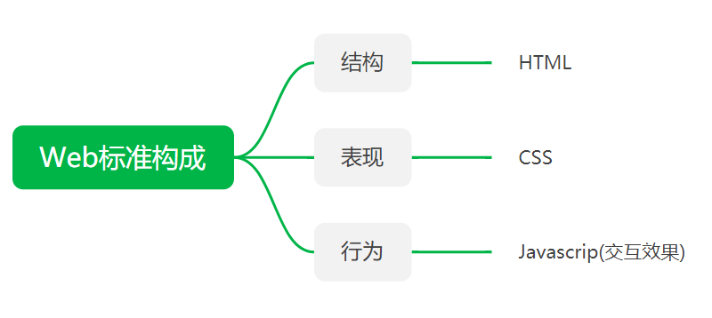
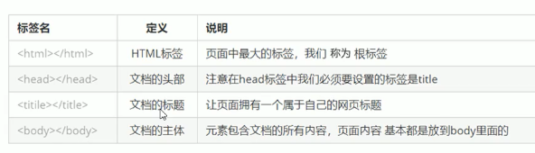
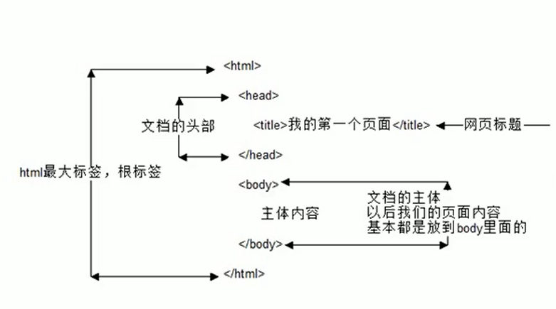
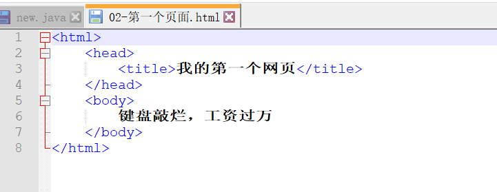
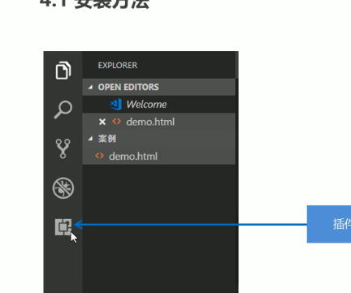

HTML概述和认识语法
2020年5月23日
9:39
# HTML概述和认识语法
## 一、HTML基本知识
### 1、网页基本组成
网站是网页的集合

网页是HTML格式的文件，通过浏览器阅读
### 2、什么是HTML
超文本标记语言

描述网页的一种标记语言
### 3、常用浏览器
浏览器是网页运行的平台，常用的浏览器有 IE、火狐（Firefox）、谷歌（Chrome）、Safari和Opera等。我们平时称为五大浏览器。
### 4、Web标准的三大组成成分
1）W3C标准

2）Web标准构成：

## 二、HTML基础标签
### 1．标签介绍
所有标签包含于尖括号，

大部分是双标签成对出现，eg.\<html\>\</html\>第一个是开始，第二个结束标签

单标签少见eg.\<br/\>
### 2.标签关系
--包含关系

\<head\>

\<title\>\</title\>

\</head\>

--并列关系

\<head\>\</head\>

\<body\>\</body\>
### 3、HTML基本结构标签

## 三、开发工具
### 1、VSCode
1.  先创建保存文件，后缀名.html
2.  打==！==（小写的）再按Tab。生成页面骨架
3.  右边键选查看
4.  Ctrl +放大字体
### 2、vscode插件使用
点击查询插件

### 3、网页开发工具
--\<!DOCTYPEhtml\>

文档类型声明标签，告诉浏览器页面采取html5版本来显示页面

--\<htmllang="en"\>

告诉浏览器这是一个英文网站,设置语言

--\<metacharset="UTF-8"\>

必须写，用万国码保存字符，否则乱码
