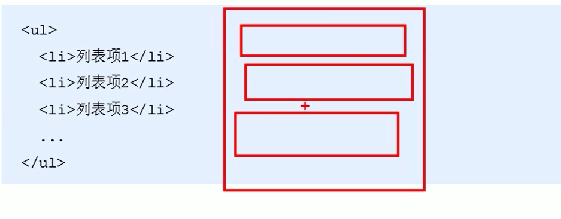

列表标签
2020年5月23日
9:44

# 列表标签
用来布局
## 一、无序列表（重点）

1.无顺序之分，是并列的
2、\<ul\>\</ul\>只能嵌套\<li\>\</li\>
3、\<li\>\</li\>之间相对于一个容器，容纳所有元素，无序列表自带的样式属性，实际使用时用CSS设置
4.去掉前面的点
<table>
<colgroup>
<col style="width: 100%" />
</colgroup>
<thead>
<tr class="header">
<th>
li {

list-stytle: none;

}
</th>
</tr>
</thead>
<tbody>
</tbody>
</table>
## 
## 二、有序列表
自动排123
\<ol\>
\<li\>列表项1\</li\>
\<li\>列表项2\</li.
\<ol\>
1.\<ol\>\</ol\>只能嵌套\<li\>\</li\>
2.\<li\>\</li\>之间相对于一个容器，容纳所有元素
有序列表自带的样式属性123….，实际使用时用CSS设置
## 
## 三、自定义列表
用于对术语名词进行解释
\<dl\>
\<dt\>名词1\</dt\>
\<dd\>名词1解释1\</dt\>
\<dd\>名词1解释2\</dt\>
\</dl\>
\<ol\>\</ol\>只能嵌套\<dt\>\<dd\>
\<dt\>对应多个\<dd\>
