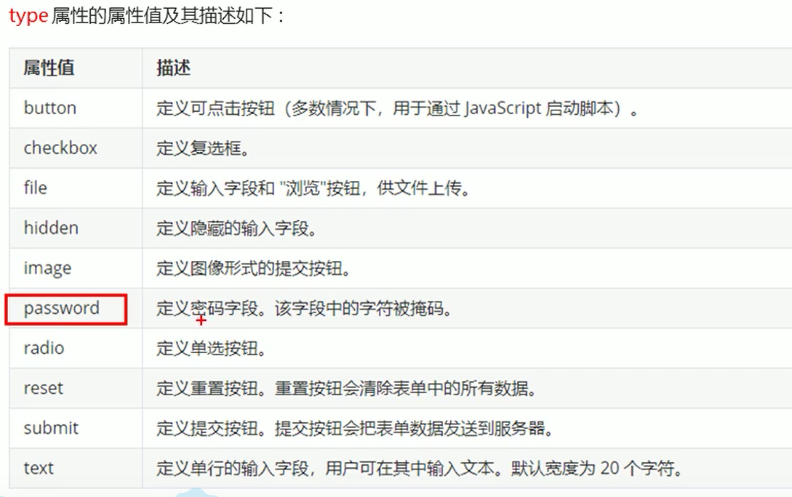
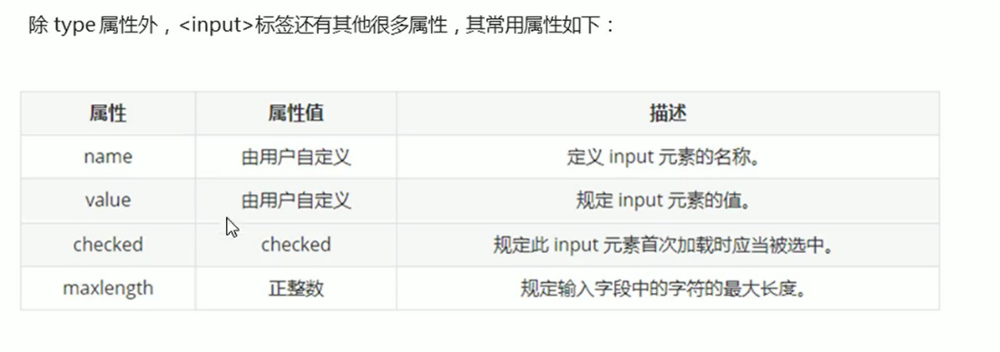
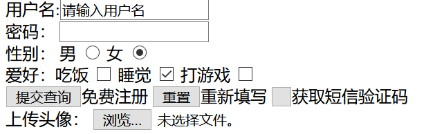
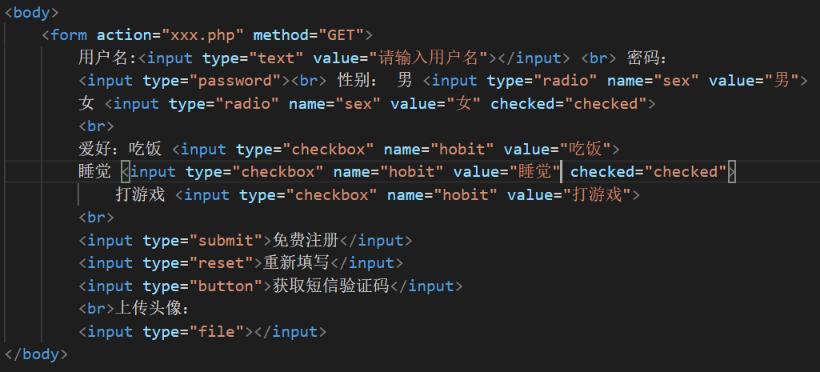
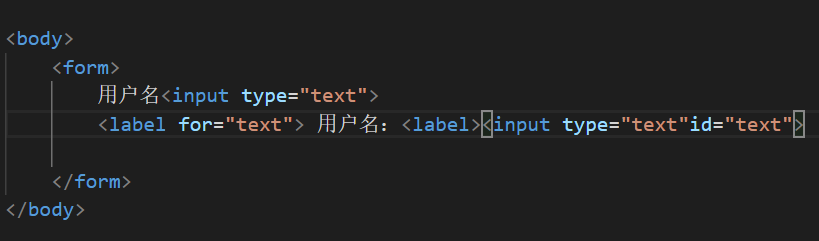
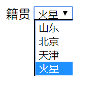
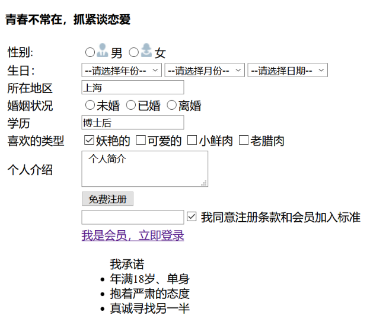

表单标签
2020年5月23日
9:44

表单标签
## 一、表单域
### 1、作用：
用于收集用户信息
### 2、组成
表单域、表单控件（表单元素）、提示信息，包含表单元素的区域，收集信息，把信息送给后台
### 3、格式
\<form action=”url地址” method=”提交方式” name=”表单域名称”\>
各种表单元素控件
| \<formaction="demo.php"method="POST"name="name1"\>\</form\> |
|-----------------------------------------------------------------|

常用属性：
| 属性   | 属性值   | 作用                                               |
|--------|----------|----------------------------------------------------|
| action | url地址  | 用于指定接收并处理表单数据的服务器程的url地址。    |
| method | get/post | 用于设置表单数据的提交方式，具取值为get或post.     |
| name   | 名称     | 用于指定表单的名称，以区分同一个页面中的多个表单域 |
## 二、表单控件（表单元素）
### 1、input输入表单元素
\<input type=”属性值”/\>
\<input/\>为单标签
Type属性设置不同的属性值用来指定不同类型的控件

name 、value是每个表单元素都有的属性值，主要给后台人员使用
name表示属于同一块
**value是在页面显示的名字**
设置radio后还是多选，要在每一项加上”name=”xx” ”才可以实现多选
单选和多选最好都要加上name，且name一样
案例

#### *label标签*
对准标签内文本，就会自动选择，增加用户体验
<table>
<colgroup>
<col style="width: 100%" />
</colgroup>
<thead>
<tr class="header">
<th>
&lt;label for=”sex”&gt;男&lt;/label&gt;

&lt;input type=”radio” name=”sex” id=”sex”/&gt;
</th>
</tr>
</thead>
<tbody>
</tbody>
</table>
核心：\<label\>标签的for属性应当与相关元素id属性相同

### 2、Select下拉表单元素
<table>
<colgroup>
<col style="width: 100%" />
</colgroup>
<thead>
<tr class="header">
<th>
&lt;select&gt;

&lt;option&gt;选项1&lt;/option&gt;

&lt;option&gt;选项2&lt;/option&gt;

&lt;/select&gt;
</th>
</tr>
</thead>
<tbody>
</tbody>
</table>
在\<option\>中定义select=”selected”时，当前项为默认选中项

<table>
<colgroup>
<col style="width: 100%" />
</colgroup>
<thead>
<tr class="header">
<th>
&lt;body&gt;

籍贯

&lt;select&gt;

&lt;option&gt;山东&lt;/option&gt;

&lt;option&gt;北京&lt;/option&gt;

&lt;option&gt;天津&lt;/option&gt;

&lt;option selected="selected"&gt;火星&lt;/option&gt;

&lt;/select&gt;

&lt;/body&gt;
</th>
</tr>
</thead>
<tbody>
</tbody>
</table>
### 3、textarea文本域元素
书写大量文字eg.留言板
\<textarea\>文本内容\</textarea\>
可以加cols 和rows控制大小，但是实际开发不用，用CSS来改变
<table>
<colgroup>
<col style="width: 100%" />
</colgroup>
<thead>
<tr class="header">
<th>&lt;form&gt; 
今日反馈: 
&lt;textarea cols="50" rows="5"&gt;pink老师,我知道这个反馈留言是textarea来做的 &lt;/textarea&gt; 
&lt;/form&gt;</th>
</tr>
</thead>
<tbody>
</tbody>
</table>

案例

<table>
<colgroup>
<col style="width: 100%" />
</colgroup>
<thead>
<tr class="header">
<th>
&lt;body&gt;

&lt;h4&gt;青春不常在，抓紧谈恋爱&lt;/h4&gt;

&lt;table width="600"&gt;

&lt;tr&gt;

&lt;td&gt;性别:&lt;/td&gt;

&lt;td&gt;

&lt;input type="radio" name="sex" id="man"&gt;&lt;img src="images/man.jpg"&gt; &lt;label for="man"&gt;男&lt;/label&gt;

&lt;input type="radio" name="sex" id="woman"&gt;&lt;img src="images/women.jpg"&gt; &lt;label for="woman"&gt;女&lt;/label&gt;

&lt;/td&gt;

&lt;tr&gt;

&lt;td&gt;生日：&lt;/td&gt;

&lt;td&gt;

&lt;select&gt;

&lt;option selected="selected"&gt;--请选择年份--&lt;/option&gt;

&lt;option&gt;2000&lt;/option&gt;

&lt;option&gt;2001&lt;/option&gt;

&lt;option&gt;2001&lt;/option&gt;

&lt;/select&gt;

&lt;select&gt;

&lt;option selected="selected"&gt;--请选择月份--&lt;/option&gt;

&lt;option&gt;1&lt;/option&gt;

&lt;option&gt;2&lt;/option&gt;

&lt;option&gt;3&lt;/option&gt;

&lt;/select&gt;

&lt;select&gt;

&lt;option selected="selected"&gt;--请选择日期--&lt;/option&gt;

&lt;option&gt;4&lt;/option&gt;

&lt;option&gt;5&lt;/option&gt;

&lt;option&gt;6&lt;/option&gt;

&lt;/select&gt;

&lt;/td&gt;

&lt;/td&gt;

&lt;/tr&gt;

&lt;tr&gt;

&lt;td&gt;所在地区&lt;/td&gt;

&lt;td&gt;&lt;input type="text" value="上海"&gt;&lt;/td&gt;

&lt;/tr&gt;

&lt;tr&gt;

&lt;td&gt;婚姻状况&lt;/td&gt;

&lt;td&gt;

&lt;input type="radio" name="condition"&gt;未婚

&lt;input type="radio" name="condition"&gt;已婚

&lt;input type="radio" name="condition"&gt;离婚

&lt;/td&gt;

&lt;/tr&gt;

&lt;tr&gt;

&lt;td&gt;学历&lt;/td&gt;

&lt;td&gt;&lt;input type="text" value="博士后"&gt;&lt;/td&gt;

&lt;/tr&gt;

&lt;tr&gt;

&lt;td&gt;喜欢的类型&lt;/td&gt;

&lt;td&gt;

&lt;input type="checkbox" name="like" checked="checked"&gt;妖艳的

&lt;input type="checkbox" name="like"&gt;可爱的

&lt;input type="checkbox" name="like"&gt;小鲜肉

&lt;input type="checkbox" name="like"&gt;老腊肉

&lt;/td&gt;

&lt;/tr&gt;

&lt;tr&gt;

&lt;td&gt;个人介绍&lt;/td&gt;

&lt;td&gt; &lt;textarea&gt; 个人简介&lt;/textarea&gt;&lt;/td&gt;

&lt;/tr&gt;

&lt;tr&gt;

&lt;td&gt;&lt;/td&gt;

&lt;td&gt;&lt;input type="submit" value="免费注册"&gt;&lt;/td&gt;

&lt;/tr&gt;

&lt;tr&gt;

&lt;td&gt;&lt;/td&gt;

&lt;td&gt;

&lt;input&gt;&lt;input type="checkbox" checked="checked"&gt; 我同意注册条款和会员加入标准 &lt;/input&gt;

&lt;/td&gt;

&lt;/tr&gt;

&lt;tr&gt;

&lt;td&gt;&lt;/td&gt;

&lt;td&gt;

&lt;a href="#"&gt; 我是会员，立即登录&lt;/a&gt;

&lt;/td&gt;

&lt;/tr&gt;

&lt;tr&gt;

&lt;td&gt;

&lt;/td&gt;

&lt;td&gt;

&lt;ul&gt;

我承诺

&lt;li&gt;年满18岁、单身&lt;/li&gt;

&lt;li&gt;抱着严肃的态度&lt;/li&gt;

&lt;li&gt;真诚寻找另一半&lt;/li&gt;

&lt;/ul&gt;

&lt;/td&gt;

&lt;/tr&gt;

&lt;/table&gt;

&lt;/body&gt;
</th>
</tr>
</thead>
<tbody>
</tbody>
</table>
