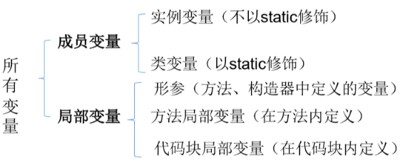
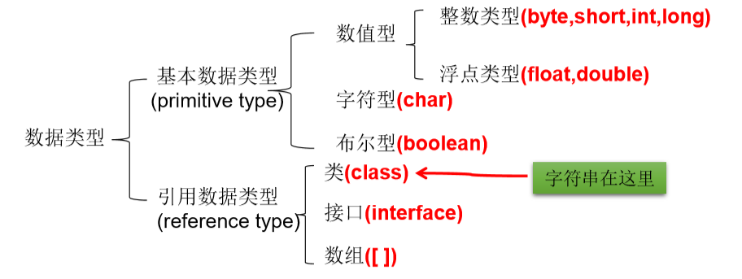
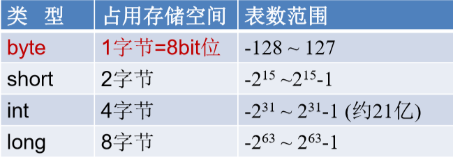
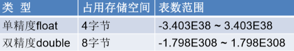
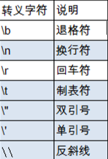
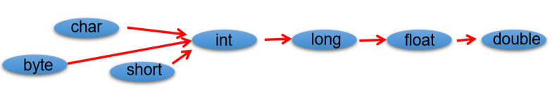

## 一、关键字&保留字
1、关键字(keyword)
定义：被Java语言赋予了特殊含义，用做专门用途的字符串（单词）
特点：关键字中所有字母都为小写

2、保留字(reserved word)
Java保留字：现有Java版本尚未使用，但以后版本可能会作为关键字使用。自己命名标识符时要避免使用这些保留字 goto 、const

## 二、标识符Identifier
1、定义： 对各种变量、方法和类等要素命名时使用的字符序列称为标识符
2、命名规则
由26个英文字母大小写，0-9 ，\_或 \$ 组成
数字不可以开头。
不可以使用关键字和保留字，但能包含关键字和保留字。
Java中严格区分大小写，长度无限制。
标识符不能包含空格

3、命名规范
包名：多单词组成时所有字母**都小写**：xxxyyyzzz
类名、接口名：多单词组成时，所有单词的**首字母大写**：XxxYyyZzz
变量名、方法名：多单词组成时，第一个单词首字母小写，第二个单词开始每个 单词首字母大写：**xxxYyyZzz**
常量名：所有字母**都大写**。多单词时每个单词用下划线连接：XXX_YYY_ZZZ

java采用unicode字符集，因此标识符也可以使用汉字声明，但是不建议使用。

## 三、变量
### 1、概念
内存中的一个存储区域，该区域的数据可以在同一类型范围内不断变化
变量是程序中最基本的存储单元。包含变量类型、变量名和存储的值
### 2、作用
用于在内存中保存数据
### 3、声明
<table>
<colgroup>
<col style="width: 100%" />
</colgroup>
<thead>
<tr class="header">
<th>
(1)&lt;数据类型&gt; &lt;变量名&gt; = &lt;初始化值&gt;;

(2)&lt;数据类型&gt; &lt;变量名称&gt;;

&lt;变量名称&gt; = &lt;值&gt;;
</th>
</tr>
</thead>
<tbody>
</tbody>
</table>
注意：
Java中每个变量必须**先声明，后使用**
使用变量名来访问这块区域的数据
变量的作用域：其**定义所在的一对{ }**内,变量只有在其作用域内才有效
同一个作用域内，不能定义重名的变量
### 4、变量的分类
#### *按声明的位置的不同*
同：都有生命周期 异：局部变量除形参外，需显式初始化。

#### *按分配空间*
对于每一种数据都定义了明确的具体数据类型（强类型语言），在内存中分 配了不同大小的内存空间。

##### 基本数据类型
###### *（1）整数类型*
| 整数类型：byte、short、int、long |
|----------------------------------|
java的**整型常量默认为 int 型**，声明**long型常量须后加‘l’或‘L’**
java程序中变量通常声明为int型，除非不足以表示较大的数，才使用long

###### *（2）浮点类型*
| 浮点类型：float、double |
|-------------------------|
浮点型常量有两种表示形式：
<table>
<colgroup>
<col style="width: 100%" />
</colgroup>
<thead>
<tr class="header">
<th>
十进制数形式：如：5.12 512.0f .512 (必须有小数点）

科学计数法形式:如：5.12e2 512E2 100E-2
</th>
</tr>
</thead>
<tbody>
</tbody>
</table>
<table>
<colgroup>
<col style="width: 100%" />
</colgroup>
<thead>
<tr class="header">
<th>
float:单精度，尾数可以精确到7位有效数字。很多情况下，精度很难满足需求。

double:双精度，精度是float的两倍。通常采用此类型。
</th>
</tr>
</thead>
<tbody>
</tbody>
</table>
Java 的浮点型常量**默认为double型**，声明**float型常量，须后加‘f’或‘F**’。

<table>
<colgroup>
<col style="width: 100%" />
</colgroup>
<thead>
<tr class="header">
<th>
class VariableTest4 {

public static void main(String[] args) {

//1.编码情况1：

long l = 123213;//这是int自动转型long

System.out.println(l);

//编译失败：过大的整数

//long l1 = 21332423235234123;

long l1 = 21332423235234123L;

<blockquote>

//****************

//编译失败

//float f1 = 12.3;

float f1 = (float)12.3;

//2.编码情况2：

//整型常量，默认类型为int型

//浮点型常量，默认类型为double型

byte b = 12;

//byte b1 = b + 1;//编译失败

//float f1 = b + 12.3;//编译失败

</blockquote>

}

}
</th>
</tr>
</thead>
<tbody>
</tbody>
</table>
###### *(3)字符类型char*
字符型变量的三种表现形式：
<table>
<colgroup>
<col style="width: 47%" />
<col style="width: 52%" />
</colgroup>
<thead>
<tr class="header">
<th>字符常量是用单引号(‘ ’)括起来的单个字符。</th>
<th>例如：char c1 = 'a'; char c2 = '中'; char c3 = '9';</th>
</tr>
</thead>
<tbody>
<tr class="odd">
<td>Java中还允许使用转义字符‘\’来将其后的字符转变为特殊字符型常量</td>
<td>例如：char c3 = ‘\n’; // '\n'表示换行符</td>
</tr>
<tr class="even">
<td>
直接使用 Unicode 值来表示字符型常量：‘\uXXXX’。

其中，XXXX代表 一个十六进制整数
</td>
<td>如：\u000a 表示 \n。 lchar类型是可以进行运算的。因为它都对应有Unicode码。</td>
</tr>
</tbody>
</table>
转义字符

###### *（4）布尔类型*
boolean 类型用来判断逻辑条件，一般用于程序流程控制。
**boolean类型数据只允许取值true和false，无null。**

##### 引用数据类型
###### *(1)字符串类型*
String类型变量的使用
1\. String属于引用数据类型
2\. 声明String类型变量时，使用一对**""**
3\. String可以和8种基本数据类型变量做运算，且运算只能是连接运算：+
4\. 运算的结果仍然是String类型
<table>
<colgroup>
<col style="width: 100%" />
</colgroup>
<thead>
<tr class="header">
<th>
String str1=4;//no

String str2 = 3.5f + ""; //yes

System.out.println(str2); //"3.5"

System.out .println(3+4+“Hello!”); //7Hello!

System.out.println(“Hello!”+3+4); //Hello!34

System.out.println(‘a’+1+“Hello!”); //98Hello!

System.out.println(“Hello”+‘a’+1); //Helloa1
</th>
</tr>
</thead>
<tbody>
</tbody>
</table>
### 5、基本数据类型转换
#### *（1）自动类型转换*
容量小的类型自动转换为容量大的数据类型。数据类型按容 量大小排序为：

容量指范围
1）有多种类型的数据混合运算时，系统首先自动将所有数据转换成**容量最大的** 那种数据类型，然后再进行计算。
2）byte,short,char之间不会相互转换，他们三者在计算时首先转换为int类型。
3）boolean类型不能与其它数据类型运算。

#### *（2）强制类型转换*
1）将容量大的数据类型转换为容量小的数据类型。加上强制转换符：**()**，但可能造成精度降低或溢出,格外要注意。
2）通常，字符串不能直接转换为基本类型，但通过基本类型对应的包装类则可以实现把字符串转换成基本类型。
<table>
<colgroup>
<col style="width: 100%" />
</colgroup>
<thead>
<tr class="header">
<th>
String a = “43”;

int i =Integer.parseInt(a);
</th>
</tr>
</thead>
<tbody>
</tbody>
</table>
3)boolean类型不可以转换为其它的数据类型。
4）练习
<table>
<colgroup>
<col style="width: 100%" />
</colgroup>
<thead>
<tr class="header">
<th>
1）

short s = 5;

s = s-2;//no

2）

byte b = 3;

b = b + 4; //no

b = (byte)(b+4); //yes

3）

char c = ‘a’;

int i = 5;

float d = .314F;

double result = c+i+d;//yes

4）

byte b = 5;

short s = 3;

short t = s + b; //no
</th>
</tr>
</thead>
<tbody>
</tbody>
</table>

