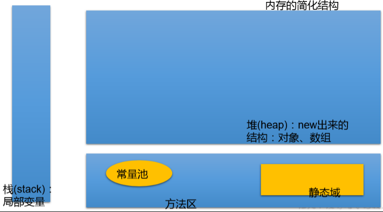
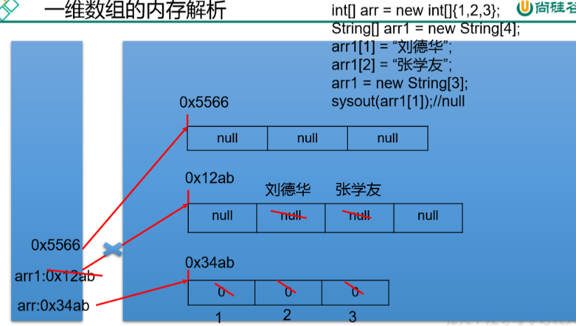
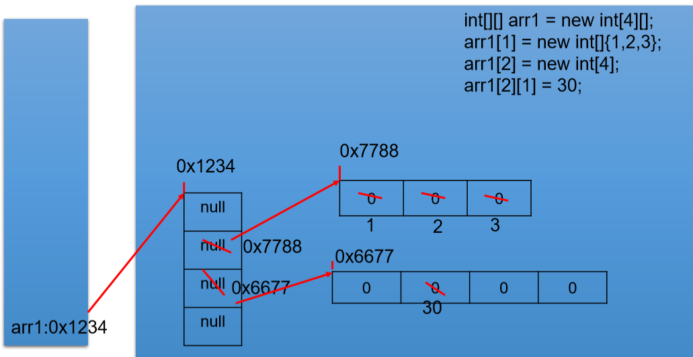
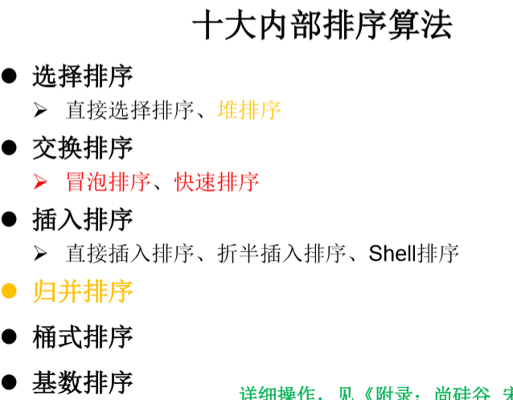

## 一、数组的概述
### 1、概述
是多个相同类型数据按一定顺序排列 的集合
### 2、特点
（1）数组是有序排列的
（2）数组本身是**引用数据类型**，而**数组中的元素可以是任何数据类型**，包括 基本数据类型和引用数据类型。
（3）创建数组对象会在内存中开辟一整块连续的空间，而数组名中引用的是 这块连续空间的首地址。
（4）**数组的长度一旦确定，就不能修改**。
### 3、分类
| 按照维度 | 按照元素的数据类型分   |
|----------|------------------------|
| 一维数组 | 基本数据类型元素的数组 |
| 二维数组 | 引用数据类型元素的数组 |
| …        |                       |

## 二、一维数组
### 1、 声明和初始化
Java中使用**关键字new**来创建数组
<table>
<colgroup>
<col style="width: 100%" />
</colgroup>
<thead>
<tr class="header">
<th>
int[] ids;//声明

//1.1 静态初始化:数组的初始化和数组元素的赋值操作同时进行

ids = new int[]{1001,1002,1003,1004};

ids1 = {1001,1002,1003,1004};

//1.2动态初始化:数组的初始化和数组元素的赋值操作分开进行

String[] names = new String[5];

//总结：数组一旦初始化完成，其长度就确定了
</th>
</tr>
</thead>
<tbody>
</tbody>
</table>
### 2、调用数组的指定位置的元素
<table>
<colgroup>
<col style="width: 100%" />
</colgroup>
<thead>
<tr class="header">
<th>
//2.如何调用数组的指定位置的元素:通过角标的方式调用。

//数组的角标（或索引）从0开始的，到数组的长度-1结束。

names[0] = "王铭";

names[1] = "王赫";

names[2] = "张学良";

names[3] = "孙居龙";

names[4] = "王宏志";

//names[5] = "周扬";//报错
</th>
</tr>
</thead>
<tbody>
</tbody>
</table>
### 3、数组的长度
<table>
<colgroup>
<col style="width: 100%" />
</colgroup>
<thead>
<tr class="header">
<th>
//属性:length

System.out.println(names.length);//5
</th>
</tr>
</thead>
<tbody>
</tbody>
</table>
### 4、遍历
<table>
<colgroup>
<col style="width: 100%" />
</colgroup>
<thead>
<tr class="header">
<th>
for(int i = 0;i &lt; names.length;i++){

System.out.println(names[i]);

}
</th>
</tr>
</thead>
<tbody>
</tbody>
</table>
### 5、数组元素的默认初始化值 
| 整型         | 0                    |
|--------------|----------------------|
| 浮点型       | 0.0                  |
| char型       | 0或'\u0000'，而非'0' |
| Boolean      | false                |
| 引用数据类型 | null                 |
### 
### 6、数组的内存解析 
内存结构

## 三、多维数组
### 1、概述
对于二维数组的理解，我们可以看成是一维数组array1又作为另一个一维数组array2的元素而存在。
其实，从数组底层的运行机制来看，其实没有多维数组。
### 2. 二维数组的使用
#### *①声明和初始化*
<table>
<colgroup>
<col style="width: 100%" />
</colgroup>
<thead>
<tr class="header">
<th>
//1.二维数组的声明和初始化

int[] arr = new int[]{1,2,3};//一维数组

//静态初始化

int[][] arr1 = new int[][]{{1,2,3},{4,5},{6,7,8}};

//动态初始化1

String[][] arr2 = new String[3][2];

//动态初始化2

String[][] arr3 = new String[3][];//具体可以以后定

//也是正确的写法：

int[] arr4[] = new int[][]{{1,2,3},{4,5,9,10},{6,7,8}};

int[] arr5[]={{1,2,3},{4,5},{6,7,8}};
</th>
</tr>
</thead>
<tbody>
</tbody>
</table>
#### *② 调用数组的指定位置的元素*
<table>
<colgroup>
<col style="width: 100%" />
</colgroup>
<thead>
<tr class="header">
<th>
//2.如何调用数组的指定位置的元素

System.out.println(arr1[0][1]);//2

System.out.println(arr2[1][1]);//null

arr3[1] = new String[4];

System.out.println(arr3[1][0]);//null
</th>
</tr>
</thead>
<tbody>
</tbody>
</table>
#### *③ 数组的长度*
<table>
<colgroup>
<col style="width: 100%" />
</colgroup>
<thead>
<tr class="header">
<th>
System.out.println(arr4.length);//3

System.out.println(arr4[0].length);//3
</th>
</tr>
</thead>
<tbody>
</tbody>
</table>
#### *④遍历数组*
<table>
<colgroup>
<col style="width: 100%" />
</colgroup>
<thead>
<tr class="header">
<th>
for(int i = 0;i &lt; arr4.length;i++){

for(int j = 0;j &lt; arr4[i].length;j++){

System.out.print(arr4[i][j] + " ");

}

System.out.println();

}
</th>
</tr>
</thead>
<tbody>
</tbody>
</table>

#### *⑤ 数组元素的默认初始化值* 
<table>
<colgroup>
<col style="width: 100%" />
</colgroup>
<thead>
<tr class="header">
<th>
针对于初始化方式一：比如：int[][] arr = new int[4][3];

外层元素的初始化值为：地址值

内层元素的初始化值为：与一维数组初始化情况相同
</th>
</tr>
</thead>
<tbody>
<tr class="odd">
<td>
针对于初始化方式二：比如：int[][] arr = new int[4][];

外层元素的初始化值为：null

内层元素的初始化值为：不能调用，否则报错。
</td>
</tr>
</tbody>
</table>

<table>
<colgroup>
<col style="width: 100%" />
</colgroup>
<thead>
<tr class="header">
<th>
int[][] arr = new int[4][3];

System.out.println(arr[0]);//[I@15db9742

// [-一维数组; I--int类型；

System.out.println(arr[0][0]);//0

System.out.println(arr);//[[I@6d06d69c

String[][] arr2 = new String[4][2];

System.out.println(arr2[1]);//地址值

System.out.println(arr2[1][1]);//null

double[][] arr3 = new double[4][];

System.out.println(arr3[1]);//null

System.out.println(arr3[1][0]);//报错
</th>
</tr>
</thead>
<tbody>
</tbody>
</table>
####  *⑥ 数组的内存解析* 

## 
### 3、练习
（1）int\[\] x,y\[\]; //x是一维数组，y是二维数组
一维数组：int\[\] x 或者int x\[\] 二维数组：int\[\]\[\] y 或者 int\[\] y\[\] 或者 int y\[\]\[\]
（2）创建一个长度为6的int型数组，要求数组元素的值都在1-30之间，且是随机赋值。同时，要求 元素的值各不相
<table>
<colgroup>
<col style="width: 100%" />
</colgroup>
<thead>
<tr class="header">
<th>
创建一个长度为6的int型数组，要求数组元素的值都在1-30之间，且是随机赋值。同时，要求 元素的值各不相同

[0,90) + 10 [10,100)

[10,99] (int)(Math.random() * 90 + 10)

package basic.arraydemo;

public class ArrayTestDemo {

public static void main(String[] args) {

// TODO Auto-generated method stub

//方法一

int []arr=new int[10];

for(int i=0;i&lt;arr.length;i++) {

arr[i]=(int)(Math.random()*30+1);

boolean flag=true;

while(true) {

for(int j=0;j&lt;i;j++) {

if(arr[i]==arr[j]) {

flag=true;

break;

}

}

if(flag) {

arr[i]=(int)(Math.random()*30+1);

flag=false;

continue;

}

break;

}

}

for (int i = 0; i &lt; arr.length; i++) {

System.out.print(arr[i]+" ");

}

// 方法二

int[] arr1 = new int[6];

for(int i=0;i&lt;arr1.length;i++) {

arr1[i]=(int)(Math.random()*30+1);

for(int j=0;j&lt;i;j++) {

if(arr[i]==arr[j]) {

i--;

break;

}

}

}

for (int i = 0; i &lt; arr1.length; i++) {

System.out.print(arr1[i]+" ");

}

}

}
</th>
</tr>
</thead>
<tbody>
</tbody>
</table>
（3）
<table>
<colgroup>
<col style="width: 100%" />
</colgroup>
<thead>
<tr class="header">
<th>

package basic.arraydemo;

public class ArrayTestDemo1 {

public static void main(String[] args) {

// TODO Auto-generated method stub

int[] array1,array2;

array1 = new int[]{2,3,5,7,11,13,17,19};

//显示array1的内容

for(int i = 0;i &lt; array1.length;i++){

System.out.print(array1[i] + "\t");

}

//赋值array2变量等于array1

array2 = array1;

//修改array2中的偶索引元素，使其等于索引值(如array[0]=0,array[2]=2)

for(int i = 0;i &lt; array2.length;i++){

if(i % 2 == 0){

array2[i] = i;

}

}

System.out.println();

//打印出array1

for(int i = 0;i &lt; array1.length;i++){

System.out.print(array1[i] + "\t");

}

}

}

Console

2 3 5 7 11 13 17 19

0 3 2 7 4 13 6 19
</th>
</tr>
</thead>
<tbody>
</tbody>
</table>

## 四、常见算法
### 1.数组元素的赋值(杨辉三角、回形数等)
<table>
<colgroup>
<col style="width: 100%" />
</colgroup>
<thead>
<tr class="header">
<th>使用二维数组打印一个 10 行杨辉三角。</th>
</tr>
</thead>
<tbody>
<tr class="odd">
<td>
1

11

121

1331

14641

15101051

1615201561

172135352171

18285670562881

193684126126843691
</td>
</tr>
</tbody>
</table>
<table>
<colgroup>
<col style="width: 100%" />
</colgroup>
<thead>
<tr class="header">
<th>
package basic.arraydemo;

public class ArrayTestDemo {

public static void main(String[] args) {

// TODO Auto-generated method stub

int [][]yangHui=new int[10][];

for(int i=0;i&lt;yangHui.length;i++) {

yangHui[i]=new int[i+1];

//给首末元素赋值

yangHui[i][0]=yangHui[i][i]=1;

for(int j = 1;j &lt; yangHui[i].length - 1;j++){

yangHui[i][j] = yangHui[i-1][j-1] + yangHui[i-1][j];

}

}

for(int i=0;i&lt;yangHui.length;i++) {

for(int j=0;j&lt;yangHui[i].length;j++) {

System.out.print(yangHui[i][j]+"\t");

}

System.out.println();

}

}

}
</th>
</tr>
</thead>
<tbody>
</tbody>
</table>
### 2. 求数值型数组中元素的最大值、最小值、平均数、总和等
<table>
<colgroup>
<col style="width: 100%" />
</colgroup>
<thead>
<tr class="header">
<th>
package basic.arraydemo;

public class ArrayTestDemo1 {

public static void main(String[] args) {

// TODO Auto-generated method stub

int[] arr= new int[]{2,3,5,7,11,13,17,19};

for(int i=0;i&lt;arr.length;i++) {

System.out.print(arr[i]+" " );

}

System.out.println();

//最大值

int max=arr[0];

for(int i=1;i&lt;arr.length;i++) {

if(arr[i]&gt;max) {

max=arr[i];

}

}

System.out.println("Max: "+max );

//总和

int sum=0;

for(int i=0;i&lt;arr.length;i++) {

sum=sum+arr[0];

}

//平均数

double avg=(sum+0.0)/arr.length;

System.out.println("Sum: "+sum );

System.out.println("Avg: "+avg );

}

}
</th>
</tr>
</thead>
<tbody>
</tbody>
</table>
### 3. 数组的复制、反转、查找(线性查找、二分法查找)
数组的复制、反转
<table>
<colgroup>
<col style="width: 100%" />
</colgroup>
<thead>
<tr class="header">
<th>
package basic.arraydemo;

public class ArrayTestDemo2 {

public static void main(String[] args) {

// TODO Auto-generated method stub

//算法的考查：数组的复制、反转、查找(线性查找、二分法查找)

String[] arr = new String[]{"JJ","DD","MM","BB","GG","AA"};

//数组的复制(区别于数组变量的赋值：arr1 = arr)

String[] arr1 = new String[arr.length];

for(int i = 0;i &lt; arr1.length;i++){

arr1[i] = arr[i];

}

for(int i=0;i&lt;arr1.length;i++) {

System.out.print(arr1[i]+" " );

}

System.out.println("----------------------");

//反转

//方法一

for(int i=0;i&lt;arr.length/2;i++) {

String temp=arr[i];

arr[i]=arr[arr.length-1-i];

arr[arr.length-1-i]=temp;

}

//方法二

for(int i=0,j=arr.length-1;i&lt;j;j--,i++) {

String temp=arr[i];

arr[i]=arr[j];

arr[j]=temp;

}

System.out.println("反转后：");

for(int i=0;i&lt;arr.length;i++) {

System.out.print(arr[i]+" " );

}

}

}
</th>
</tr>
</thead>
<tbody>
</tbody>
</table>
查找
线性查找
<table>
<colgroup>
<col style="width: 100%" />
</colgroup>
<thead>
<tr class="header">
<th>
package basic.arraydemo;

public class ArrayTestDemo2 {

public static void main(String[] args) {

String[] arr = new String[]{"JJ","DD","MM","BB","GG","AA"};

//线性查找：

String key="BB";

boolean isFlag=true;

for(int i=0;i&lt;arr.length;i++) {

if(key.equals(arr[i])) {

System.out.println("找到了指定的元素，位置为：" + i);

isFlag = false;

break;

}

}

if(isFlag) {

System.out.println("没有找到");

}

}

}
</th>
</tr>
</thead>
<tbody>
</tbody>
</table>
二分法查找
**前提：所要查找的数组必须有序**。

<table>
<colgroup>
<col style="width: 100%" />
</colgroup>
<thead>
<tr class="header">
<th>
int[] arr2 = new int[]{-98,-34,2,34,54,66,75,105,210,333};

int key=75;

int head=0;

int end=arr2.length-1;

boolean isFlag=true;

while(head&lt;=end) {

int middle=(head+end)/2;

if(arr2[middle]==key) {

System.out.println("找到了指定的元素，位置为：" + middle);

isFlag = false;

break;

}else if(arr2[middle]&gt;key) {

end = middle - 1;

}else {

head = middle + 1;

}

}

if(isFlag){

System.out.println("很遗憾，没有找到的啦！");

}
</th>
</tr>
</thead>
<tbody>
</tbody>
</table>
### 4. 数组元素的排序算法（冒泡）

冒泡排序
<table>
<colgroup>
<col style="width: 100%" />
</colgroup>
<thead>
<tr class="header">
<th>
public class BubbleSortTest {

public static void main(String[] args) {

int[] arr = new int[]{43,32,76,-98,0,64,33,-21,32,99};

//冒泡排序

for(int i = 0;i &lt; arr.length - 1;i++){

1

for(int j = 0;j &lt; arr.length - 1 - i;j++){

if(arr[j] &gt; arr[j + 1]){

int temp = arr[j];

arr[j] = arr[j + 1];

arr[j + 1] = temp;

}

}

}1

for(int i = 0;i &lt; arr.length;i++){

System.out.print(arr[i] + "\t");

}

}

}
</th>
</tr>
</thead>
<tbody>
</tbody>
</table>

快速排序
<table>
<colgroup>
<col style="width: 100%" />
</colgroup>
<thead>
<tr class="header">
<th>

public class QuickSort {

private static void swap(int[] data, int i, int j) {

int temp = data[i];

data[i] = data[j];

data[j] = temp;

}

private static void subSort(int[] data, int start, int end) {

if (start &lt; end) {

int base = data[start];

int low = start;

int high = end + 1;

while (true) {

while (low &lt; end &amp;&amp; data[++low] - base &lt;= 0)

;

while (high &gt; start &amp;&amp; data[--high] - base &gt;= 0)

;

if (low &lt; high) {

swap(data, low, high);

} else {

break;

}

}

swap(data, start, high);

subSort(data, start, high - 1);//递归调用

subSort(data, high + 1, end);

}

}

public static void quickSort(int[] data){

subSort(data,0,data.length-1);

}

}
</th>
</tr>
</thead>
<tbody>
</tbody>
</table>
## 五、Arrays工具类
java.util.Arrays:操作数组的工具类，里面定义了很多操作数组的方法
<table>
<colgroup>
<col style="width: 100%" />
</colgroup>
<thead>
<tr class="header">
<th>
package basic.arraydemo;

import java.util.Arrays;

public class ArrayTestDemo3 {

public static void main(String[] args) {

// TODO Auto-generated method stub

//1.boolean equals(int[] a,int[] b):判断两个数组是否相等。

int[] arr1 = new int[]{1,2,3,4};

int[] arr2 = new int[]{1,3,2,4};

boolean isEquals = Arrays.equals(arr1, arr2);

System.out.println(isEquals);

//2.String toString(int[] a):输出数组信息。

System.out.println(Arrays.toString(arr1));

//3.void fill(int[] a,int val):将指定值填充到数组之中。

Arrays.fill(arr1, 10);

System.out.println(Arrays.toString(arr1));

//4.void sort(int[] a):对数组进行排序。

Arrays.sort(arr2);

System.out.println(Arrays.toString(arr2));

//5.int binarySearch(int[] a,int key)

int[] arr3 = new int[]{-98,-34,2,34,54,66,79,105,210,333};

int index = Arrays.binarySearch(arr3,-33);

if(index &gt;= 0){

System.out.println(index);

}else{

System.out.println(index);//-3==-2-1=-index-1

System.out.println("未找到");

}

}

}

Console

[10, 10, 10, 10]

[1, 2, 3, 4]

-3

未找到
</th>
</tr>
</thead>
<tbody>
</tbody>
</table>
Arrays.copyOf复制数组
## 六、常见异常
数组中的常见异常：
1\. 数组角标越界的异常：ArrayIndexOutOfBoundsExcetion
2\. 空指针异常：NullPointerException
<table>
<colgroup>
<col style="width: 100%" />
</colgroup>
<thead>
<tr class="header">
<th>
public class ArrayExceptionTest {

public static void main(String[] args) {

//1. 数组角标越界的异常：ArrayIndexOutOfBoundsExcetion

int[] arr = new int[]{1,2,3,4,5};

//for(int i = 0;i &lt;= arr.length;i++){

//System.out.println(arr[i]);

//}

//System.out.println(arr[-2]);

//System.out.println("hello");

//2.2. 空指针异常：NullPointerException

//情况一：

//int[] arr1 = new int[]{1,2,3};

//arr1 = null;

//System.out.println(arr1[0]);

//情况二：

//int[][] arr2 = new int[4][];

//System.out.println(arr2[0][0]);

//情况三：

String[] arr3 = new String[]{"AA","BB","CC"};

arr3[0] = null;

System.out.println(arr3[0].toString());

}

}
</th>
</tr>
</thead>
<tbody>
</tbody>
</table>
