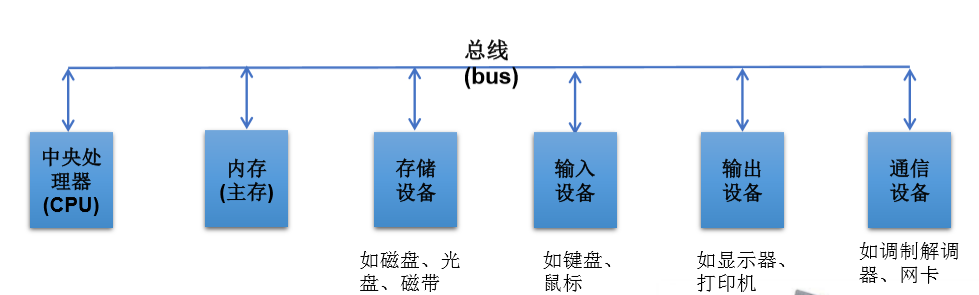
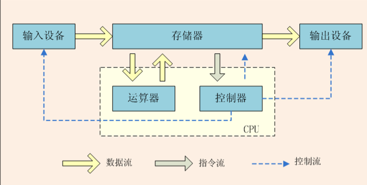
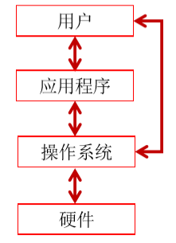
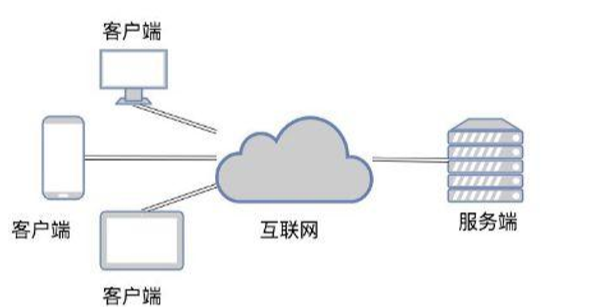
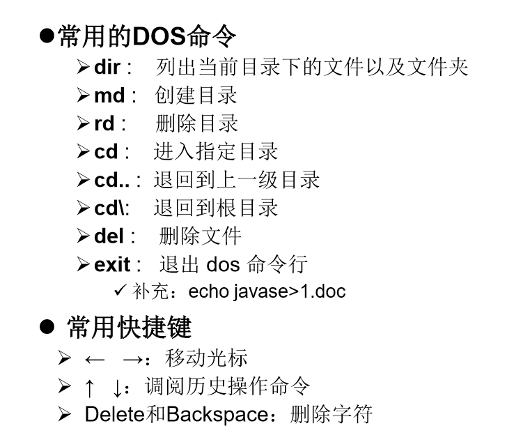

## 一、计算机概述
计算机包括硬件(hardware)和软件(software)两部分。

## 二、计算机硬件介绍

冯·诺依曼体系结构是现代计算机的基础，**冯·诺依曼**被称为“计算机之父”。

### 1、中央处理器
中央处理器(Central Processing Unit,CPU)从内存中获取指令，然后执行这些指令。
（1）控制单元(control unit)和算术/逻辑单元(arithmetic/login unit)。
控制单元：用于控制和协调其他组件的动作。 算术/逻辑单元：用于完成数值运算(+、-、\*、/)和逻辑运算(比较)。
（2） 每台计算机都有一个内部时钟，该时钟以固定速度发射电子脉冲。时钟速度越快，在给定的时间段内执行的指令就越多。速度的计量单位是赫兹(Hz)，1Hz相当于每秒1个脉 冲。随着CPU速度不断提高，目前以千兆赫(GHz)来表述。
（3） 最初一个CPU只有一个核(core)。核是处理器中实现指令读取和执行的部分。一个多核 CPU是一个具有两个或者更多独立核的组件。可提高CPU的处理能力。
### 
### 2、内存
内存(Random-Access Memory,**RAM**)：由一个有序的字节序列组成，用于存储程序及程序需要的数据。
（1） 每个字节都有一个唯一的地址。
（2）一个计算机具有的RAM越多，它的运行速度越快，但是此规律是有限制的。
（3） 计算机中是最基本的存储单元是字节(byte) 。每个字节由8个bit（比特）构成。
（4）**计算机的存储能力是以字节和多字节来衡量的**。

千字节(kilobyte,KB) = 1024B
兆字节(megabyte,MB) = 1024KB
千兆字节(gigabyte,GB) = 1024MB
万亿字节(terabyte,TB) = 1024GB

### 3、存储设备
光盘驱动器(CD和DVD) CD的容量可达700MB。 DVD的容量可达4.7GB。
USB闪存驱动器 USB: Universal Serial Bus，通用串行总线。
可以使用USB将打印机、数码相机、鼠标、外部硬盘驱动器连接到计算机上。 USB闪存驱动器很小，可用于存储和传输数据的设备。
### 
### 4、输入和输出
常见的输入设备：键盘（keyboard）和鼠标（mouse）
常见的输出设备：显示器（monitor）和打印机（printer）
显示器屏幕分辨率：是指显示设备水平和垂直方向上显示的像素(px)数。 **分辨率越高，图像越锐化、越清晰**。
### 
### 5、通信设备
常见的设备有：拨号调制解调器：使用的是电话线，传输速度可达56 000bps(bps:每秒比特)
DSL（数字用户线）：使用的也是电话线，但传输速度叫上面的快20倍
电缆调制解调器：利用有线电视电缆进行数据传输，通常速度比DSL快。
网络接口卡（NIC）：将计算机接入局域网（LAN）的设备。局域网通常用于大学、 商业组织和政府组织。速度甚至可达1000Mbps
无线网络：在家庭、商业和学校中极其常见。计算机可通过无线适配器连接到局域 网或internet上。
## 
## 三、操作系统和万维网
### 1、操作系统
操作系统(Operating System)是运行在计算机上的最重要的程序，它可以管理和控制计算机的活动.

## 
## 2、万维网

万维网是无数个网络站点和网页的集合，它们在一起构成了因特网Internet最 主要的部分（因特网也包括电子邮件、Usenet以及新闻组）。它实际上是多 媒体的集合，是由超级链接连接而成的。我们通常通过网络浏览器上网观看的， 就是万维网的内容。
## 
## 四、软件
软件开发 软件，即一系列按照特定顺序组织的计算机数据和指令的集合。有系统软件和应用软件之分。
1、图形化界面(Graphical User Interface GUI)这种方式简单直观，使用者易于接受，容易上手操作。
2、命令行方式(Command Line Interface CLI)：需要有一个控制台，输入特定的指令，让计算机完成一些操作。较为麻烦，需要记录住一些命令。
3、Pascal之父Nicklaus Wirth： “Algorithms+Data Structures=Programs”
4、计算机语言：人与计算机交流的方式。计算机语言有很多种。如：C ,C++ ,Java ,PHP , Kotlin，Python，Scala等。

## 五、命令行
1、**window+r** cmd 打开
2、常用命令行

