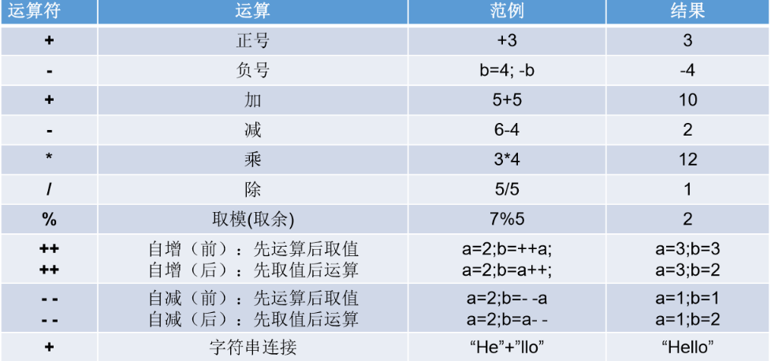
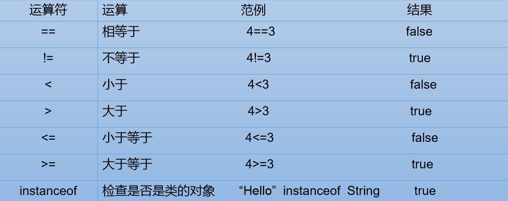
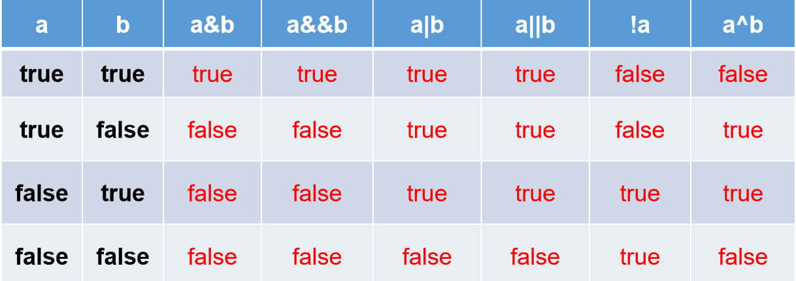
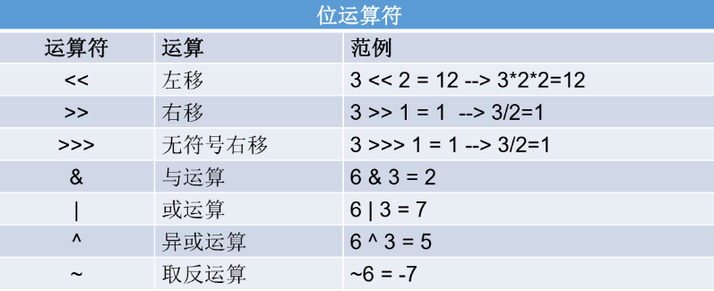
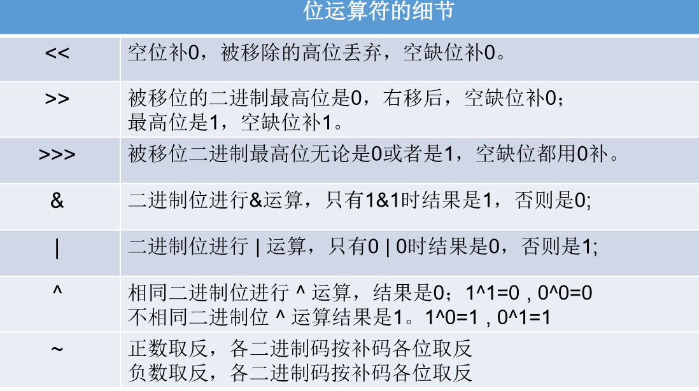
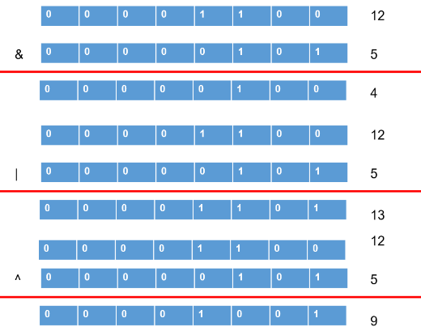
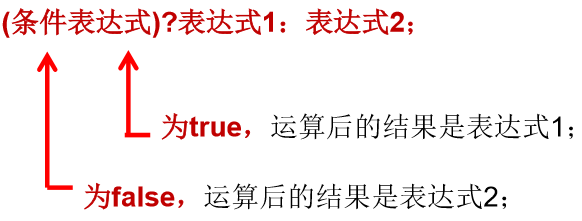
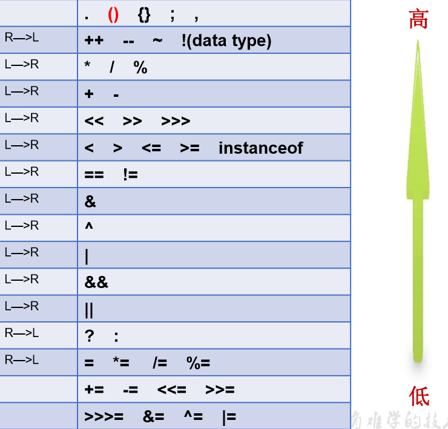

## 一、算术运算符
1，应用

2，注意
1）结果的负号取决于最左边的数，取模运算的结果不一定总是整数。
2）对于除号“/”，它的整数除和小数除是有区别的：整数之间做除法时，只保留整数部分而舍弃小数部分。
3）“+”除字符串相加功能外，还能把非字符串转换成字符串.
| System.out.println(“5+5=”+5+5); //打印结果是？ 5+5=55 ? |
|---------------------------------------------------------|
4）练习
随意给出一个整数，打印显示它的个位数，十位数，百位数的值。
<table>
<colgroup>
<col style="width: 100%" />
</colgroup>
<thead>
<tr class="header">
<th>
int num = 187;

int bai = num / 100;

int shi = num % 100 / 10;

//int shi = num / 10 % 10;

int ge = num % 10;

System.out.println("百位为：" + bai);

System.out.println("十位为：" + shi);

System.out.println("个位为：" + ge
</th>
</tr>
</thead>
<tbody>
</tbody>
</table>
## 二、赋值运算符
1、定义
符号：=
当“=”两侧数据类型不一致时，可以使用自动类型转换或使用强制 类型转换原则进行处理。 并且支持连续赋值。
赋值运算符： +=, -=, \*=, /=, %=（+=：左=左+右，赋值给左边）
2、练习
<table>
<colgroup>
<col style="width: 100%" />
</colgroup>
<thead>
<tr class="header">
<th>
int i2,j2;

//连续赋值

i2 = j2 = 10;

int i3 = 10,j3 = 20;

short s = 3;

s = s+2; //编译失败

s += 2; //不会改变变量本身的数据类型

int i = 1;

i *= 0.1;

System.out.println(i);// 0，注意int类型

i++; System.out.println(i);//1

//开发中，如果希望变量实现+2的操作，有几种方法？(前提：int num = 10;)

//方式一：num = num + 2;(其他类型可能类型不同而编译失败)

//方式二：num += 2; (推荐)

//开发中，如果希望变量实现+1的操作，有几种方法？(前提：int num = 10;)

//方式一：num = num + 1;

//方式二：num += 1;

//方式三：num++; (推荐)
</th>
</tr>
</thead>
<tbody>
</tbody>
</table>

## 三、比较运算符（关系运算符）
1，定义
比较运算符的结果都是boolean型，也就是要么是true，要么是false。

2、练习
<table>
<colgroup>
<col style="width: 100%" />
</colgroup>
<thead>
<tr class="header">
<th>
int i = 10;

int j = 20;

System.out.println(i == j);//false

System.out.println(i = j);//20

boolean b1 = true;

boolean b2 = false;

System.out.println(b2 == b1);//false

System.out.println(b2 = b1);//true
</th>
</tr>
</thead>
<tbody>
</tbody>
</table>

## 四、逻辑运算符
1、定义
| &—逻辑与    | && —短路与   |
|-------------|--------------|
| \| —逻辑或  | \|\| —短路或 |
| ！—逻辑非   |             |
| ^ —逻辑异或 |             |

2、注意
1）逻辑运算符用于连接布尔型表达式，在Java中不可以写成3\<x\<6，应该写 成x\>3 & x\<6 。
2）“&”和“&&”的区别：
单&时，左边无论真假，右边都进行运算；
双&时，如果左边为真，右边参与运算，如果左边为假，那么右边不参与运算。
“\|”和“\|\|”的区别同理，\|\|表示：当左边为真，右边不参与运算。
3、练习
<table>
<colgroup>
<col style="width: 100%" />
</colgroup>
<thead>
<tr class="header">
<th>
class Test {

public static void main (String [] args) {

 boolean x=true;

 boolean y=false;

 short z=42; 6．

 //if(y == true)

 if((z++==42)&amp;&amp;(y=true))z++;

 if((x=false) || (++z==45)) z++;

 System. out.println(“z=”+z);

}

}

//z= 46
</th>
</tr>
</thead>
<tbody>
</tbody>
</table>

<table>
<colgroup>
<col style="width: 100%" />
</colgroup>
<thead>
<tr class="header">
<th>
//区分&amp; 与 &amp;&amp;

//相同点1：&amp; 与 &amp;&amp; 的运算结果相同

//相同点2：当符号左边是true时，二者都会执行符号右边的运算

//不同点：当符号左边是false时，&amp;继续执行符号右边的运算。&amp;&amp;不再执行符号右边的运算。

//开发中，推荐使用&amp;&amp;

boolean b1 = true;

b1 = false;

int num1 = 10;

if(b1 &amp; (num1++ &gt; 0)){

System.out.println("我现在在北京");

}else{

System.out.println("我现在在南京");

}

//我现在在南京

System.out.println("num1 = " + num1);//num1 = 11

boolean b2 = true;

b2 = false;

int num2 = 10;

if(b2 &amp;&amp; (num2++ &gt; 0)){

System.out.println("我现在在北京");

}else{

System.out.println("我现在在南京");

}

</th>
</tr>
</thead>
<tbody>
</tbody>
</table>

## 五、位运算符
1、定义
位运算是直接对整数的二进制进行的运算

左移：乘2的n次幂；右移：除以2的n次幂
对于正数来说，空出来的最高位拿0补
对于负数来说： \>\>右移以后，最高空出来的位拿1去补 \>\>\> 右移以后，高空出来的位拿0去补
2、注意
1）一个数异或另一个数量两次，值不变
m = (m ^ n) ^ n
3、练习
1）

2）
| 最高效方式的计算2 \* 8 ？ 2 \<\< 3 或 8 \<\< 1 |
|------------------------------------------------|
<table>
<colgroup>
<col style="width: 100%" />
</colgroup>
<thead>
<tr class="header">
<th>
//练习：交换两个变量的值

int num1 = 10;

int num2 = 20;

System.out.println("num1 = " + num1 + ",num2 = " + num2);

//方式一：定义临时变量的方式

//推荐的方式

int temp = num1;

num1 = num2;

num2 = temp;

//方式二：好处：不用定义临时变量

//弊端：① 相加操作可能超出存储范围 ② 有局限性：只能适用于数值类型

//num1 = num1 + num2;

//num2 = num1 - num2;

//num1 = num1 - num2;

//方式三：使用位运算符

//有局限性：只能适用于数值类型

//num1 = num1 ^ num2;

//num2 = num1 ^ num2;

//num1 = num1 ^ num2;
</th>
</tr>
</thead>
<tbody>
</tbody>
</table>
## 
## 六、三元运算符
1、定义

2、注意
1）表达式1和表达式2为同种类型
2）三元运算符与if-else：三元运算符要求必须返回一个结果
3、练习
<table>
<colgroup>
<col style="width: 100%" />
</colgroup>
<thead>
<tr class="header">
<th>
//获取三个数的最大值

int n1 = 12;

int n2 = 30;

int n3 = -43;

int max1 = (n1 &gt; n2)? n1 : n2;

int max2 = (max1 &gt; n3)? max1 : n3;

System.out.println("三个数中的最大值为：" + max2);
</th>
</tr>
</thead>
<tbody>
</tbody>
</table>
## 七、优先级

