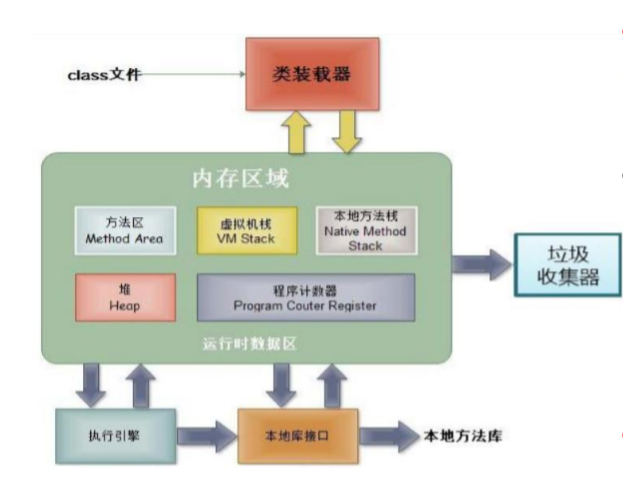

## 内存
### 一、基本了解
1、认识
堆（Heap）：此内存区域的唯一目的 **就是存放对象实例**，几乎所有的对象 实例都在这里分配内存。这一点在 Java虚拟机规范中的描述是：所有的 对象实例以及数组都要在堆上分配。
栈（Stack）：是指虚拟机栈。虚拟机栈用于存储**局部变量**等。 局部变量表存放了编译期可知长度的 各种基本数据类型（boolean、byte、 char 、 short 、 int 、 float 、 long 、 double）、对象引用（reference类型， 它不等同于对象本身，是对象在堆内 存的首地址）。 方法执行完，自动释 放。
方法区（Method Area），用于存储已 被虚拟机加载的类信息、常量、静态 变量、即时编译器编译后的代码等数 据。
**引用类型的变量，只可能存储两类值：null 或 地址值（含变量的类型）**

