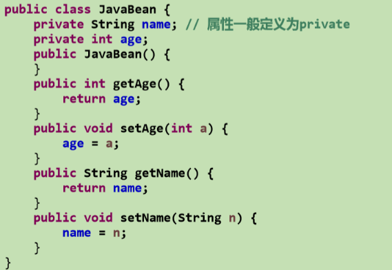
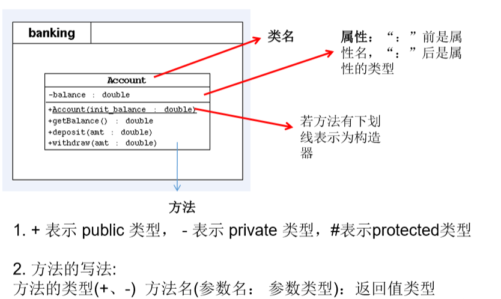

## 构造器
### 一、构造器
1、构造器的特征

它具有与**类相同的名称，** **不声明返回值类型**。（与声明为void不同）

**不能被static、final、synchronized、abstract、native修饰**，

不能有 return语句返回值

2、构造器的作用：创建对象；给对象进行初始化

3、格式
<table>
<colgroup>
<col style="width: 100%" />
</colgroup>
<thead>
<tr class="header">
<th>
修饰符 类名 (参数列表) {

初始化语句；

}
</th>
</tr>
</thead>
<tbody>
</tbody>
</table>
4、分类

根据参数不同，构造器可以分为如下两类：

隐式无参构造器（系统默认提供） ；显式定义一个或多个构造器（无参、有参）

注 意：

（1）Java语言中，每个类都至少有一个构造器

（2）默认构造器的修饰符与所属类的修饰符一致

（3）一旦显式定义了构造器，则系统不再提供默认构造器

（4）一个类可以创建多个重载的构造器

（5）父类的构造器不可被子类继承

5、构造器重载，参数列表必须不同

### 二、属性赋值过程
赋值的位置： ① 默认初始化 ② 显式初始化 ③ 构造器中初始化 ④ 通过“对象.属性“或“对象.方法”的方式赋值

赋值的先后顺序： ① - ② - ③ - ④
### 
### 三、JavaBean
JavaBean是一种Java语言写成的可重用组件。

所谓javaBean，是指符合如下标准的Java类：

类是公共的

有一个无参的公共的构造器

有属性，且有对应的get、set方法

### 四、UML类图

