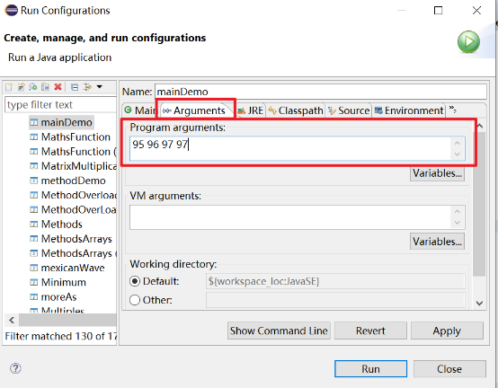
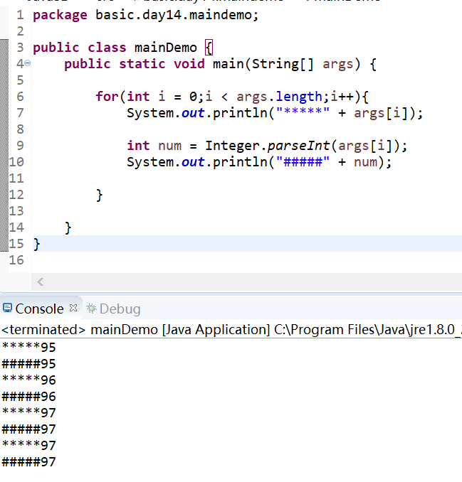
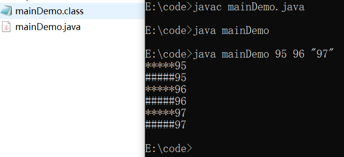

# main方法的语法
2020年8月11日
9:11

## 一、main()方法的使用说明：
1\. main()方法作为程序的入口
2\. main()方法也是一个普通的静态方法

<table>
<colgroup>
<col style="width: 100%" />
</colgroup>
<thead>
<tr class="header">
<th>
public class MainTest {

public static void main(String[] args) {//入口

Main.main(new String[100]);

MainTest test = new MainTest();

test.show();

}

public void show(){

}

}

class Main{

public static void main(String[] args) {

for(int i = 0;i &lt; args.length;i++){

args[i] = "args_" + i;

System.out.println(args[i]);

}

}

}
</th>
</tr>
</thead>
<tbody>
</tbody>
</table>

3\. main()方法可以作为我们与控制台交互的方式。（之前：使用Scanner）
-在eclipse中
1，先运行一次，生成字节码

2，

3，

4，

-命令行（记得去掉包名）

