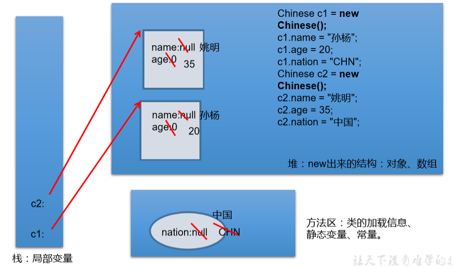

# 关键字static
2020年8月11日
9:11

## 一、static关键字的使用
1.static:静态的
2.static可以用来修饰：**属性、方法、代码块、内部类**
3.使用static修饰属性：静态变量（或类变量）
3.1 属性，按是否使用static修饰，又分为：静态属性 vs 非静态属性(实例变量)

**实例变量**：创建了类的多个对象，**每个对象都独立的拥有一套类中的非静态属性**。当修改其中一个对象中的非静态属性时，不会导致其他对象中同样的属性值的修改。

**静态变量**：创建了类的多个对象，**多个对象共享同一个静态变量**。当通过某一个对象修改静态变量时，会导致其他对象调用此静态变量时，是修改过了的。

3.2 static修饰属性的其他说明：

① **静态变量随着类的加载而加载**。可以通过"**==类.静态变量"==**的方式进行调用

② **静态变量的加载要早于对象的创建**。

③ 由于类只会加载一次，则**静态变量在内存中也只会存在一份**：存在**方法区的静态域**中。

④
|     | 类变量 | 实例变量 |
|------|--------|----------|
| 类   | yes    | no       |
| 对象 | yes    | yes      |
3.3 静态属性举例：System.out; Math.PI;
4，内存

## 二、静态方法
1、 随着类的加载而加载，可以通过"**==类.静态方法==**"的方式进行调用
2、
|     | 静态方法 | 非具体方法 |
|------|----------|------------|
| 类   | yes      | no         |
| 对象 | yes      | yes        |
3、
| 静态方法中   | **只能调用静态的方法或属性**                             |
|--------------|----------------------------------------------------------|
| 非静态方法中 | 既可以调用非静态的方法或属性，也可以调用静态的方法或属性 |
## 三、 static注意点
1 在**静态的方法**内，**不能使用this关键字、super关键字**
2 关于静态属性和静态方法的使用，从生命周期的角度去理解。
3 开发中，如何确定一个属性是否要声明为static的？
\> **属性是可以被多个对象所共享的**，不会随着对象的不同而不同的。
\> 类中的**常量**也常常声明为static
开发中，如何确定一个方法是否要声明为static的？
\> 操作静态属性的方法，通常设置为static的

\> 工具类中的方法，习惯上声明为static的。 比如：Math、Arrays、Collections

<table>
<colgroup>
<col style="width: 100%" />
</colgroup>
<thead>
<tr class="header">
<th>
public class StaticTest {

public static void main(String[] args) {

Chinese.nation = "中国";

Chinese c1 = new Chinese();

c1.name = "姚明";

c1.age = 40;

c1.nation = "CHN";

Chinese c2 = new Chinese();

c2.name = "马龙";

c2.age = 30;

c2.nation = "CHINA";

System.out.println(c1.nation);

//编译不通过

//Chinese.name = "张继科";

c1.eat();

Chinese.show();

//编译不通过

//Chinese.eat();

//Chinese.info();

}

}

//中国人

class Chinese{

String name;

int age;

static String nation;

public void eat(){

System.out.println("中国人吃中餐");

//调用非静态结构

this.info();

System.out.println("name :" +name);

//调用静态结构

walk();

System.out.println("nation : " + nation);

}

public static void show(){

System.out.println("我是一个中国人！");

//不能调用非静态的结构

//eat();

//name = "Tom";

//可以调用静态的结构

System.out.println(Chinese.nation);

walk();

}

public void info(){

System.out.println("name :" + name +",age : " + age);

}

public static void walk(){

}

}

</th>
</tr>
</thead>
<tbody>
</tbody>
</table>

