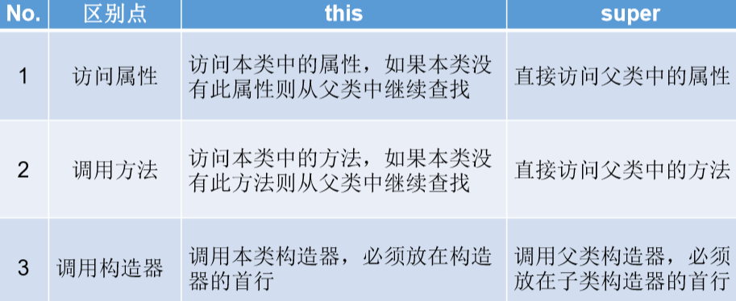

## 关键字super
### 一、关键字super
1、 super关键字的使用
super理解为：父类的
super可以用来调用：属性、方法、构造器
super的使用：调用属性和方法
2、注意
在子类的方法或构造器中。通过使用"super.属性"或"super.方法"的方式，显式的调用父类中声明的属性或方法。但是，通常情况下，我们习惯省略"super."
特殊情况：当**子类和父类**中定义了**同名的属性**时，我们要想在**子类中调用父类中声明的属性**，则必须显式的使用"**super.属性**"的方式，表明调用的是父类中声明的属性。
特殊情况：当子类重写了父类中的方法以后，我们想在子类的方法中调用父类中被重写的方法时，则必须显式的使用"super.方法"的
3、this和super的区别

4、super调用构造器
我们可以在子类的构造器中显式的使用"super(形参列表)"的方式，调用父类中声明的指定的构造器
**"super(形参列表)"的使用，必须声明在子类构造器的首行！**
在类的构造器中，针对于**"this(形参列表)"或"super(形参列表)"只能二选一，不能同时出现**
在构造器的首行，没有显式的声明"this(形参列表)"或"super(形参列表)"，则**默认调用的是父类中空参的构造器：super()**
在类的多个构造器中，**至少有一个类的构造器中使用了"super(形参列表)"，调用父类中的构造器**

<table>
<colgroup>
<col style="width: 100%" />
</colgroup>
<thead>
<tr class="header">
<th>
package com.atguigu.java3;

public class Person {

String name;

int age;

int id = 1001;//身份证号

public Person(){

System.out.println("我无处不在！");

}

public Person(String name){

this.name = name;

}

public Person(String name,int age){

this(name);

this.age = age;

}

public void eat(){

System.out.println("人：吃饭");

}

public void walk(){

System.out.println("人：走路");

}

}

public class Student extends Person{

String major;

int id = 1002;//学号

public Student(){

super();

}

public Student(String major){

super();

this.major = major;

}

public Student(String name,int age,String major){

//this.name = name;

//this.age = age;

super(name,age);

this.major = major;

}

@Override

public void eat() {

System.out.println("学生：多吃有营养的食物");

}

public void study(){

System.out.println("学生：学习知识");

this.eat();

super.eat();

walk();

}

public void show(){

System.out.println("name = " + name + ", age = " + age);

System.out.println("id = " + this.id);

System.out.println("id = " + super.id);

}

}

</th>
</tr>
</thead>
<tbody>
</tbody>
</table>
