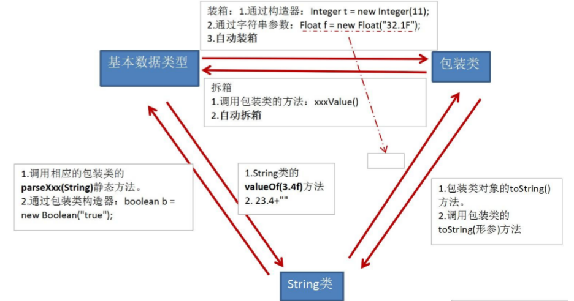

## 一、包装类的使用
1.java提供了8种基本数据类型对应的包装类，使得基本数据类型的变量具有类的特征
2.掌握的：基本数据类型、包装类、String三者之间的相互转换

<table>
<colgroup>
<col style="width: 100%" />
</colgroup>
<thead>
<tr class="header">
<th>
package basicdemo;

import org.junit.Test;

class Order{

boolean isMale;

Boolean isFemale;

}

public class WrpperTest {

<h3 id="基本数据类型----包装类调用包装类的构造器">//基本数据类型 ---&gt;包装类：调用包装类的构造器</h3>

@Test

public void test1() {

int num1=10;

Integer in1=new Integer(num1);

System.out.println(in1.toString());//10

Integer in2=new Integer("75");

System.out.println(in2);//75

//Double d2=new Double("7.5a");

//System.out.println(d2);//报错

Boolean b1 = new Boolean(true);

Boolean b2 = new Boolean("TrUe");

System.out.println(b2);//true,大小写没关系

Order o=new Order();

System.out.println(o.isMale);//false

System.out.println(o.isFemale);//null

}

<h3 id="包装类---基本数据类型">//包装类---&gt;基本数据类型</h3>
<blockquote>

//调用包装类Xxx的xxxValue()

</blockquote>

@Test

public void test2() {

Integer in1=new Integer(7);

int i1=in1.intValue();

System.out.println(i1+1);//8

}

/*

 * JDK 5.0 新特性：自动装箱 与自动拆箱

 */

@Test

public void test3() {

int num1=10;

//自动装箱：基本数据类型 ---&gt;包装类

Integer in1=10;

Boolean bo1=true;

//自动拆箱：包装类---&gt;基本数据类型

int num2=in1;

}

//基本数据类型、包装类---&gt;String类型：调用String重载的valueOf(Xxx xxx)

@Test

public void test4(){

int num1=7;

//方法一："+"号连接

String str1=num1+"";

//方法二

//使用String的valueOf(xxx);

float f1=7.5f;

String str2=String.valueOf(f1);

}

<h3 id="string类型----基本数据类型包装类">//String类型 ---&gt;基本数据类型、包装类</h3>

//调用包装类的parseXxx(String s)

@Test

public void test5() {

String str1="123";

int num1=Integer.parseInt(str1);

String str="123a";

//int num1=Integer.parseInt(str);//报错NumberFormatException

String str2="true";

String str3="true1";

boolean b1=Boolean.parseBoolean(str2);

boolean b2=Boolean.parseBoolean(str3);

System.out.println(b1);//true

System.out.println(b2);//false

}

}

</th>
</tr>
</thead>
<tbody>
</tbody>
</table>
练习

<table>
<colgroup>
<col style="width: 100%" />
</colgroup>
<thead>
<tr class="header">
<th>
public void test1() {

Object o1 = true ? new Integer(1) : new Double(2.0);

System.out.println(o1);// 1.0//类型自动提升

}
</th>
</tr>
</thead>
<tbody>
<tr class="odd">
<td>
public void test3() {

Integer i = new Integer(1);

Integer j = new Integer(1);

System.out.println(i == j);//false

//Integer内部定义了IntegerCache结构，IntegerCache中定义了Integer[],

//保存了从-128~127范围的整数。如果我们使用自动装箱的方式，给Integer赋值的范围在

//-128~127范围内时，可以直接使用数组中的元素，不用再去new了。目的：提高效率

Integer m = 1;

Integer n = 1;

System.out.println(m == n);//true

Integer x = 128;//相当于new了一个Integer对象

Integer y = 128;//相当于new了一个Integer对象

System.out.println(x == y);//false

}
</td>
</tr>
</tbody>
</table>

