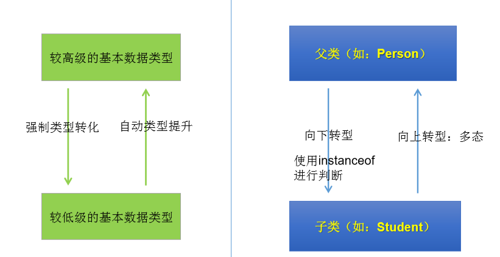

## 一、多态性
1、 对象的多态性：**父类的引用指向子类的对象**（或子类的对象赋给父类的引用）
2、. 多态的使用：虚拟方法调用
有了对象的多态性以后，我们在**编译期，只能调用父类中声明的方法**，但在**运行期，我们实际执行的是子类重写父类的方法**。
**总结：编译，看左边；运行，看右边。**
3、多态性的使用前提： **① 类的继承关系 ② 方法的重写**
4、对象的多态性，**只适用于方法，不适用于属性**（编译和运行都看左边）
若**编译时类型和运行时类型不一致**，就出现了对象的多态性(Polymorphism)
多态情况下，“看左边”：看的是父类的引用（父类中不具备子类特有的方法）
“看右边”：看的是子类的对象（实际运行的是子类重写父类的方法）
5,对象的多态
—在Java中,子类的对象可以替代父类的对象使用
一个变量只能有一种确定的数据类型
一个引用类型变量可能指向(引用)多种不同类型的对象
<table>
<colgroup>
<col style="width: 100%" />
</colgroup>
<thead>
<tr class="header">
<th>
Person p = new Student();

Object o = new Person();//Object类型的变量o，指向Person类型的对象

o = new Student(); //Object类型的变量o，指向Student类型的对象
</th>
</tr>
</thead>
<tbody>
</tbody>
</table>
子类可看做是特殊的父类，所以父类类型的引用可以指向子类的对象：向上转型(upcasting)。
6，一个引用类型变量如果声明为父类的类型，但实际引用的是子类对象，那么该变量就不能再访问子类中添加的属性和方法
Student m = new Student(); m.school = “pku”; //合法,
Student类有school成员变量 Person e = new Student(); e.school = “pku”; //非法,Person类没有school成员变量
属性是在编译时确定的，编译时e为Person类型，没有school成员变量，因而编译错误。

## 二、多态小结
<table>
<colgroup>
<col style="width: 100%" />
</colgroup>
<thead>
<tr class="header">
<th>
package com.atguigu.java4;

/*

* 面向对象特征之三：多态性

*

* 1.理解多态性：可以理解为一个事物的多种形态。

* 2.何为多态性：

* 对象的多态性：父类的引用指向子类的对象（或子类的对象赋给父类的引用）

*

* 3. 多态的使用：虚拟方法调用

* 有了对象的多态性以后，我们在编译期，只能调用父类中声明的方法，但在运行期，我们实际执行的是子类重写父类的方法。

* 总结：编译，看左边；运行，看右边。

*

* 4.多态性的使用前提： ① 类的继承关系 ② 方法的重写

*

* 5.对象的多态性，只适用于方法，不适用于属性（编译和运行都看左边）

*/

class Person {

String name;

int age;

int id = 1001;

public void eat(){

System.out.println("人：吃饭");

}

public void walk(){

System.out.println("人：走路");

}

}

class Man extends Person{

boolean isSmoking;

int id = 1002;

public void earnMoney(){

System.out.println("男人负责挣钱养家");

}

public void eat(){

System.out.println("男人多吃肉，长肌肉");

}

public void walk(){

System.out.println("男人霸气的走路");

}

}

class Woman extends Person{

boolean isBeauty;

public void goShopping(){

System.out.println("女人喜欢购物");

}

public void eat(){

System.out.println("女人少吃，为了减肥");

}

public void walk(){

System.out.println("女人窈窕的走路");

}

}

public class PersonTest {

public static void main(String[] args) {

Person p1 = new Person();

p1.eat();

Man man = new Man();

man.eat();

man.age = 25;

man.earnMoney();

//*************************************************

System.out.println("*******************");

//对象的多态性：父类的引用指向子类的对象

Person p2 = new Man();

//Person p3 = new Woman();

//多态的使用：当调用子父类同名同参数的方法时，实际执行的是子类重写父类的方法 ---虚拟方法调用

p2.eat();

p2.walk();

//p2.earnMoney();

<blockquote>

System.out.println(p2.id);//1001

</blockquote>

}

}

</th>
</tr>
</thead>
<tbody>
</tbody>
</table>

## 三、instanceof 操作符 
x instanceof A：检验x是否为类A的对象，返回值为boolean型。
要求**x所属的类与类A必须是子类和父类的关系**，否则编译错误。
如果x属于类A的子类B，x instanceof A值也为true
<table>
<colgroup>
<col style="width: 100%" />
</colgroup>
<thead>
<tr class="header">
<th>
package com.atguigu.exer;

/*

* 建立InstanceTest 类，在类中定义方法method(Person e);

在method中:

(1)根据e的类型调用相应类的getInfo()方法。

(2)根据e的类型执行：

如果e为Person类的对象，输出：

“a person”;

如果e为Student类的对象，输出：

“a student”

“a person ”

如果e为Graduate类的对象，输出：

“a graduated student”

“a student”

“a person”

*

*

*

*/

public class InstanceTest {

public static void main(String[] args) {

InstanceTest test = new InstanceTest();

test.method(new Student());

}

public void method(Person e){

//虚拟方法调用

String info = e.getInfo();

System.out.println(info);

//方式一

//if(e instanceof Graduate){

//System.out.println("a graduated student");

//System.out.println("a student");

//System.out.println("a person");

//}else if(e instanceof Student){

//System.out.println("a student");

//System.out.println("a person");

//}else{

//System.out.println("a person");

//}

//方式二

if(e instanceof Graduate){

System.out.println("a graduated student");

}

if(e instanceof Student){

System.out.println("a student");

}

if(e instanceof Person){

System.out.println("a person");

}

}

}

public class PersonTest {

public static void main(String[] args) {

Person p1 = new Person();

p1.eat();

Man man = new Man();

man.eat();

man.age = 25;

man.earnMoney();

//*************************************************

System.out.println("*******************");

//对象的多态性：父类的引用指向子类的对象

Person p2 = new Man();

//Person p3 = new Woman();

//多态的使用：当调用子父类同名同参数的方法时，实际执行的是子类重写父类的方法 ---虚拟方法调用

p2.eat();

p2.walk();

//p2.earnMoney();

System.out.println(p2.id);//1001

System.out.println("****************************");

//不能调用子类所特有的方法、属性：编译时，p2是Person类型。

p2.name = "Tom";

//p2.earnMoney();

//p2.isSmoking = true;

//有了对象的多态性以后，内存中实际上是加载了子类特有的属性和方法的，但是由于变量声明为父类类型，导致

//编译时，只能调用父类中声明的属性和方法。子类特有的属性和方法不能调用。

//如何才能调用子类特有的属性和方法？

//向下转型：使用强制类型转换符。

Man m1 = (Man)p2;

m1.earnMoney();

m1.isSmoking = true;

//使用强转时，可能出现ClassCastException的异常。

//Woman w1 = (Woman)p2;

//w1.goShopping();

/*

 * instanceof关键字的使用

 *

 * a instanceof A:判断对象a是否是类A的实例。如果是，返回true；如果不是，返回false。

 *

 *

 * 使用情境：为了避免在向下转型时出现ClassCastException的异常，我们在向下转型之前，先

 * 进行instanceof的判断，一旦返回true，就进行向下转型。如果返回false，不进行向下转型。

 *

 * 如果 a instanceof A返回true,则 a instanceof B也返回true.

 * 其中，类B是类A的父类。

 */

if(p2 instanceof Woman){

Woman w1 = (Woman)p2;

w1.goShopping();

System.out.println("******Woman******");

}

if(p2 instanceof Man){

Man m2 = (Man)p2;

m2.earnMoney();

System.out.println("******Man******");

}

if(p2 instanceof Person){

System.out.println("******Person******");

}

if(p2 instanceof Object){

System.out.println("******Object******");

}

}

}
</th>
</tr>
</thead>
<tbody>
</tbody>
</table>

## 四、对象类型转换 (Casting )
基本数据类型的Casting：
自动类型转换：**小的数据类型可以自动转换成大的数据类型** 如long g=20; double d=12.0f
强制类型转换：可以把**大的数据类型强制转换(casting)成小的数据类型** 如 float f=(float)12.0; int a=(int)1200L
对Java对象的强制类型转换称为造型
从 **子类到父类的类型转换可以自动进行**

从**父类到子类**的类型转换必须通过造型(**强制类型转换)**实现

无继承关系的引用类型间的转换是非法的

在造型前可以使用instanceof操作符测试一个对象的类型

## 五、子类继承父类
1.若子类重写了父类方法，就意味着子类里定义的方法彻底覆盖了父类里的同名方法，系统将不可能把父类里的方法转移到子类中：编译看左边，运行看右边
2.对于实例变量则不存在这样的现象，即使子类里定义了与父类完全相同的实例变量， 这个实例变量依然不可能覆盖父类中定义的实例变量：编译运行都看左边

## 六、练习
<table>
<colgroup>
<col style="width: 100%" />
</colgroup>
<thead>
<tr class="header">
<th>
class Base {

int count = 10;

public void display() {

System.out.println(this.count);

}

}

class Sub extends Base {

int count = 20;

public void display() {

System.out.println(this.count);

}

}

public class FieldMethodTest {

public static void main(String[] args) {

Sub s = new Sub();

System.out.println(s.count);//20

s.display();//20

Base b = s;//多态性

//==：对于引用数据类型来讲，比较的是两个引用数据类型变量的地址值是否相同

System.out.println(b == s);//true

System.out.println(b.count);//10

b.display();//20

}

}
</th>
</tr>
</thead>
<tbody>
</tbody>
</table>

<table>
<colgroup>
<col style="width: 100%" />
</colgroup>
<thead>
<tr class="header">
<th>
package com.atguigu.exer;

//考查多态的笔试题目：

public class InterviewTest1 {

public static void main(String[] args) {

Base1 base = new Sub1();

base.add(1, 2, 3);

Sub1 s = (Sub1)base;

s.add(1,2,3);

}

}

class Base1 {

public void add(int a, int... arr) {

System.out.println("base1");

}

}

class Sub1 extends Base1 {

public void add(int a, int[] arr) {

System.out.println("sub_1");

}

public void add(int a, int b, int c) {

System.out.println("sub_2");

}

}

</th>
</tr>
</thead>
<tbody>
</tbody>
</table>

