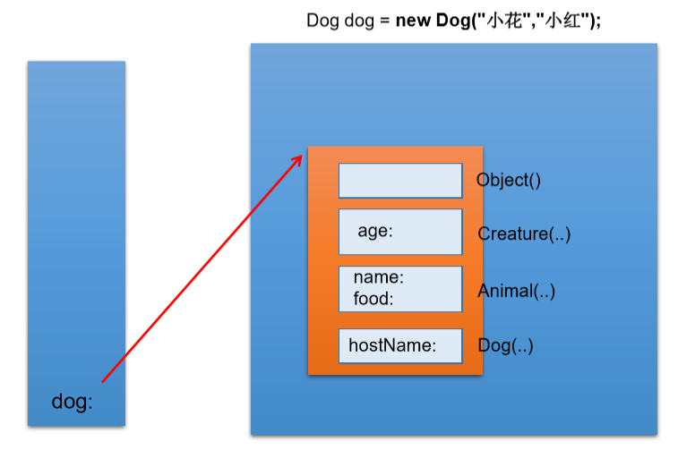

## 子类对象实例化过程
### 一、子类对象实例化过程
子类对象实例化的全过程
1\. 从结果上来看：（继承性）
子类继承父类以后，就获取了父类中声明的属性或方法。
创建子类的对象，在堆空间中，就会加载所有父类中声明的属性。
2\. 从过程上来看：
通过子类的构造器创建子类对象时，一定会直接或间接的调用其父类的构造器，进而调用父类的父类的构造器， 直到调用了java.lang.Object类中空参的构造器为止。正因为**加载过所有的父类的结构，所以才可以看到内存中有父类中的结构**，子类对象才可以考虑进行调用。
\* 明确：虽然创建子类对象时，调用了父类的构造器，但是**自始至终就创建过一个对象，即为new的子类对象。**

