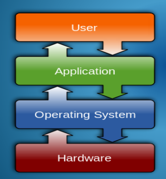
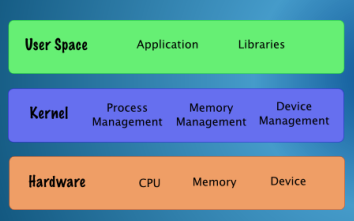

## 一、概念认识
**1，什么是操作系统**
操作系统(OS)是一个大型而复杂的软件系统，它管理计算机的所有硬件资源，并使其易于使用。
<table>
<colgroup>
<col style="width: 100%" />
</colgroup>
<thead>
<tr class="header">
<th>
An operating system (OS) is a large and complex software system

which <strong>manages all of the hardware resources of a computer and makes it easy to use.</strong>
</th>
</tr>
</thead>
<tbody>
</tbody>
</table>

2，认识
1）每一个configuration是不同的，所以需要统一的interface

**2）**应用程序通过一组应用程序编程接口(API)和系统调用与操作系统交互，定义操作系统组件可以执行的常用功能（和相关参数）。因此，可以为特定的操作系统编写应用程序。该操作系统是一个编程平台。操作系统API的可用性减少了使在硬件上运行应用程序所需的开发工作。

| Applications interact with the operating system through a collection of Application Programming Interfaces (APIs) and System Calls, which define a set of commonly required functions (and associated parameters) that the operating system components can perform. |
|---------------------------------------------------------------------------------------------------------------------------------------------------------------------------------------------------------------------------------------------------------------------|

3）这是一个并发环境，必须同时处理许多任务和事件，这些任务的协调必须提供最有效和最好地利用可用资源。
concurrent environment

4）用户与操作系统的交互通常通过图形用户界面或基于文本的命令行界面【command-line interface】来完成。

## 二、操作系统的核心Kernel

1,操作系统的核心是指管理CPU、电气存储器、基本进程间通信和低级硬件设备相关联的核心服务集。
内核在处理器上以特权模式执行，其中提供其他指令和权限。

该内核是各种操作系统分布中通用的。
The Kernel is common to various Operating System Distributions.
Kernel核心，要点

2,操作系统分配【 Operating System Distribution】将具有内核【Kernel】的其他组件，如文件系统、数据库引擎、网络通信套件、图形和媒体功能、Web服务器、用户界面GUI、安全和身份验证元素、各种外部I/O设备的设备驱动程序以及用于配置系统的实用程序。

为特定发行版选择的软件包可以针对不同的目标环境进行定制，如台式机、服务器或移动设备、家庭或业务用途。

3，操作必须执行的任务
<table>
<colgroup>
<col style="width: 100%" />
</colgroup>
<thead>
<tr class="header">
<th><ol type="1">
<li>
在相互竞争的用户流程之间的资源分配和管理。
</li>
<li>
最大限度地提高资源利用率，其目标是提高整个系统的吞吐量。
</li>
<li>
为机器提供用户界面和应用程序界面。
</li>
<li>
协调许多并发活动和设备，处理来自连接硬件的输入和输出，并确保实现正确的同步和通信。
</li>
<li>
充当资源保护者，保护计算机系统的各种资源不受恶意或意外滥用。
</li>
<li>
核算用户流程的资源使用期间，适当执行配额或限制。
</li>
<li>
电力和热管理。
</li>
</ol>
<blockquote>

(i) Allocation and Management of Resources among competing user processes.

(ii) Maximising Resource Utilisation with the goal of improving overall system throughput.

(iii) Providing a user interface and an application interface to the machine.

(iv) Coordinating the many concurrent activities and devices, handling input and output from attached hardware and ensuring correct synchronisation and communication is achieved.

(v) Acting as a Resource Guardian to protect various resources of the computer system from malicious or accidental misuse.

(vi) Accounting for periods of resource usage by user processes, enforcing quotas or restrictions as appropriate.

(vii) Power and Thermal Management.

</blockquote></th>
</tr>
</thead>
<tbody>
</tbody>
</table>

## 三、其他操作系统
1，
大多数台式机/笔记本电脑使用微软Microsoft Windows
苹果电脑使用(Mac)操作系统
许多服务器环境使用基于Unix的操作系统，如Linux和Free-BSD。
移动设备和其他复杂的设备，如无线接入点、机顶盒也运行操作系统。
安卓系统是一款基于Linux的操作系统，专为触摸屏手机和其他设备设计。超过25亿台设备使用安卓系统。
苹果的iPhone使用iOS操作系统。29.9%移动市场份额
微软的手机操作系统\<0.04%的市场份额

2，云计算操作系统Cloud Operating System
数据和/或应用程序远程托管在互联网上属于不同公司的数据中心，而不是居住在您自己的计算机中。
您可以“租用”这些系统的软件、存储资源或计算资源，并使用基于Web的浏览器作为用户界面或使用基于Web的API访问这些资源。

云计算被视为一种高可靠性、高可用性、成本效益性、可扩展性、高性能的手段，能够从世界任何地方访问您的数据和应用程序。

