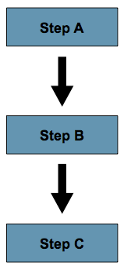
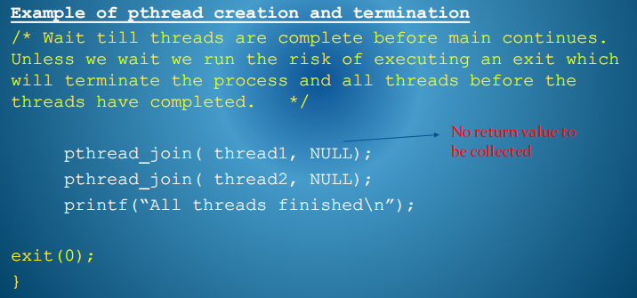
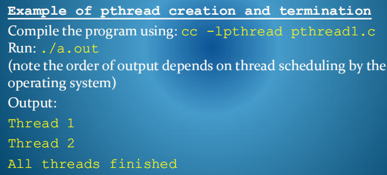

## 1，Sequential Process Execution Pattern
<table>
<colgroup>
<col style="width: 67%" />
<col style="width: 32%" />
</colgroup>
<thead>
<tr class="header">
<th>顺序进程有<strong>单个执行线程</strong>。也就是说，该进程一次只执行从程序中的一个特定点检索到的指令，并按顺序执行它们。</th>
<th>

</th>
</tr>
</thead>
<tbody>
</tbody>
</table>

<table>
<colgroup>
<col style="width: 39%" />
<col style="width: 60%" />
</colgroup>
<thead>
<tr class="header">
<th>流控制指令，如循环、选择语句和过程调用或外部事件，会导致进程在需要时跳转到代码的其他部分，<strong>但单个线程进程一次只能做一件事</strong></th>
<th>

</th>
</tr>
</thead>
<tbody>
</tbody>
</table>

Process Control Block Structure

Overhead Cost：使用fork()创建进程会占用处理器时间来分配和初始化许多结构，并占用内存资源使用方面的持续成本。

## 2，Sequential Process Memory Space Organisation

运行时堆栈是一个内存区域，它本质上与处理器指令相链接，用于管理调用/返回机制和其他与执行相关的目的。

## 3，Subset of Data Associated with a Process Execution Context

进程的当前执行上下文由一个小的特定信息子集表示。

The current state of the CPU program counter.

Various CPU registers may be used for caching other data.

A runtime stack stores parameters and linkage for method calls and other temporary data.

## 4，Multi-threaded Processes

现代操作系统支持单个进程环境的模型，**支持在流程代码中的不同点独立执行的多个控制线程**。

优点
这些轻量级线程结构共享包含进程的环境，因此可以快速创建，并且可以由内核作为可调度的实体进行管理。

由于服务器响应性，网络协议的问题更少
并行性的简单概念，便于程序员理解，将线程分配给模块化任务

## 5，Implementing Thread Support
在任何操作系统上的并行性
线程机制可以在内核内部或普通用户空间进程中(例如JavaVM)或两者都实现，其中用户线程映射到内核线程上。

任何语言中的平行论
多线程代码可以用任何有线程程序库和运行时可以链接的编程语言编写

**6，User Space Threads**
优点
此实现不需要对线程的任何操作系统支持。调用库中的函数来创建或销毁线程或调度线程可以作为用户空间中的本地函数调用来快速处理，它操作本地数据结构来控制用户定义的线程以及程序在给定时刻正在做什么。

缺点
上下文切换到内核会阻止进程中的所有线程，因为内核不知道存在在应用程序上下文中操作的单独线程抽象。
此外，由用户空间线程库对线程的调度也不是先发制人的。
而且，该应用程序也不能从多核处理中获益。

## 7，Kernel Space Threads
优点
在内核空间中实现线程提供了更大的灵活性和效率。
发出系统调用的线程不一定会阻止该进程中的所有其他线程。

线程可以安排到提供真正应用程序并发性的多处理器系统上的单独CPU上。

线程在CPU周期的同等基础上竞争，它们可能很容易被硬件计时器抢占

缺点

8，Kernel Multithreaded Design设计
为了实现更大的响应能力，内核本身可以作为一个多线程进程来实现。E.g.调度程序、IPC和I/O处理都可以是单独的线程。

这样，在系统调用进行中时，内核并不会阻止需要内核服务的所有进程。

这需要仔细设计内核数据结构和算法，以允许多线程活动的同步。这是一个必要的内核设计，特别是当底层硬件具有多处理器架构时。

9，Unix-POSIX接口中的线程管理
POSIX标准的开发目的是通过跨所有Unix系统品种制定系统调用标准来提供操作系统服务的通用抽象或虚拟化，从而增强代码的可移植性。

POSIXp线程API是适用于线程管理的接口的组件。

还有Windows系统的pthied库实现。

pthread Thread Creation
pthread_create()函数创建新线程。该函数包含四个参数：-
An identifier for the thread management structure, of type pthread_t

attributes the new thread will have such as stack size and scheduling attributes.

where the new thread will begin execution in the program

list of arguments to be passed to the function the thread will execute

Thread Management in Unix – POSIX Interface

10，Thread Termination & Collecting Results
线程在函数结束时隐式终止。

分离一个线程并清理已分配的结构

