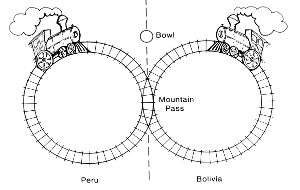
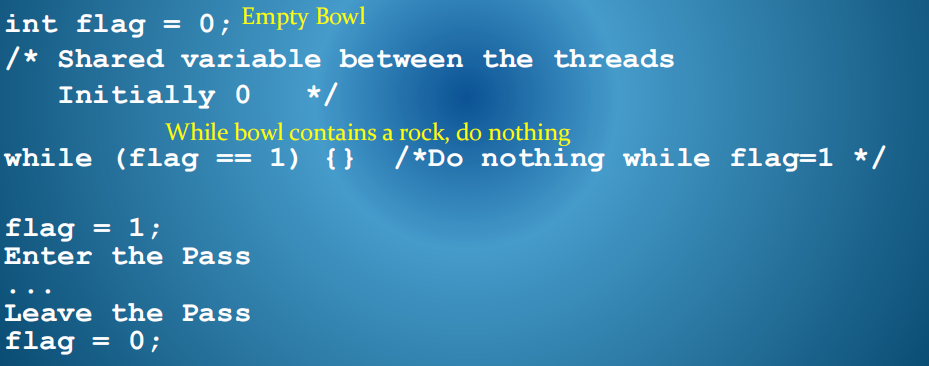
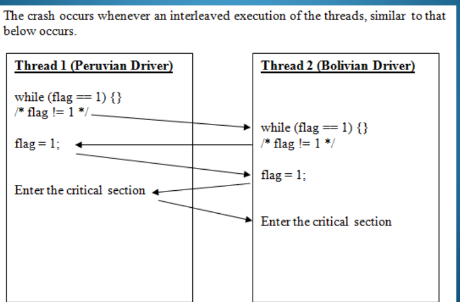
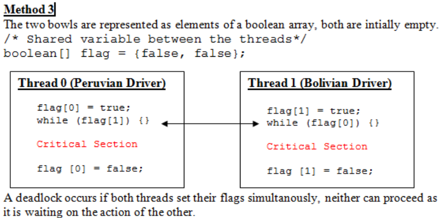
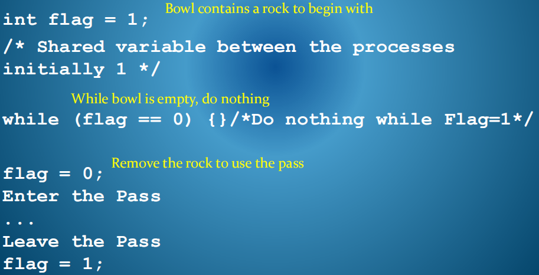
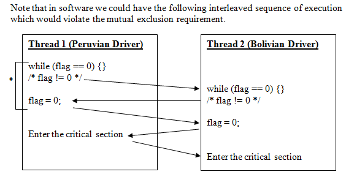

11-The Mutual Exclusion Problem
2021年6月15日
9:18

线程活动的协调的需要

排序线程之间的任务

协调对资源的访问

线程方面的优势
- 添加并发性的简单机制
- 可以添加到现有的语言中
- 轻量级的资源，快速创建

一、引入

1，考虑一个N个协作线程系统，其中每个线程可能共享一个需要独占访问的代码段来完成。

2，**没有两个线程能够同时执行此this critical section of code。**

二、两个地区开火车问题相撞的问题Train Drivers Problem

方法一

1，方法
| 只有一个碗，有石头表示正在使用，使用结束要拿走石头，碗里只能有一个石头 |
|------------------------------------------------------------------------|

他们在山口的入口处放了一个碗。在进入山口之前，司机必须停下火车，走到一个碗前，伸手进去，看看里面是否有一块石头。如果碗是空的，他会四处寻找一块石头，并把它扔进碗里，表明他的火车正在使用山口，然后他驾驶火车进入山口

如果一个司机到达山口时发现碗里有一块石头，他就会把它留在那里。他反复午睡，重新检查碗，直到他发现碗是空的。

当火车通过通行后，他必须走回碗里把岩石移走

2，问题

1）据称，秘鲁官员编造的颠覆性时刻表可能会永远阻止玻利维亚的火车。详细说明

2）不幸的是，有一天两列火车撞了。请解释一下。

3，代码
<table>
<colgroup>
<col style="width: 97%" />
<col style="width: 2%" />
</colgroup>
<thead>
<tr class="header">
<th>

</th>
<th>

</th>
</tr>
</thead>
<tbody>
</tbody>
</table>

方法二

1，方法
| A：碗空才能走，要放回；B碗有石头才能走，要记得拿走【使用次数不合理】 |
|----------------------------------------------------------------------|
玻利维亚车手必须在进入通行证时等待，直到碗空了，然后开车穿过通行证，走回去，把一块石头放进碗里。秘鲁司机必须在入口等待，直到碗里有一块石头，然后他开车穿过山口，走回来把石头从碗里移开。

2，问题

在此之前，秘鲁火车每天运行两次，玻利维亚火车每天运行一次。秘鲁人对这个新的安排非常不满。为什么呢？

3，代码

虽然不违反互排除，但执行是锁定步骤。

方法三

1，方法
| 两个碗，用的时候，拿走自己碗而定石头，并且另一个必须空才能走 |
|--------------------------------------------------------------|
顾问被叫回来，想出一个解决方案，解决秘鲁的问题和防止崩溃的问题。他建议用两个碗，每个司机给一个。

当司机希望进入时，他首先先在自己的碗里掉一块石头，作为他希望使用传球的信号。然后他检查另一个司机的碗是否空。如果是这样的话，他开着火车穿过，走回来，从自己的碗里取出石头。

然而，如果另一个驾驶的碗确实有一块石头，那么他让司机先通过午睡，并定期重试另一个驾驶的碗，直到另一个司机在清除传球后移走石头。

2，问题

这个解决方案工作了很长一段时间，直到有一天，两列火车在入口同时被封锁。为什么呢？

3，代码

方法四【正确】

1，方法
| 使用一个碗，已经有石头，经过的时候拿走石头，结束放回。 |
|--------------------------------------------------------|
使用一个碗，但最初它有一块石头。如果任何一个司机在碗里发现一块石头，他就把它取出，开车穿过通行证。然后他走回去，在碗里放了一块石头。如果司机在想进入山口时发现碗里没有石头，他就会等待

2，问题

为什么此解决方案会有效？它与方法1有什么区别？

3，代码【】

<u>原因是从碗里取出一块石头是一个不可分割的操作。</u>一次只有一个司机能找到并拿走这块岩石。然而，在软件中，我们的算法分别测试标志，然后设置它。

要解决互排除问题，图中用星号标记的语句必须不可分割。也就是说，它们必须完全或根本不执行，但必须阻止与另一个进程的交叉执行。

