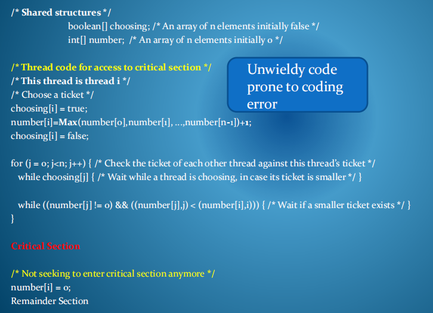
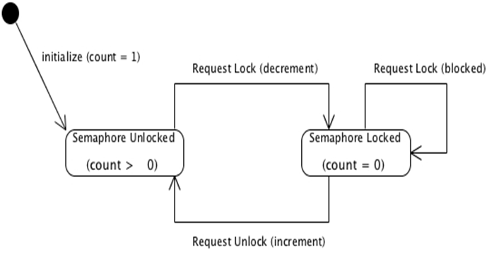
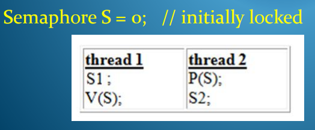
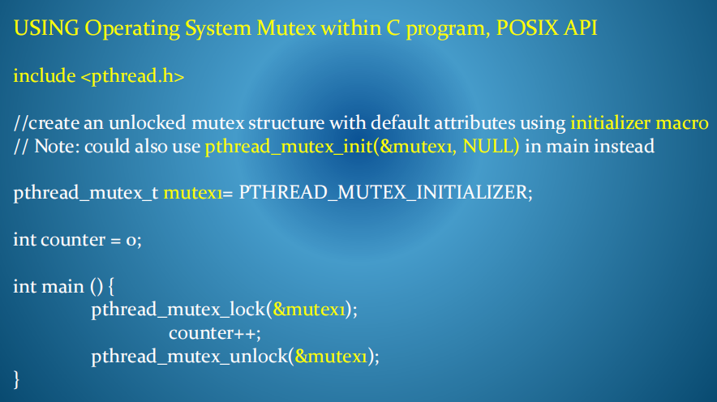
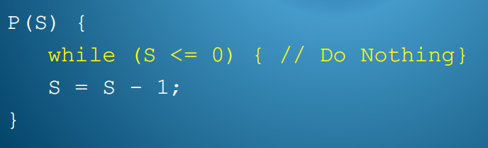
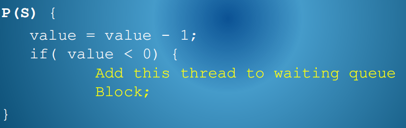
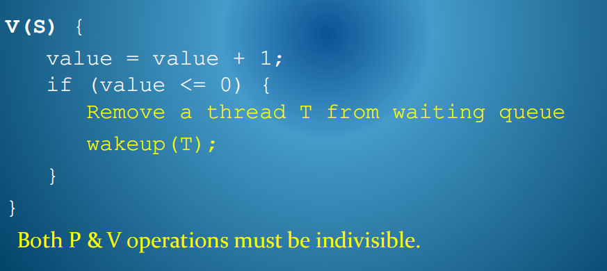

一、解决相互排除问题的方法的限制性

两个或N个流程的软件解决方案（烘焙算法）

每个流程在使用关键部分之前执行约定的入口代码序列，完成后执行约定的退出代码序列。

该方案的一个问题是，当程序员使用来保护任意关键部分时，输入和退出代码以及相关的共享数据结构有点笨拙和尴尬。

软件算法和多处理器操作
由于多处理器系统中高速缓存的操作，如果处理器在存储在本地高速缓存中时可以不同地查看这些数据结构（非线程安全），那么基于线程之间共享数据结构状态的软件解决方案可能无法工作。

基于使用不可分割的指令的旋转锁解决方案，如TestandSet or Swap/Xchg
一个不可分割的指令，如测试和设置或交换使用一个非缓存的锁变量，它在一个操作中读取和设置。

基于使用不可分割指令的自旋锁解决方案的限制性
这些都为互排除提供了一个简单的解决方案，但不提供对进展或有界等待的任何保证。当竞争线程旋转锁时，哪个线程是任意获得的（基于调度）。

对于多个处理器系统来说，硬件测试和设置操作的执行效率也不如可以使用本地缓存的指令低，因此希望将执行它们的需求降到最低。

二、Busy Waiting
1，所有这些软件解决方案都涉及到忙碌的等待——代码中的一个执行循环，线程在其计划的时间段内持续测试锁定条件，直到条件允许它继续进入关键部分。

当一个线程被调度时，它可以花所有时间重复地重新评估一个条件，直到调度另一个线程之前永远不会改变并改变该条件。

如果等待时间很短，但等待时间不长，我们需要暂停该进程。

2，忙碌的等待实现有许多缺点：-
1）由于处理器时间浪费，反复重新评估条件，系统性能下降。
2）定时等待-当线程可能只想等待一段时间时，不可能实现一个边界等待原语的锁
3）如果关键部分中的低优先级任务可能保持锁定，导致高优先级任务等待，则可能发生优先级反转

## 三、Semaphores
为了处理使用同步代码的笨拙方面（参见软件解决方案）
并处理访问关键部分的公平性（参见不可分割的硬件指令方法）
以及繁忙等待的问题（在这两种方法中都可以看到），我们引入了一种更方便和高效的同步结构，称为Semaphores

1，Semaphores
信号量是一种通用的同步工具。

在其经典定义中，信号量由一个共享的整数变量组成，只能通过两个定义的操作，P&V，（有时称为Wait and Signal, or Acquire and Release)）。

PV必须是不可分割的。

2，两种类型
当使用信号量值来控制互排除时，则使用只能具有值0或1的二进制信号量。它被用作一个互斥锁锁定机制。

**计数信号量**（或速率限制信号量 counting semaphore (or rate limiting semaphore)）也可以通过将计数值设置为一次允许进入代码区域的最大线程数（如n）来实现。

在这种情况下，n个线程将能够减少信号量，但n个+1线程将阻塞，直到其中一个早期的线程释放它。该信号量被用作线程之间的信号传递机制。

3，使P和V不可分割的建议
1），为了使这些操作在单处理器系统中不可分割，我们可以
将PV方法视为关键部分，在进出运维操作时，使用我们的N流程软件解决方案。
在操作系统调用时实现P和V，并在执行期间关闭中断，以防止交换正在执行的线程。
2），旋转锁-我们可以使用不可分割的硬件测试和设置指令和一个锁变量，它必须首先由任何希望执行P或V的进程独家获得。
3）由于P和V代码相对较短，在不同线程中同时执行它们的可能性不太大，因此忙等待与信号量代码相关的自旋锁的影响将是最小的。

4，Usage of Semaphores
因此，如果我们可以创建不可分割的P和V操作，我们可以使用下面更简单的编码进行同步

4，General Synchronisation
在下面的序列中，我们希望停止线程2中的语句S2的执行，直到线程1中的语句S1完成。通过创建一个信号量S并将其初始化为0，线程2将被保持不变，直到线程1增加S。

5，

Practical Implementation of Semaphores
请注意，实现信号量的经典定义使互斥的实现成为标准化，但P和V操作仍然包括一个繁忙的等待循环，并没有解决访问关键部分的公平性。如果线程不是\>0，它将无限期地循环，检查信号量的值。

为了克服繁忙等待和公平访问的问题，我们可以为P和V操作提供更好的实施如下：

6，信号量可以用来解决各种经典的协调问题。我们将研究在许多计算应用程序中常见的几类问题：
Producer Consumer Problem生产者问题
A situation where two or more threads exchange data with each other through a
shared buffer.两个或多个线程通过共享缓冲区相互交换数据的一种情况。

Dining Philosphers Problem哲学家进餐问题
A situation where limited resources must be allocated among competing
threads in a way that avoids deadlock.必须以避免死锁的方式在竞争线程之间分配资源有限的情况。

Readers Writers Problem读者写者问题
A situation where some threads alter the contents of a database and other
thread simply query the contents.某些线程改变数据库的内容，而其他线程只需查询内容的情况

