## 一、动态分区Dynamic Partitioning
1，加载进程时分配线性地址空间区域的问题

一个类似的问题是在运行时管理进程内的堆区域。
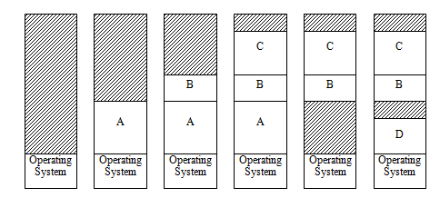

2，进程地址空间可分为三个主要区域。

| text  | 程序的代码占据了这个区域，并且通常是静态的。                                                                                                                                                                               |
|-------|----------------------------------------------------------------------------------------------------------------------------------------------------------------------------------------------------------------------------|
| stack | 堆栈通常是一个固定大小的内存区域，进程用于创建堆栈帧，用于保存参数和本地变量，并在调用函数时返回链接地址。帧总是以LIFO的方式添加和删除到堆栈的顶部，从而使分配和释放速度更快。每个线程都必须有自己的堆栈，但要共享一个堆。 |
| heap  | 堆是一个可变大小的内存区域，用于创建动态数据结构和对象。与基于堆栈的变量不同，在函数调用返回后，在堆上创建的变量仍然存在。对堆的线性空间的管理更加复杂，而且需要的时间更长。                                               |

3，实现管理线性地址空间所需的基本操作
Allocation和Deallocation
分配和 存储单元分配

1）Allocation
意味着内存管理器找到并分配足够容纳内存请求的可用空间。

如何跟踪内存空间的哪些部分是空闲的？
三种方法
Bit Maps
Linked List
Buddy System

方法1--Bit Maps
1，结构
将内存空间划分为固定大小的小分配单元，例如每个分配单元为1024个字节（1K）
2.bitmap包含每个分配单元的一个位，它表示该单元的状态，
1 for used, 0 for unused.
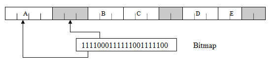

内存的大小和所选择的分配单元的大小决定了位图的大小。

案例
如果内存空间大小为4G字节，并以1024字节分配单元分配，那么将有400万个分配单元，因此位图大小需要为512K字节。

2，大规模的分配单位
分配单元的尺寸可能是一个重要的设计考虑因素。
如果分配单元太大，位图将会更小，但我们只能在多个大分配单元中分配内存空间，因此进程可能不需要上次分配单元中更多的空间。

3，小型分配单位
分配单元的尺寸可能是一个重要的设计考虑因素。

如果内存很大，而分配单元相对较小，那么位图将是一个更大的数据结构，而搜索位图字符串可能会很耗时。

4，分配和回收
分配allocation
涉及搜索表示大到足以适应请求的区域的比特字符串。

如果0值用于空，而1值表示已使用的分配单元，
则查找空闲区域意味着在位图中查找零字节块。
一些处理器有一个特殊的指令来帮助实现这一点。

Deallocation
内存管理器只需重置与被释放的分配单元对应的位图中的相应位。

方法2-Linked Lists
1，跟踪可用内存空间
维护一个信息记录，描述每个可变大小的空闲块的大小和位置，并将这个可变数量的记录保存在动态链表结构中
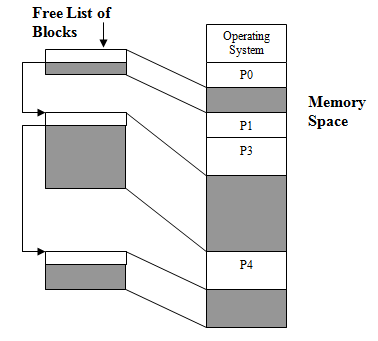

2，分配与回收
分配
内存管理器必须搜索列表，以找到适合请求的适当大小的空闲块。

回收
添加到释放列表中的是新的释放块记录，描述释放块的起始位置和大小。

3，存储链接列表的位置
可用列表的记录可以存储在它们所描述的未使用的内存区域的前几个字节内，
因此内存管理器只需要维护一个指向该列表的第一个记录的指针。

4，链接列表的搜索和分配策略
Placement Algorithms

内存管理器在为进程分配空间时，可以考虑搜索空闲列表的许多不同策略。
其目标是尽量减少对压实的需要。

5，动态分区分配算法
当很多歌空闲分区都能满足要求时，应该选择那个分区进行分配

按照地址，无需排列
| Next Fit   | 每一次都是从上一次结束的地方开始查找                 |
|------------|------------------------------------------------------|
| First Fit: | 每次从低地址开始查找，找到第一个能满足大小的空闲分区 |

按照大小排列，每一次都需要重新排列
| Best Fit效果最好 | 优先使用更小的空闲分区，缺点：会产生很多外部碎片 |
|------------------|--------------------------------------------------|
| Worst Fit        | 优先使用最大的空闲分区 缺点：大进程没有空间了    |

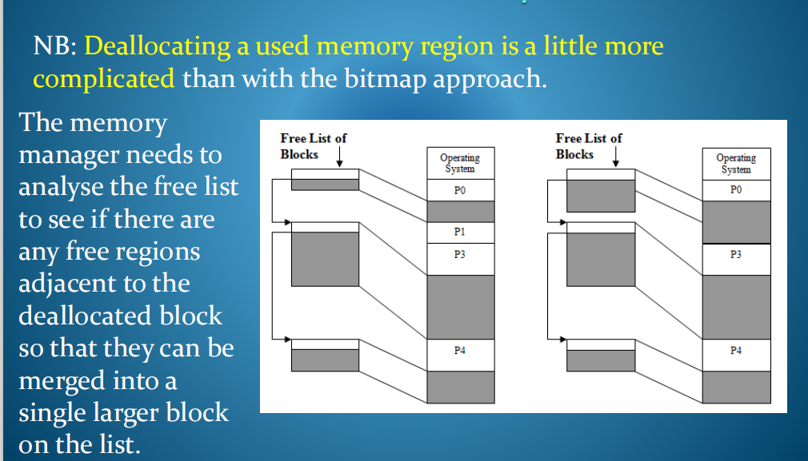

对比
| Bit Map                                  | Linked List                                    |
|------------------------------------------|------------------------------------------------|
| 固定大小的数据结构，无论内存使用情况如何 | 动态大小，取决于自由线段的数量                 |
| 分配效率取决于位图的大小，字节搜索       | 分配可能涉及到长列表搜索，如果有许多小段       |
| 回收速度快                               | 回收需要完成链表分析，来决定相邻的模块是否合并 |
| 每个进程的½页面内部碎片化                | 没有内部碎片化                                 |
|                                         |                                               |

Method 3 - Buddy System
1，buddy system内存管理,
努力让内存分配与相邻内存合并能快速进行
简单的说，来自同一个大块的两个小块才是伙伴

例如，一个1M字节的内存需要21个列表。第一个列表将包含大小为1字节的免费块，下一个列表大小为2字节的免费块，下一个列表大小为4字节的免费块，等等，直到第21个列表，其中将包含大小为1兆字节的免费块
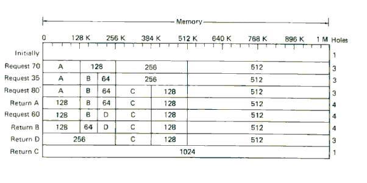

方法4--Paged Architecture
1，需要更多的硬件支持
使用基本和限制寄存器的分区是限制的，因为进程分配的地址空间限制在一个连续的段。

内存将内存碎片分割成更小的可用区域，很难找到一个大区域来容纳大的连续段，而不会导致压缩和重定位开销。

页面体系结构克服了这些问题，但需要额外的硬件支持，一种映射机制，以代替基础/限制寄存器的想法。

2，基础
对于页面架构的内存被分成一些相对较小的(可能是512-8K字节)固定大小的单位，称为页面。

进程地址空间由多个页组成。物理页面可以从内存空间内的任意可用页面分配给进程。

关键点
物理页面不需要是连续的（彼此相邻的）——需要一个映射机制。

3，从逻辑上的映射到物理上的映射
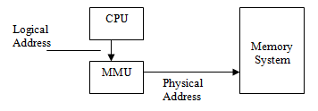
进程具有其内存空间的逻辑视图，由0到最大的逻辑页数组成。

这些页面由处理器的内存管理单元映射到内存中相应的物理页面。

4，每个进程的映射信息都保存在一个页面表中。每个进程有一个页面表。这个数据结构有多大？
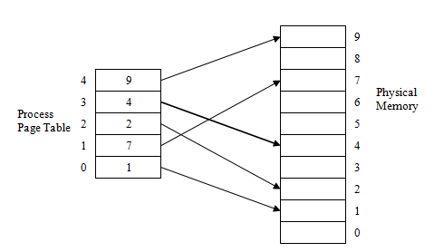

5，内存地址分为两部分，一个页号和一个在该页内的偏移量。
MMU将处理器生成的逻辑地址中的页号与页表中的相应物理页进行交换。
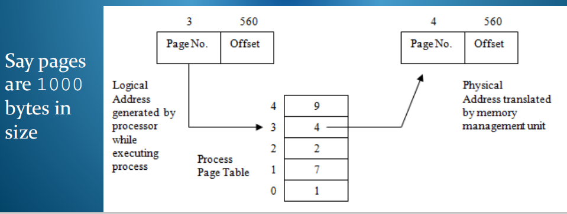

6，优缺点
优点：
保护-由于进程只有其地址空间的逻辑视图，因此它们无法访问其他进程的地址空间，因为页面表不会包含指向任何其他进程的页面的指针。

分配给进程的内存空间可以由随机分散在物理内存中的页面组成，而不全部都必须彼此相邻。易于跟踪可用空间和分配请求大小的空间。

通过将页面映射修改到页面表，很容易重新定位或扩展进程的地址空间。

缺点
通过将页面映射修改到页面表，很容易重新定位或扩展进程的地址空间。
对于每个逻辑内存访问，可能需要两个真正的内存访问，除非处理器可以将页面表的部分内容缓存到转换查找旁缓冲区中。页面映射仍然会稍微减慢对内存的访问时间。

由于内存空间被分配给多个页中的进程，因此进程可能不需要分配给它的最后一页的所有内存空间。平均每个进程大约½一个页面会被浪费。这种现象被称为内部碎片化。

7，Demand Paging
为了实现良好的系统性能和设备使用，需要在内存中有一个很好的进程混合。
如果每个进程地址空间都很大，我们可能没有足够的真实内存空间来容纳很多人
观察过程执行行为显示出参考位置。可能没有必要同时保持整个电气存储器中的进程地址空间。

1）
仅保留每个进程地址空间对应于当前引用位置的部分。
允许我们增加多重编程的程度，因为为每个进程分配的页面更少
允许处理虚拟地址空间超过实际电子内存的容量

2）Deallocation存储单元分配
指内存管理器将当前分配的内存空间收回回free area。

3）为了实现此想法，内存管理器使用硬盘区域，即交换文件来存储系统中每个活动进程的地址空间（所有逻辑页面）。

然后，内存管理器一次将一定数量的这些页面带到物理内存中，该工作集对应于每个进程的当前位置。

4）Demand Paged Virtual Memory System Concept
需求页面虚拟内存系统的概念
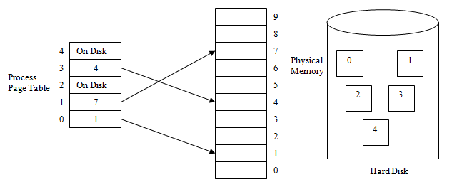

1，需要修改到页表
单个位字段与每个页面条目相关联，称为有效/无效位。引用页面内的地址时，
MMU会查阅相关页表条目并检查位设置为有效还是无效（0或1）

如果有效，则将页面表中的条目用于访问适当的物理内存页面，否则内存管理单元将触发称为页面故障的事件。
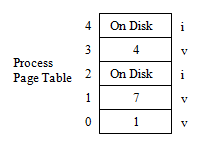

2，维护页面故障
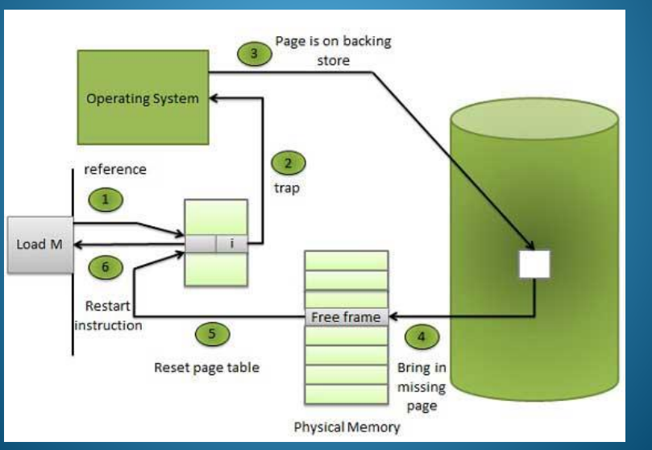

8，Working Set

必须为每个进程分配一些物理内存页面，其中内存管理器试图从与其当前引用位置对应的逻辑地址空间存储页面。分配给进程的物理页面集称为其工作集。

工作集的大小上限由可用的最大物理内存页面数决定。
该下限由处理器体系结构特性决定。

二，页面置换算法
好的页面置换算法追求更小的缺页率
1，
理解页面置换算法：当发生缺页中断时，如果操作系统内存中没有空闲页面，则操作系统必须在内存选择一个页面将其移出内存，以便为即将调入的页面让出空间，而用来选择淘汰哪一页的规则叫做页面置换算法。”

有时，内存中可能没有可用的页面来容纳传入的页面，或者操作系统可能会限制进程的工作集的大小，以便对物理内存空间分配中的其他进程保持公平的态度。

这两种情况都意味着当前内存中的页面需要交换到磁盘，以为传入的页面腾出空间。选择要替换的页面将选择使用页面替换算法。

2，页面更换的效率问题

重要的是不要交换进程很快可能再次需要的页面，因为每个页面故障导致磁盘操作比访问主内存慢得多

许多页面故障活动会显著减少整个内存访问时间，并使磁盘系统更加繁忙

有时，如果工作集太小，进程的页面将不断地在内存和磁盘之间进行交换，从而导致执行性能较差。这种现象被称为鞭打，通常可以通过增加工作集的大小来消除。

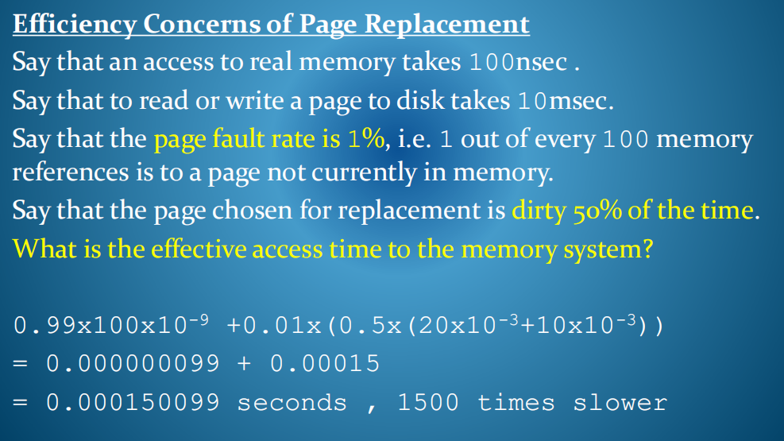

算法
1，最佳置换算法Optimal Page Replacement
每一次选择的淘汰的页面是以后永久不使用的，
或者在**最长时间内不再被访问的页面**，
这样可以保证最低缺页率

前提：这将需要未来了解一个进程将访问哪些页面，并且不能在实践中实现。
方法：手动看后面哪一个最迟用，就选哪个

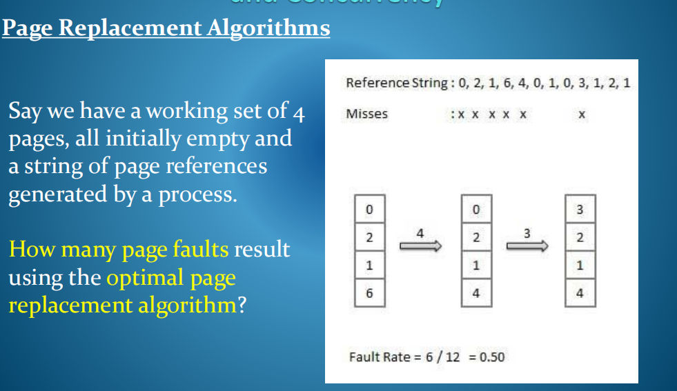

2，First In First Out
**每次选择淘汰的页面是最早进入内存的页面**
时间戳不需要更新，因此该算法实现起来非常简单和便宜。

然而，FIFO的行为并不特别适合大多数程序的行为。
使用FIFO替换算法会导致多少个页面错误？
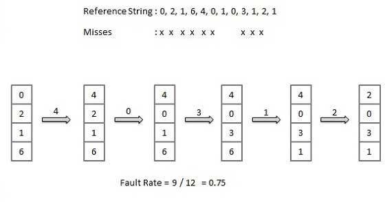

<table>
<colgroup>
<col style="width: 90%" />
<col style="width: 9%" />
</colgroup>
<thead>
<tr class="header">
<th>
5，Belady’s Anomaly

直观上看，进程可用的页面帧越多，出现的页面故障就越少。

一般来说，这是真的，但它不能像下一个例子所证明的那样得到保证。

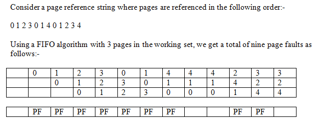

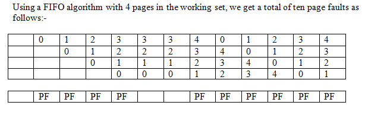

</th>
<th></th>
</tr>
</thead>
<tbody>
</tbody>
</table>

3，最近最久未使用置换算法Least Recently Used 【LRU】
淘汰最近上一次中最久没有使用的页面

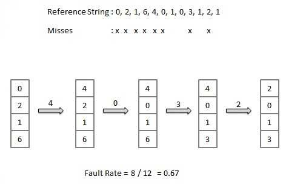

4， Least Frequently Used
最不常用的算法用过去一段时间内最少的引用替换页面
其想法是，如果不经常需要，这个页面会导致最少的页面故障。

但是，当进程更改其引用位置时，它需要的新页面最初使用频率较低，即使需要，也会选择进行替换。

使用最少的用户需要一个计数器与每个页面表条目相关联，每当内存访问该页面时，该条目就会递增。

