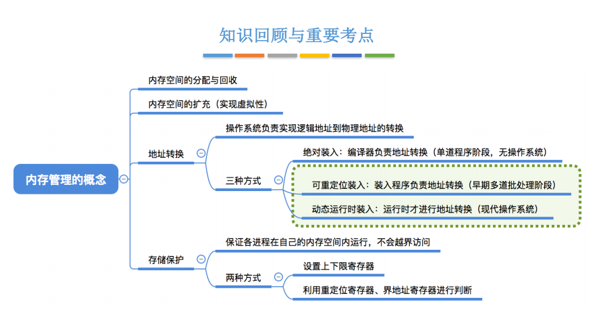
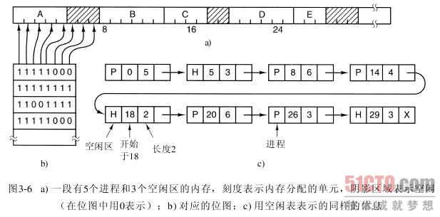

1， 使用位图的存储管理

使用位图时，内存被划分为几个或几千个字节的单元，即位图中的一位，0表示空闲，1表示占用。如下：

分配单元的大小是一个重要的设计因素。分配单元越小，位图越大。然而即使只有4个字节大小的分配单元，32位(4字节)的内存也只需要位图中的1位；32n位的内存需要n位的位图，所以位图只占用了1/32的内存。若选择比较大的分配单元，则位图更小。但若进程的大小不是分配单元的整数倍，那么在最后一个分配单元中就会有一定数量的内存被浪费了。

因为内存的大小和分配单元的大小决定了位图的大小，所以它提供了一种简单的利用一块固定大小的内存区就能对内存使用情况进行记录的方法。这种方法的主要问题是，在决定把一个占k个分配单元的进程调入内存时，存储管理器必须搜索位图，在位图中找出有k个连续0的串。查找位图中指定长度的连续0串是耗时的操作（因为在位图中该串可能跨越字的边界），这是位图的缺点。

2，
buddy system简介：
<table>
<colgroup>
<col style="width: 100%" />
</colgroup>
<thead>
<tr class="header">
<th>

buddy system内存管理，努力让内存分配与相邻内存合并能快速进行（对于普通算法来讲，合并内存相当困难），它利用的是计算机擅长处理2的幂运算。

我们创建一系列空闲块列表，每一种都是2的倍数。

举个例子，如果最小分配单元是8字节，整个内存空间有1M。我们创建8字节内存块链表，16字节内存块链表，32字节内存块链表，64,128,256,512,1k,2K, 4K, 8K, 16K, 32K, 64K, 128K, 256K, 512K 和一个1M内存块链表。

除了1M内存块链表有一个可用单元，其余链表初始为空。所有的内存分配都会向上取整到2的倍数----70K会向上取整到128K，15K会向上取整到16K，等等。

什么是Buddy

buddy system允许一个被分配块单元平均拆分成两个大小是原来一半的块单元，这两个块单元互为伙伴。块B的伙伴必须满足大小跟块B一样大，并且内存地址相邻（才可以合并）。

另一个伙伴性质是所有块单元在内存中的地址必须能被它自己的大小整除。比如16字节的块的地址都是一些16的倍数，如64字节的块的地址都是一些64的倍数，等等。

不仅如此，低地址的“伙伴”必须在一个能它“父亲块大小”整除，简单的说，来自同一个大块的两个小块才是伙伴。

分配内存示例

我们想分配70K的块空间

1.70K向上取整到2的倍数：128K

2.查询有128K空闲块吗？

3.没有，分配256K块。

　　a.有256K的空闲块吗？

　　b.没有，分配512K的块。

　　　　i.有512K空闲块吗？

　　　　ii.没有，分配1M的空闲块

　　　　　　i.有1M的空闲块吗？

　　　　　　ii.有，从1M的那个空闲链表中摘下，分配出去

iii.拆开一半挂在512k空闲链表上

iv.返回另一半512K块

　　c.拆开一半挂在256k空闲链表上

　　d.返回另一半256k块

4.将获得的256K的块拆两半，一半挂在128K空闲链表中

5.另一半128K块返回用户。

内存回收示例

当回收一个内存块，我们把它挂到对应的空闲链表上，然后查询它的伙伴是不是也在这个空闲链表上，如果是则合并他们然后挂接在对应2倍大小块所对应的空闲链表。重复该逻辑。假设我们回收刚刚分配的128K块内存

1.这个128K的块的伙伴也在128K的空闲链表上吗？

2.是的，移除它的128K伙伴块。

3.合并成256K的内存块

　　a.这个256K的块的伙伴也在256K空闲链表上吗？

　　b.是的，移除该伙伴并合并成512K的块。

　　c.这个512K的块的伙伴也在512K空闲链表上吗？

　　d.是的，移除该伙伴并合并成1M的块。

　　e.这个1M的块的伙伴也在1M空闲链表上吗？

　　f.没有，添加这个1M的块在1M的空闲链表上。

算法的优劣势分析

buddy system能很快地分配和回收内存块，但有内碎片，因为它要向上取2的幂的块大小，有空间浪费，但这是所有内存分配算法都避免不了的。linux系统使用它来分配内存页，很可能是因为内存页的大小是2的次幂。
</th>
</tr>
</thead>
<tbody>
</tbody>
</table>
