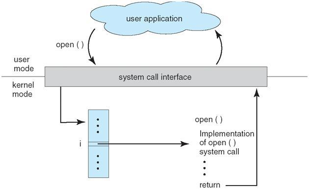

## 一、 Programs, Processes, Processors
### 1,程序Programs
a，程序的定义
程序是指定已定义的执行序列的指令的集合。它是将一种算法转换成一种编程语言。
A program is a collection of instructions specifying a defined sequence of execution. It is the translation of an algorithm into a programming language.

编译器将程序代码映射到特定处理器的一系列机器指令中，这些指令存储在对象文件中

### 2,进程process
a, 进程的定义
进程是正在运行中的程序的一个实例。它是一个操作系统的抽象化过程。当执行指令时，就存在一个进程。
A process is an instance of a program in action. It is an operating system abstraction.
When the instructions are being carried out, a process exists.

程序的可执行模块作为程序图像加载到主内存中，处理器从中获取指令instructions。该程序映像具有特定于特定操作系统和处理器的格式，并包括任何程序参数、堆栈空间、数据空间和程序代码。
The program image has a format specific to a particular operating system and processor and includes any program parameters, stack space, data space and program code.

b, 进程的特性
进程是执行上下文，是运行时所需的内核管理信息的集合。
进程是一种动态实体，其寿命从几毫秒到几个月不等。
进程可能是持久的，可以实现系统服务。
操作系统本身可以由多个进程组成，如进程管理器、内存管理器、文件管理器等。

A process is an execution context, a collection of kernel managed information needed while it is running.
Processes are dynamic entities whose lifetimes range from a few milliseconds to maybe months.
Processes may be persistent, implementing system services.
The operating system itself may be made up of several processes such as the <u>process manager, the memory manager, the file manager and so on.</u>

### 3,处理器processors
处理器是通过执行存储器图像中的指令来运行进程的代理。
在大多数台式机中，只有一个处理器（有时称为CPU –central processing unit)

现代处理器有多个执行的“核心”，能够同时执行多个进程的指令

### 4,Processor Time Sharing of Ready Processes
1)ready process
由于系统中的进程比处理器多得多，当处理器有执行指令时，通过向就绪处理器分配处理器的时间来共享处理器的资源

2)Blocked Processes
进程并不总是准备好使用处理器，因为有时它们必须等待可能向它们提供数据的其他设备，或者必须等待需要分配的资源或已经在使用，或者必须等待用户交互或必须发生的时间段才能继续。

## 二、 Representing Process Abstractions
### 1,操作系统的基本任务
操作系统的一个基本任务是流程管理--创建、控制、终止--管理执行环境
A fundamental task of an operating system is process management –
Creating,

Controlling,

Terminating –Managing the Execution Environment

操作系统必须为进程分配内存空间和cpu时间等资源，它必须保护资源不受其他进程活动的影响，并在共享相同资源的进程之间提供同步机制

为了实现这个基本任务，操作系统使用数据结构来表示其正在处理的处理对象的状态。

对于每个进程，操作系统维护一个进程控制块(PCB)或进程描述符，以清楚地了解每个进程的操作、在执行中达到了什么点以及分配了哪些资源
### 
### 2,PCB
1)PCB
进程控制块用于跟踪执行上下文（有关进程及其活动的所有资源信息），可用于将该进程到任何可用处理器上的独立调度。

2)作用
Process Identification Data
Processor State
Process Control Data
简化的过程控制块(PCB)

## 三、Process Lifecycle
1,根据PCB的优先级或执行状态，PCB可以在进程生命周期内在不同的队列之间移动。

队列保留等待使用调度算法进行服务的不同资源的进程，
进程的PCB块表示其中一个操作系统队列上的进程。

在一些需要CPU执行指令的期间，在其他期间等待各种其他系统资源，如输入/输出设备，提供数据，以便继续执行

## 四、System Calls - Communicating with the Operating System
1,出于安全和可靠性的原因，只能通过使用特定的机制来实现不相关的进程之间或与硬件和操作系统本身之间的直接通信或干扰。
by using a specific mechanism.

2,
通过使用操作系统提供的进程间通信功能来调节与系统中其他进程的通信。这些函数可将消息数据从一个进程映射到另一个进程。

与操作系统的通信是通过一个特殊的系统调用机制来完成的，它可以自动切换处理器的执行模式。
Communication with the operating system is done via a special system call mechanism which automatically switches the mode of execution of the processor.

3,为了强制执行硬件保护，某些处理器指令受到限制，不能由普通用户进程执行。

处理器在两种模式中的一种模式下执行，即用户模式或监督模式。
当执行用户处理时，处理器处于用户模式，只能执行其指令集的子集。User Mode
当执行执行监督处理时，可以执行操作系统代码，，然后可以执行其完整的指令集。Supervisor Mode.

处理器可以实现几种执行模式，但至少需要两种模式来保护系统免受用户处理活动的影响。
操作系统代码在特权模式下执行，其中处理器中有更广泛的指令集，这些指令在用户模式下不可用。

4,切换到监督模式
切换到监督模式:一种被称为软件中断software interrupt的特殊处理器指令是这样做的机制。

进程需要与操作系统通信，以便获得受保护的系统服务，如访问硬盘或其他硬件、创建新进程、进行进程间通信或配置内核服务。
obtain protected system services

5,系统调用通常通过与用户空间进程链接的包装库来访问。
包装器函数检查所使用的正确参数，并将调用软件中断机制。
系统调用的包装API可以帮助应用程序跨不同内核和语言实现的代码的可移植性。

这是使用硬件中断机制来实现的。Hardware Interrupt
电信号从硬件设备发送，以表示它们需要注意或已完成任务。

需要使用硬件中断机制，以使系统能够有效地管理大量硬件设备。轮询设备的状态无效。
通常支持芯片用于管理、识别和识别中断，并将其发送到处理器。
实现多任务处理环境也需要一种硬件中断机制。
当任务计划使用处理器设定的时间时，初始化时钟计时器。当时间结束时，中断信号会调用操作系统调度程序来选择另一个进程。此方案可防止一个进程无限期地占用CPU。

