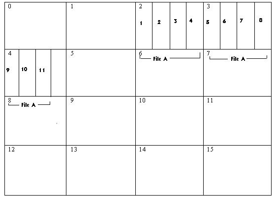
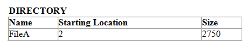
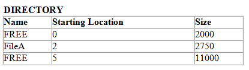

二、
1，文件如何存放在外存，物理上如何组织
假设我们有一个由11x250字节的记录组成的文件存储在一个磁盘上，它有16个1000字节大小的物理块，我们想访问第6条记录来读取到程序内存中

Read(FileA, Record=6, Destination=Buffer, NumBytes=250)
文件A存储在三个连续的块

要执行该请求，文件系统必须确定文件A在磁盘上的物理位置，读取包含记录6的磁盘块并提取记录6，并将数据移到位置缓冲区。

三、Directory File
1，为了确定FileA的位置，文件系统需要数据结构来存储与在特定存储设备上存储的每个文件相关的其他信息。此数据结构称为文件系统目录directory。

2，存储设备上的每个文件在目录中都有自己的条目，其中给出其
name, type, size, location information、可以访问它的人、使用会计历史和其他系统特定的详细信息。

3，我们需要在目录条目中包含以方便访问文件A中的所有数据的只是如下条目：

（假设连续分配文件空间）

4，通过连续分配，如果该文件的第一个块的位置已知，则该文件的大小已知并且物理磁盘块的大小已知，则可以确定该文件的其余块的位置，而不必显式地存储此位置信息。

所以，对于我们最初的请求
Read(FileA, Record=6, Destination=Buffer, NumBytes=250)

请参考目录以确定磁盘上FileA的起始位置，然后：
\*\*\*\*\*\*Read The Disk Block With Record 6 \*\*\*\*\*\*

5，哪个数据块包含记录6
我们知道物理磁盘块的大小为1000字节。我们还被告知，这个文件中的记录长度为250个字节

这个程序对于文件A的逻辑视角来看，用11个记录，每一个250bytes中，一共占了2750bytes

物理逻辑看，在特定的设备上，占用了块2,3,4

<table>
<colgroup>
<col style="width: 97%" />
<col style="width: 2%" />
</colgroup>
<thead>
<tr class="header">
<th>
1，为了访问记录6，FileA中的起始字节位置（记录偏移）计算如下

2，为了确定它位于哪个逻辑块中，我们除以块的大小，看看它平均进入了多少次

【数据块的偏移量】

3.然后，我们通过添加在目录中找到的文件的开始块号“2”来映射块的物理位置，然后文件系统从存储设备中读取物理块3。

</th>
<th></th>
</tr>
</thead>
<tbody>
</tbody>
</table>

6，提取记录6，然后移动到缓冲区

我们现在在内存中有了逻辑块1，我们需要提取记录6。记录6从块内的字节号250开始，记录长250字节。

因此，我们将块1中偏移250到499的字节复制到文件系统原始请求提供的缓冲区变量中，我们就完成了。
Read(FileA, Record=6, Destination=Buffer, NumBytes=250)

注：在实际实践中，它可能不那么简单，因为任意数据大小可能不适合固定大小的磁盘块，并且可能跨越块边界。

7，提高工作效率
现在我们了解了文件系统如何执行文件I/O操作的基础知识，是时候分析迄今为止我们的方法所描述的潜在性能，并考虑对我们设计的一些实际修改了。

三、
考虑一下，如果我们的程序希望按顺序读取FileA的11条记录，文件系统必须做些什么

<table>
<colgroup>
<col style="width: 100%" />
</colgroup>
<thead>
<tr class="header">
<th>
1，查找目录以确定FileA的位置

2，计算包含我们的记录的块的物理块位置，并从存储设备中读取该块。

3，计算所需记录的偏移量，并将其内容复制到程序缓冲区
</th>
</tr>
</thead>
<tbody>
</tbody>
</table>

1，首先，该目录存储在哪里？
目录必须存储在其描述的存储设备的某个地方，以便文件系统在断电或存储设备移动到其他计算机后，可以初始找到目录本身。

否则，存储设备的内容将无法解释。

因此，我们上面的算法将导致文件系统访问磁盘11次，以读取包含目录信息的块，并为该信息搜索我们的文件输入。

我们还将进一步执行11个磁盘读取操作，以获取包含FileA的每个记录的块

这使得总共有22个磁盘读取操作可以从FileA读取11个块。

大目录可以描述成千个文件。

这意味着它们本身可能会占用存储设备上的许多块。

如果我们每次想知道文件的起始位置时，都要搜索所有这些目录块，我们将会有更多的磁盘读取操作来按顺序读取我们的11条记录

在实际操作中，为了避免必须这样做，文件系统提供了在执行任何读写操作之前打开文件供访问的功能

打开文件时，将搜索目录一次文件位置信息或部分内容。

然后，文件系统将这些信息保存在内存中，并为未来的所有读写操作咨询这些信息。如果修改了文件，则可能需要更改其目录条目（例如，如果大小更改）。目录可以在内存中更改，直到我们完成文件，然后在关闭文件时写入存储设备

在我们的示例中，读取操作前打开和关闭文件的方法将将目录操作的数量从11个减少到1个

如果我们在内存中保留属于文件的磁盘块（可能是最近使用的块的小子集）缓存，我们也可以实现对文件的更好的访问性能

要读取记录2，我们会注意到文件的块0已经在缓存区域中，因为我们读取记录1，并且我们可以直接访问记录2，而不生成磁盘读取操作。因此，我们可以将数据块读取操作从11个减少到3个。总体上从22个减少到4个

2，跟踪空闲空间

1）自动进行文件空间分配
为了使用户更容易存储文件，文件系统必须跟踪存储设备的空闲区域的位置。
当创建新文件或扩展现有文件时，文件系统可以从空闲区域自动分配空闲块（或称为集群的空闲块组），而用户无需指定文件的位置。

2）使用现有的目录数据结构，我们可以使用以下条目完全描述磁盘的状态（再次假设连续分配）。

如果我们想为占用2500字节的FileB创建空间，那么文件系统可以扫描目录中一个连续的可用部分，它足够大，可以容纳新文件。由于空间大于需要，可以在目录中进行较小的自由条目，如下

=

