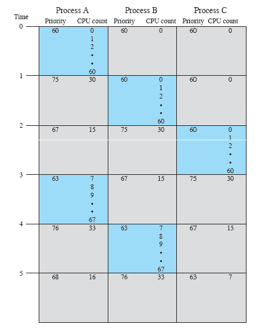
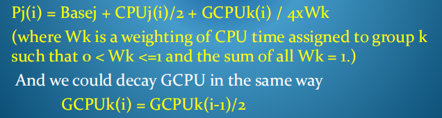
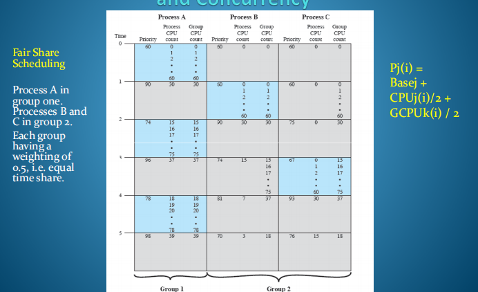

## 案例学习：传统的Unix调度程序
1，设计支持单用户在单处理器上共享多任务交互环境。
最初不是为实时过程需求（在时间约束内调度任务）、多用户或对称多处理而设计的。
自2003年以来，现代Unix实现进行了改进，以满足这些需求。

2，为交互式用户任务提供良好的响应时间，
同时确保低优先级的后台任务不会饿死，并快速完成高优先级的系统任务。

多级反馈方法
使用RR方式进行服务的优先级队列。

优先级是介于0和127之间的值。数字越低，优先级就越高。
内核进程的优先级从0到49，用户进程的优先级从50到127。

3，所有进程系统范围的优先级从其执行历史开始的一秒间隔计算，以及用于将进程纳入优先级带的基本优先级级别。

i表示interval of interest,
j表示进程id

如果仍使用CPU，用户进程在1秒后优先处理，然后选择最高优先级任务。

最近的CPU使用量通过增加进程的优先级值而降低了进程的调度优先级。

为确保进程最终重新安排时间，在每个优先级重新计算间隔期间，进程记录的CPU利用率会衰减：-

在此示例中，时钟每秒中断系统60次，并更新当前运行的进程的CPU使用情况。

4，如何处理多个用户？
在多用户多任务处理系统中，每个用户可以运行自己的任务集合。
一个用户或应用程序运行的进程可能明显少于另一个进程
到目前为止，我们的调度算法只关注在整个进程集之间实现公平的分配，而不是关注在不同的用户或不同的应用程序之间实现公平的CPU时间分配。

方法-公平份额分配计划
该方案需要对进程优先级计算进行一些修改，以为每组进程分配处理器时间的百分比。例如，如果有k个单独的组具有不同的共享权重，每组为Wk。

