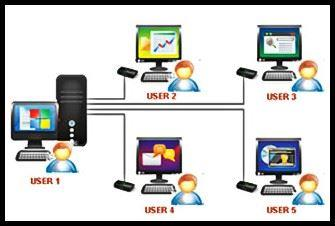
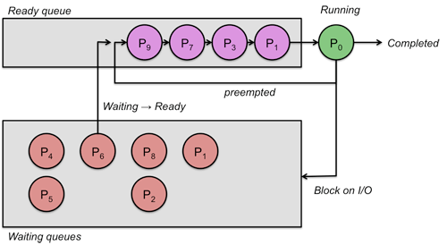
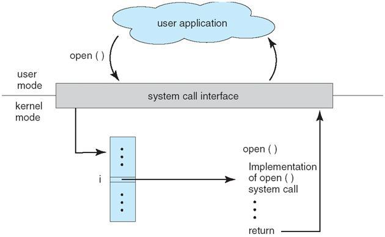
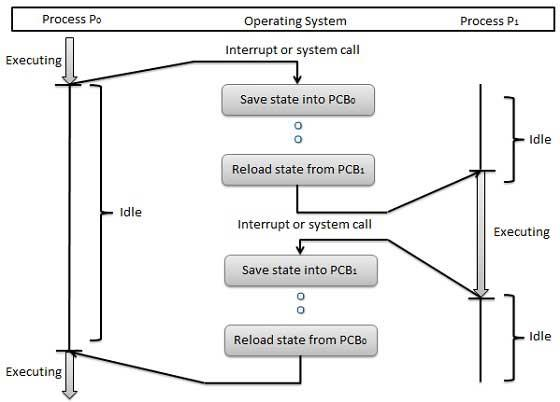
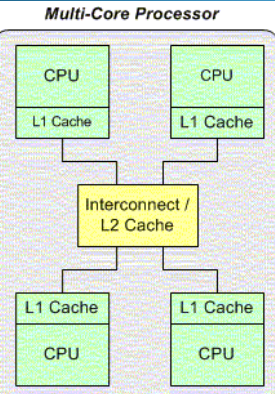
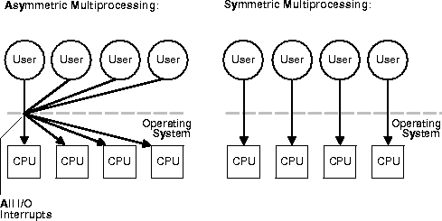
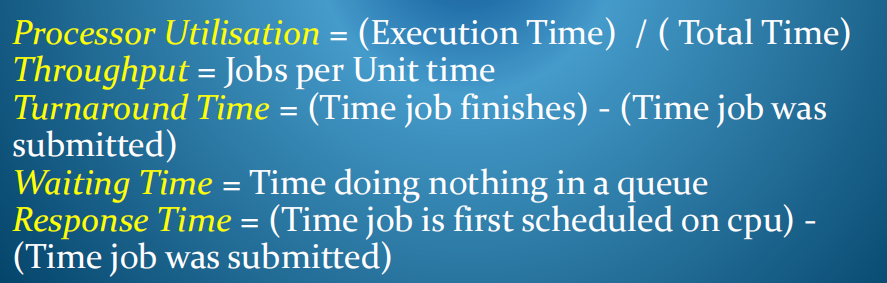
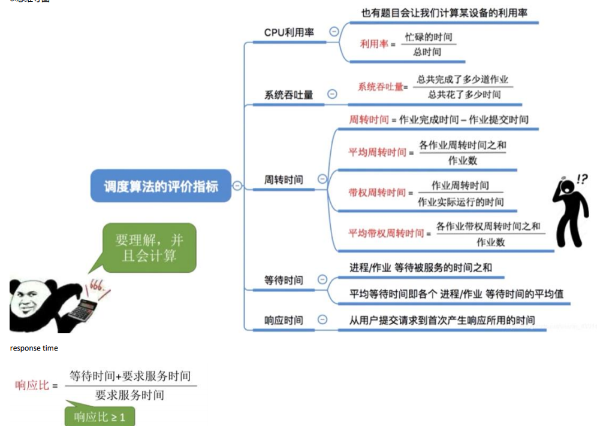
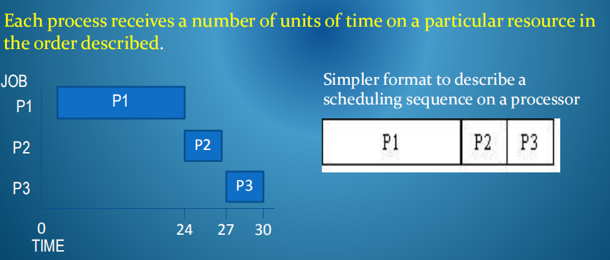

## 一、Multitasking Concepts
可进行多任务处理的概念
### 1,定义Multitasking
多任务操作系统允许多个进程在计算机系统上。

一个多用户多任务处理系统，其中一些进程可能属于不同的用户。

### 2，进程调度Process Scheduling
多任务处理系统中的进程的数量通常远远大于处理器的数量。每个流程都必须与其他流程竞争可用的资源。CPU时间很宝贵，操作系统必须决定分配哪些进程使用处理器以及多长时间

### 3，OS Control Mechanism
当一个进程进行系统调用时，或当它在处理器上的时间量到期时，所产生的软件或硬件中断会导致CPU停止从当前分配的进程中获取指令，并切换到内核中的指定代码来处理该中断。

### 4，Scheduling Decision
操作系统可以决定将CPU分配给另一个进程，在这种情况下它将执行代码来执行context switch.。
它将当前进程的运行时状态保存在进程控制块中，以便以后可以继续运行，然后执行调度程序代码以加载所选进程的运行时状态，以便CPU继续执行

### 5，Context Switch
上下文交换机代码必须有效率，
通常由硬件指令支持，
引发性能开销（CPU正在花费时间执行操作系统代码）

## 二、Multiprocessing Concepts
n\. 多重处理，多处理（技术）
### 1,Multiprocessing
多处理是在一个系统中使用多个CPU，通常分离物理CPU，但这个想法也可能适用于具有多个执行核的单个CPU

### 2,Coordinating Multiprocessing Activity
1）使用非对称多处理asymmetric multiprocessing,，一个处理器，主集中执行操作系统代码，处理I/O操作以及将工作负载分配给执行用户处理的其他处理器。使用此方案，只有一个处理器正在访问系统数据结构以进行资源控制。
虽然这使得编码操作系统功能更容易，但在处理器很少的小系统中，主机可能没有足够的从属服务器来使它保持忙碌，因此无法实现最大的硬件性能。

2）Symmetric multiprocessing是一个所有处理器都执行类似的功能并是自调度的系统。相同的处理器使用共享总线连接到单个共享主内存，并可以完全访问所有I/O设备，并由单个操作系统实例控制。在选择要执行的进程时，每个处理器将与其他进程同时检查和操作操作系统队列结构。必须仔细进行此访问争用编程，以保护共享数据结构的完整性。
## 
## 二、调度算法的公式
1，公式

2，从队列中服务进程的顺序可以用**Gantt Chart**.来描述。它表示一个调度序列。

3，Scheduling algorithms can be 抢占式/非抢占式
| preemptive     | 每当有新的加入时要对比，最短的先（抢） |
|----------------|----------------------------------------|
| non-preemptive | 当前已经到达的最短时间的优先（不抢占） |

所有的多任务处理系统multitasking systems都将采用抢占式preemptive scheduling的调度，否则，一个进程可能永远不会放弃对CPU的控制

