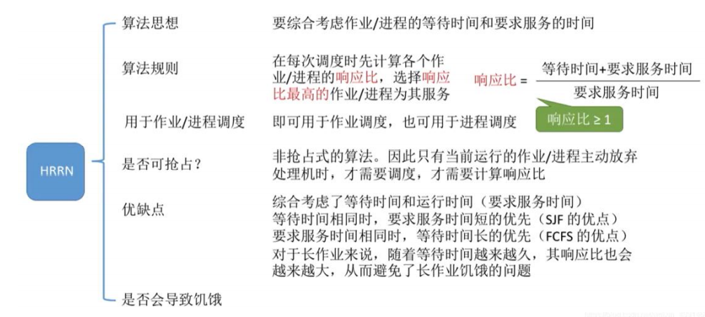

分析FCFS&SJF&HRN--非抢占式算法
non-preemptive algorithms
| FCFS (First Come First Served) | 先到先得                         |
|--------------------------------|----------------------------------|
| SJF (Shortest Job First)       | 短作业优先                       |
| HRN                            | 响应比=（等待时间）/（服务时间） |

背景：
考虑以下几点，其中三个作业按以下顺序到达，并且必须做出调度决定：-CPU突发时间是

CPU上每个任务所需的即时执行时间段。
注意，这通常不会提前知道。
## 1，FCFS&SJF
### 1，先到先得---FCFS【First come first sever】

案例
<table>
<colgroup>
<col style="width: 25%" />
<col style="width: 74%" />
</colgroup>
<thead>
<tr class="header">
<th>
执行顺序

先到先得
</th>
<th></th>
</tr>
</thead>
<tbody>
</tbody>
</table>

### 2，SJF短作业优先---SJF【Shortest Job First】
| 短作业优先 |  |
|------------|------------------------------------------------------------------------------------------------------------------------|

## 2，非优先算法分析
1）FCFS是一个固有的公平算法，但对于响应时间重要、作业时间差异很大的交互式系统表现不佳。
2）SJF在吞吐量、等待时间和响应性能方面是最优算法，但不公平。
SJF喜欢短工作，而不是长工作。就绪队列中较短作业的到来会无限期地推迟较长作业的调度，即使它们可能在就绪队列中存在相当长的一段时间。这就被称为饥饿starvation了。

## 3，估计SJF的CPU爆发长度
在实践中，不可能提前知道作业的CPU突发长度，但可以使用平滑公式（启发式猜测）来估计，如下：

## 4，Other aspects of non-preemptive SJF
SJF calculation with approximated CPU burst is more complex than FCFS

必须维护累积历史信息，并在每次选择下一个任务时执行预测突发长度所需的计算

## 5，Need Other Algorithms--HRN
<table>
<colgroup>
<col style="width: 100%" />
</colgroup>
<thead>
<tr class="header">
<th>
有了FCFS，长期工作就是短工作。

虽然SJF解决了这个问题，但连续不断的短期工作将无限期地阻止长期工作。

作业在系统中等待CPU的时间越长，它被调度的可能就越大。
</th>
</tr>
</thead>
<tbody>
</tbody>
</table>

解决这两个算法的问题
<table>
<colgroup>
<col style="width: 100%" />
</colgroup>
<thead>
<tr class="header">
<th>
<strong>(HRN) highest response ratio next</strong>最高响应比的下一个算法努力实现这一目标。

基于优先级的算法的类型。

作业的响应率计算如下所示：

响应比=（等待时间）/（服务时间）

Response Ratio = (Waiting Time) / (Service Time)

响应比率决定了作业的排序顺序。当作业在就绪队列中等待时，其优先级会增加
</th>
</tr>
</thead>
<tbody>
</tbody>
</table>
1）HRN

案例
<table>
<colgroup>
<col style="width: 100%" />
</colgroup>
<thead>
<tr class="header">
<th>

At time 6

At time 30

最后

</th>
</tr>
</thead>
<tbody>
</tbody>
</table>

补充

总结

