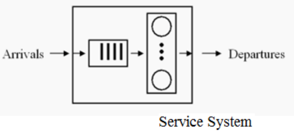
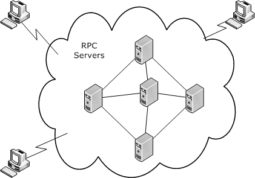
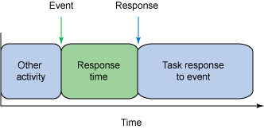
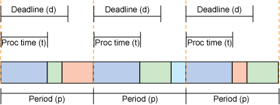

5-多处理器调度-(?)
2021年6月5日
9:46

<table>
<colgroup>
<col style="width: 100%" />
</colgroup>
<thead>
<tr class="header">
<th>
Scheduling on Multiprocessor Systems

<blockquote>

Performance Issues with Multiprocessing

Queuing Theory

Queue Organisation for Multiprocessor Systems

</blockquote>

Other Scheduling Environments

<blockquote>

Distributed Systems

Real Time Systems

</blockquote></th>
</tr>
</thead>
<tbody>
</tbody>
</table>

## 一、多处理器系统的调度
Scheduling on Multiprocessor Systems
1，在多重处理过程中出现的性能问题
使用更多的处理器似乎是提高系统整体吞吐量的一种明显方法，
但双倍处理器通常不会提高性能。

调度问题更为复杂，而且也没有单一的最佳解决方案来优化所有情况下的处理器利用率。

保留总线、输入/输出、共享内存、操作系统代码以及保持缓存一致性可能会导致一些性能延迟

2，Queuing Theory排队论-排队队列的研究
最大化吞吐量和减少排队时间是许多现实世界服务的共同目标，
而不仅仅是计算机系统和解决方案，还需要应用排队论。 queuing theory.

3，在建模和管理任何系统的性能时，我们必须解决这个问题
任务的到达模式及其性质 arrival pattern

如何排队列和调度任务How tasks are queued and dispatched

该服务的处理能力Processing capacity

每个现实世界的系统都可能有自己独特的到达特性、物理队列配置、服务容量和特性动态。

排队理论、建模和仿真的目的是帮助这些服务的管理如何最好地组织系统。在构建系统之前，您可以查看模型的性能。
1）Arrival Pattern
在使用现实世界的服务中，客户可能会通过
\- Appointment to a consultant

\- In groups to a restaurant

\- At a particular time of night to a taxi service

\- Randomly
排队和调度政策
可能有多个队列、VIP或快速传递优先级队列、公共/私有队列或其他类型分类（异构性）
如果服务认为客户太忙或没有空间容纳队列等，客户可能会有被拒绝的政策

2）对到达过程和队列过程的建模
在计算机系统中，假设任务的到达模式可能是随机的，一个独立的任务一次到达一个

许多任务有时可能会接近尾声，有时很少，有时可能没有人到达，但假设任务的到达是完全随机的。

为了建模的目的，我们让l表示在观察期间进入这样一个系统的任务的平均速率。
在那个时期，完成更多任务的机会是多少？我们可能想设计系统来应对波动。

估计到达分布的一种方法可能是监控系统，记录任务到达之间的时间，然后使用统计技术，将数据拟合概率公式，以便我们能够估计任何给定时期特定数量到达的可能性。

例如，泊松分布可以用于我们向计算机系统描述的到达过程，以找到在给定时间段内到达特定数量的任务的概率

二、其他调度环境
1， 分布式的计算机系统Distributed System

1）分布式系统由由局域网连接的物理分布式计算机系统组成
从调度的角度来看，分布式操作系统将努力监视、共享或平衡每个处理节点上的负载。

2）Scheduling in Distributed Systems
分布式系统中的调度更加复杂，因为系统信息通常不能在一个地方访问，而是在网络中单独的节点上进行管理。
算法必须收集决策所需的信息，并使用网络信息交换传输控制信息。
消息通信可能会由于损坏和丢失而导致延迟，需要偶尔的重传，或繁忙的调度模式，所有这些都会导致分布式算法中出现更大的复杂性。

2，实时控制系统Real Time Systems
一些计算机系统是为特定的工业过程控制应用而设计的。
例如，考虑一条在生产线的一端供应原材料，在另一端供应成品的生产线。
沿着生产线，传感器、阀门和其他执行器都由计算机系统进行监控和控制。传感器将数据带到计算机，必须进行分析，然后对阀门和执行器进行修改。

1）一个实时系统有定义良好的、固定的时间约束。必须在这些约束条件内进行处理，否则系统可能会失败。
A real time system has well defined, fixed time constraints. Processing must be done within those constraints or the system may fail.

2）分类
**硬实时系统**需要在有保证的时间内完成关键任务。在调度程序接受任务之前，需要分析代码的执行时间。
Hard Real Time Systems are required to complete a critical task within a guaranteed amount of time. The execution time of code needs to be analysed before a task may be accepted by the scheduler.

**软实时系统**是一种努力满足计划最后期限，但偶尔错过一个最后期限可能是可以容忍的。
**Soft Real Time Systems** are ones which endeavour to meet scheduling deadlines but where missing an occasional deadline may be tolerable.

这可以在通用系统中通过赋予关键进程比其他进程更高的优先级来实现，
并且其优先级不会随着时间的推移而降低。

3）

当使用基于优先级的方法时，关键的问题之一是调度延迟dispatch latency必须很小，以确保实时进程可以快速开始执行。这要求系统调用可优先执行。
如果要运行更高优先级的实时进程，则必须能够优先于操作系统本身。

4）专用的实时调度系统

**算法-Earliest Deadline First**
【排队走】
检测到事件时，处理过程添加到就绪队列。列表按截止日期排序，对于定期事件，这是事件的下一次发生时间。调度程序服务首先从排序队列的前面处理，服务于最紧急的任务。

**算法- Least Laxity Algorithm**
【选最小空闲时间】
如果一个过程需要200毫秒，且必须在250毫秒内完成，则其松弛度为50毫秒。最小轴度算法选择具有最小的空闲时间的过程。该算法在事件非周期性发生的情况下可能效果更好。

