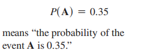
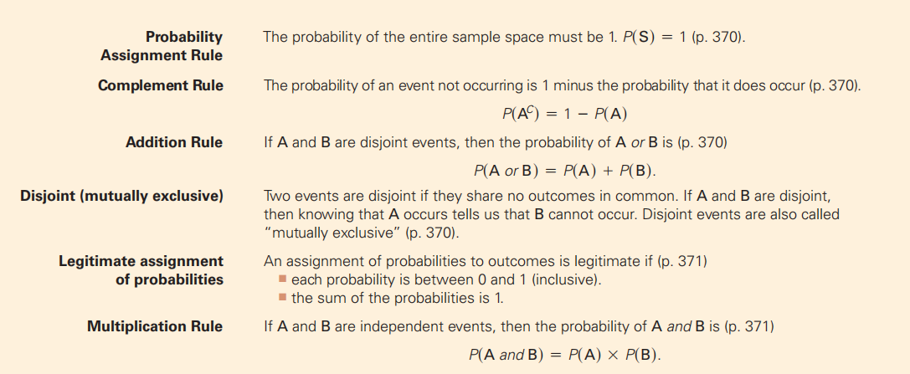

## 13.1 Random Phenomena
1，
<table>
<colgroup>
<col style="width: 18%" />
<col style="width: 81%" />
</colgroup>
<thead>
<tr class="header">
<th>随机现象random phenomenon：</th>
<th>我们知道可能会发生什么结果，但我们不知道会发生什么特定的结果。</th>
</tr>
</thead>
<tbody>
<tr class="odd">
<td>trial试验：</td>
<td>In general, each occasion upon which we observe <u>a random phenomenon</u> is called a trial.</td>
</tr>
<tr class="even">
<td>结果outcome：</td>
<td>At each trial,the value of the random phenomenon,</td>
</tr>
<tr class="odd">
<td>事件event：</td>
<td>When we combine outcomes like that, the resulting combination is an event.</td>
</tr>
<tr class="even">
<td>样本空间：</td>
<td>
We call the collection of all possible outcomes the sample space.用S来表示事件

</td>
</tr>
<tr class="odd">
<td>empirical probability</td>
<td>
Because this definition is based on repeatedly observing the event’s

outcome, this definition of probability is often called empirical probability.

</td>
</tr>
<tr class="even">
<td></td>
<td>
A phenomenon consists of trials. Each trial has an outcome. Outcomes combine to make events.

For a random phenomenon, the sample space, S, is the set of all possible outcomes of each trial.

</td>
</tr>
</tbody>
</table>

2，The Law of Large Numbers

2.1 大数定律(LLN)的原则说，当我们反复重复随机过程时，事件发生的比例确实降到一个数字。我们把这个数字称为事件的概率。【the probability of the event.】
要满足两个条件

1）每一个trial发生的概率必须一样，

2） 而且independent【 doesn’t affect the outcomes of the others】
3，不存在平均定律The Nonexistent Law of Averages
所谓的平均法根本不存在。但你会听到人们谈论它。一个优秀的击球手是在过去的六次三振吗？如果你在每周的统计学小测验中做得特别好，你的成绩不好吗？No.这不是随机现象的工作方式。没有短期内的平均收益法。

案例

## 13.2 Modeling Probability
1，概念
| theoretical probability. | 当概率来自一个数学模型而不是来自观察时，它被称为理论概率。 |
|--------------------------|------------------------------------------------------------|

2，运算公式
<table>
<colgroup>
<col style="width: 42%" />
<col style="width: 57%" />
</colgroup>
<thead>
<tr class="header">
<th>

</th>
<th>

</th>
</tr>
</thead>
<tbody>
</tbody>
</table>

注意：我们经常使用大写字母，通常从字母表的开始，来表示事件。
我们总是使用P来表示概率
正式时，**使用小数（或分数）表示概率值**，但有时，特别是更非正式交谈时，更容易使用百分比。

不要陷入认为随机事件总是同样可能的境地。赢得彩票的机会很小，尤其是那些回报很大的彩票

3，Personal Probability
3.1 subjective or personal probability：
你对你获得A的机会的个人评估表达了你对结果的不确定性。这种不确定性可能是基于你在课程中的舒适度或中期成绩，但它不能基于长期的行为。我们称这第三种概率称为==主观概率或个人概率==。
虽然个人概率可能基于经验，但它们既不是基于长期的相对频率或同样可能发生的事件。所以它们不会显示出我们所需要的一致性。因此，我们将坚持正式定义的概率。你应该注意到这个区别。

个人概率和其他两种概率之间的界限可以是模糊的。当天气预报员预测40%的降雨概率时，这是个人概率还是相对频率概率？他们声称可能是40%的时间，当地图看起来是这样的时候，它已经下雨了（经过一段时间）。或者预测员可能在陈述一种基于多年经验的个人观点，反映了对过去在类似情况下发生的事情的感觉。当你听到一个概率陈述，试着确定什么样的概率是意图。

4，The First Three Rules for Working with Probability
1\. Make a picture.
2\. Make a picture.
3\. Make a picture.

## 13.3 Formal Probability
规则1：如果概率为0，事件永远不会发生，同样，如果概率为1，它总是发生。即使您认为一个事件非常不太可能，它的概率也不可能是负的，而且即使您确定它将会发生，其概率也不能大于1。（考虑一下相对的频率。）所以我们需要那个要求

规则·2：

规则3：假设你按时上课的概率是0.8。你不能按时去上课的可能性是多少？是的，它是0.2。不是A的结果集称为A的补体，表示AC。这就导致了补充规则：
<table>
<colgroup>
<col style="width: 40%" />
<col style="width: 59%" />
</colgroup>
<thead>
<tr class="header">
<th></th>
<th>

</th>
</tr>
</thead>
<tbody>
</tbody>
</table>

<table>
<colgroup>
<col style="width: 48%" />
<col style="width: 51%" />
</colgroup>
<thead>
<tr class="header">
<th>

</th>
<th>

</th>
</tr>
</thead>
<tbody>
</tbody>
</table>

规则4：
Disjoint (or mutually exclusive) events have no outcomes in common.

概率分配规则告诉我们，要成为概率的合法分配，所有可能结果的概率的总和必须完全是1。不再，同样少。

规则5：独立性意味着一个事件的结果不会影响另一个事件的结果。
indepen dence means that the outcome of one event doesn’t influence the outcome of the
other.

案例
<table>
<colgroup>
<col style="width: 33%" />
<col style="width: 33%" />
<col style="width: 33%" />
</colgroup>
<thead>
<tr class="header">
<th>

</th>
<th>

</th>
<th>

</th>
</tr>
</thead>
<tbody>
</tbody>
</table>
注意，“至少”通常是考虑补充的提示。至少会发生一次的事情。至少发生一次是根本不发生的补充，而且这更容易找到。
至少发生一次--》至多发生0次
Some = At Least One

特别注意：
注意那些不超过1的可能性。
如果事件并非不一致，则不要添加这些事件的可能性
==如果事件不独立，则不要乘以其概率。==
Don’t confuse disjoint and independent
<table>
<colgroup>
<col style="width: 100%" />
</colgroup>
<thead>
<tr class="header">
<th>
独立和相关

独立一定不相关，不相关不一定独立

disjointed：无线性关系，不排除其他的关系
</th>
</tr>
</thead>
<tbody>
</tbody>
</table>

小结

