14-Probability Rules!
2021年5月2日
8:49

Tree ：条件概率
Venn diagram： 事件之间有交集
树形图帮助我们研究==条件概率==。
图表是直接针==对不超过2步的==随机事件的概率
## 
## 
## 14.1 The General Addition Rule
1，A,B不disjoint
解决方法：我们加上两个事件的概率，然后减去它们相交的概率

案例
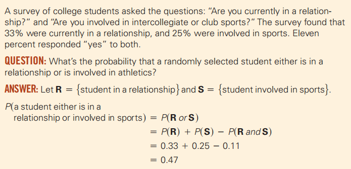

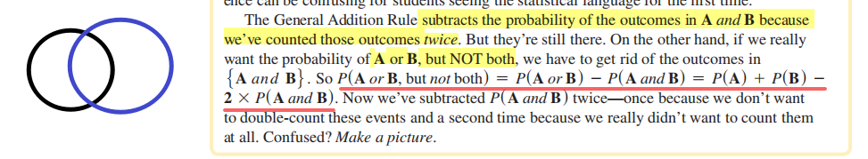
案例
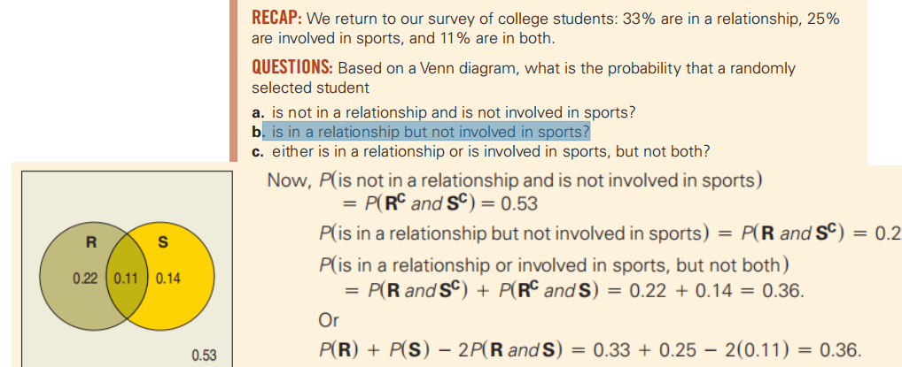

案例
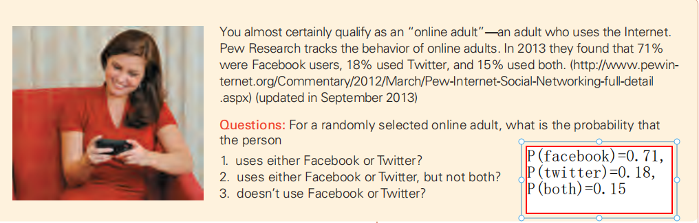

<table>
<colgroup>
<col style="width: 47%" />
<col style="width: 52%" />
</colgroup>
<thead>
<tr class="header">
<th>

</th>
<th>
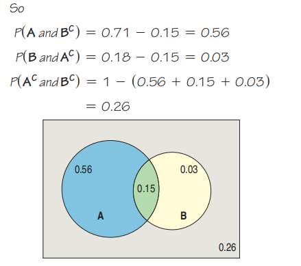

</th>
</tr>
</thead>
<tbody>
</tbody>
</table>

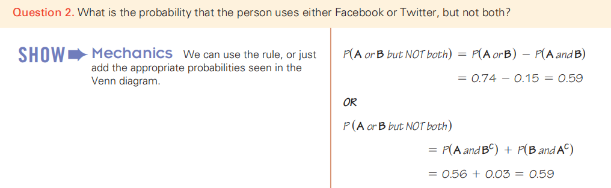

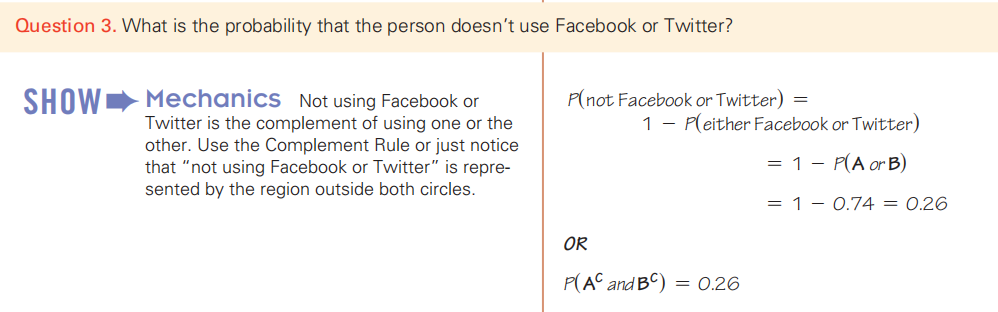

## 14.2 Conditional Probability and the General Multiplication Rule
1，A发生的前提下B再发生
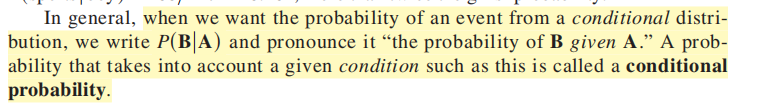

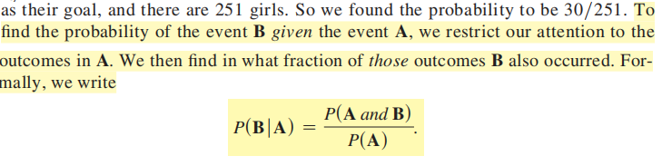

案例

2，The General Multiplication Rule
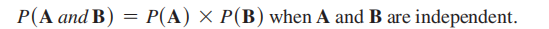

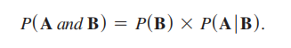
## 14.3 Independence

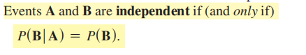

## 14.4 Picturing Probability: Tables, Venn Diagrams, and Trees
案例
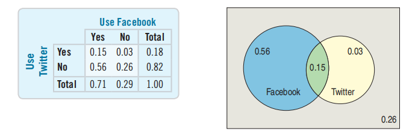

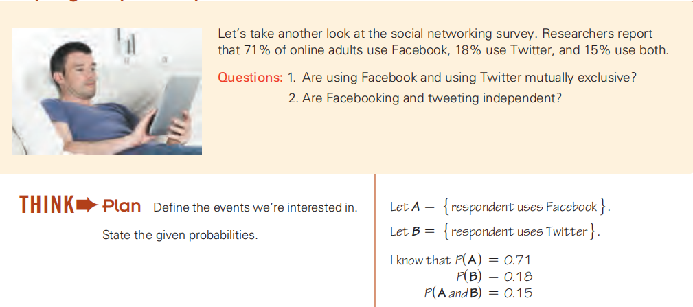

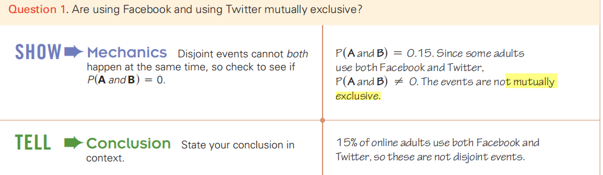
判断是否independent
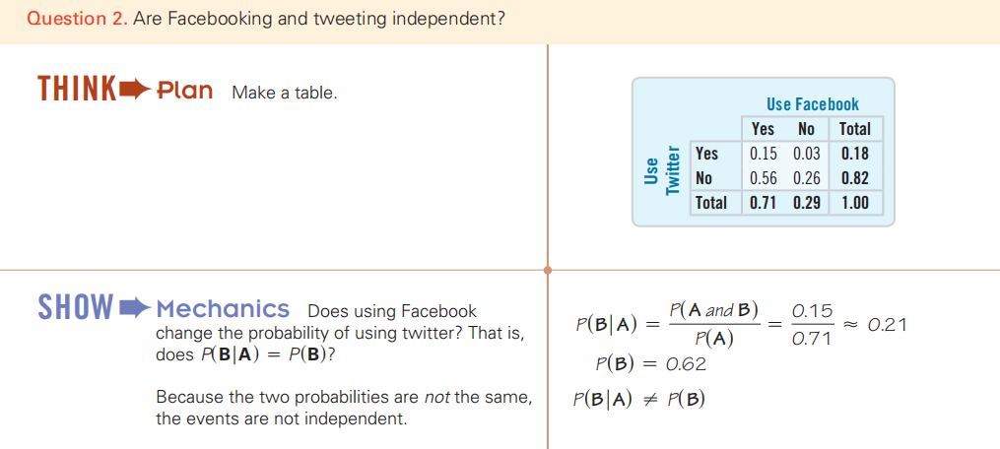

1，Tree Diagrams
案例
<table>
<colgroup>
<col style="width: 67%" />
<col style="width: 32%" />
</colgroup>
<thead>
<tr class="header">
<th></th>
<th>
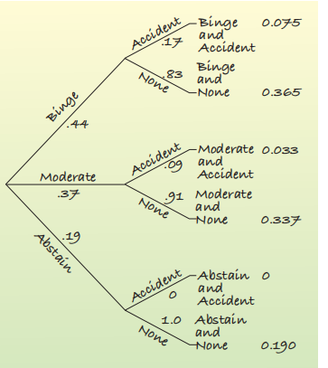

</th>
</tr>
</thead>
<tbody>
</tbody>
</table>

## 
## 14.5 Reversing the Conditioning and Bayes’ Rule

Bayes’ Rule
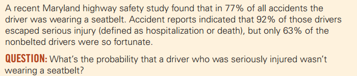

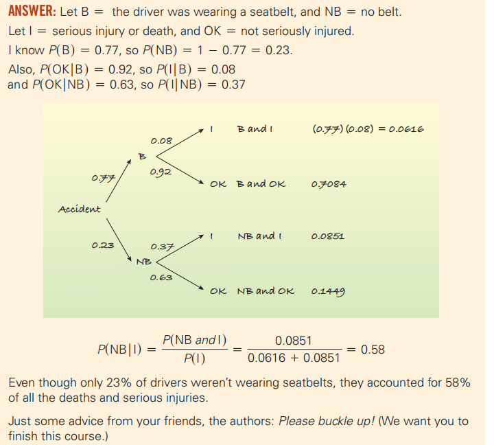

总结
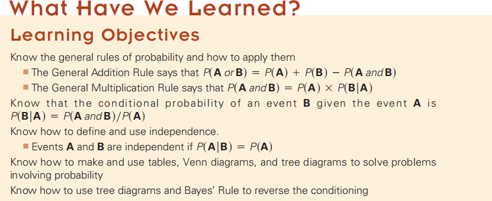

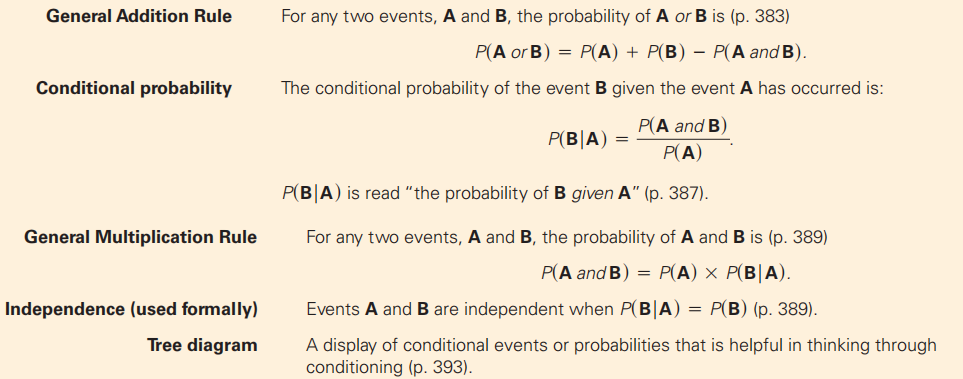
