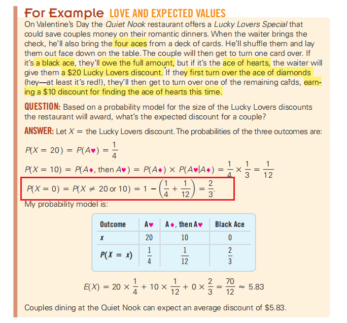
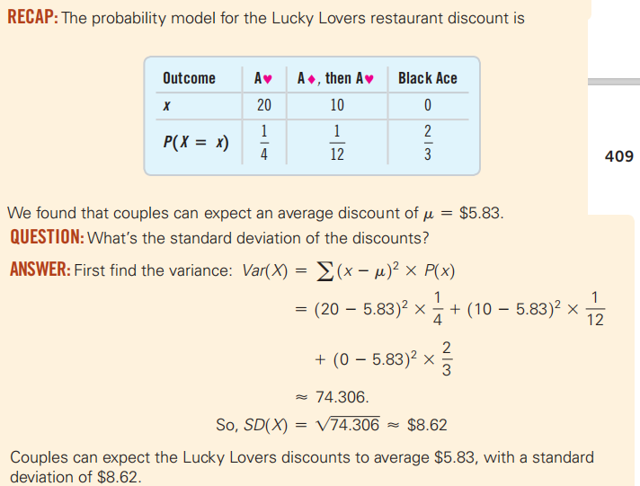
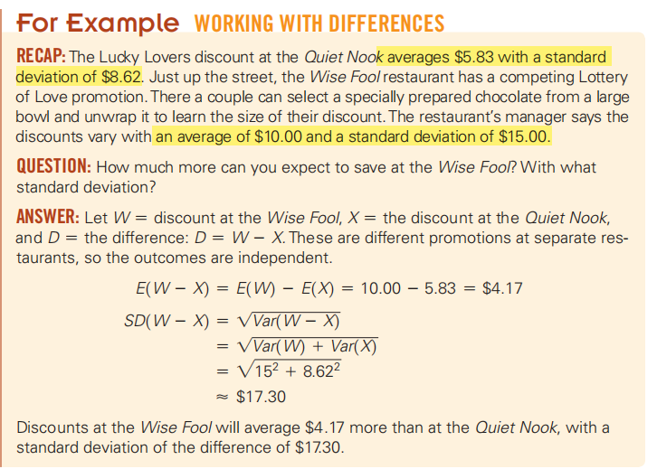

一种随机变量来建模结果的概率。使用随机变量可以帮助我们谈论和预测随机行为。

## 15.1 Center: The Expected Value

1，术语
<table>
<colgroup>
<col style="width: 38%" />
<col style="width: 61%" />
</colgroup>
<thead>
<tr class="header">
<th>random variable</th>
<th>随机变量，用X表示</th>
</tr>
</thead>
<tbody>
<tr class="odd">
<td>a discrete random variable.</td>
<td>
离散型随机变量

可以单独列出来，用x表示所有可能的值及其发生的概率的集合被称为离散随机变量的概率模型
</td>
</tr>
<tr class="even">
<td>
a continuous

random variable.
</td>
<td>连续性随机变量</td>
</tr>
<tr class="odd">
<td></td>
<td></td>
</tr>
</tbody>
</table>

案例，保险公司
例如，假设任何一年的死亡率是每1000人中就有1人，而1000人中又有2人患有某种残疾。然后我们可以在这样的表格中显示此保险单的概率模型：

我们无法预测任何一年会发生什么，但我们可以说我们期望发生的事情。为了做到这一点，我们（或者，更确切地说，保险公司）需要概率模型。

注意：请确保所有可能的结果都包含在总和中。并验证您有一个有效的概率模型开始—每个概率应该在0和1之间，并且应该为1。

案例

## 15.2 Spread: The Standard Deviation

案例

案例：离散随机变量的期望值和标准偏差

<table>
<colgroup>
<col style="width: 100%" />
</colgroup>
<thead>
<tr class="header">
<th>作为诺威电脑公司的库存负责人，您很高兴您能够在订单到达当天成功地将两台电脑运送给您最大的客户。然而，当你发现有人在你的储藏室里重新安装了翻新过的电脑时，你会被吓坏了。运送的电脑是从15台库存的电脑中随机挑选出来的，但其中4台实际上是翻新的。如果你的客户有了两台新电脑，事情就会很好。如果客户端得到一台翻新的计算机，它将自费发送回$100，您可以更换它。但是，如果两台计算机都已翻新，客户将在本月取消订单，您将总共丢失$1000。</th>
</tr>
</thead>
<tbody>
<tr class="odd">
<td>

</td>
</tr>
</tbody>
</table>

## 15.3 Shifting and Combining Random Variables
1，那么这个标准偏差呢？我们知道，从数据中添加或减去一个常数会改变平均值，但不会改变方差或标准偏差。随机变量也是如此
<table>
<colgroup>
<col style="width: 80%" />
<col style="width: 19%" />
</colgroup>
<thead>
<tr class="header">
<th></th>
<th></th>
</tr>
</thead>
<tbody>
<tr class="odd">
<td></td>
<td></td>
</tr>
<tr class="even">
<td>

</td>
<td>

</td>
</tr>
<tr class="odd">
<td>

</td>
<td>
■两个随机变量之和的平均值是平均值的和。

■两个随机变量差的平均值是平均值的差。

■如果随机变量是独立的，它们的和或差总是方差的和。
</td>
</tr>
</tbody>
</table>

案例
<table>
<colgroup>
<col style="width: 100%" />
</colgroup>
<thead>
<tr class="header">
<th>
我们已经确定，在安静的角落用餐的情侣可以期待幸运情人的平均折扣为$5.83，标准偏差为$8.62。假设几周来，餐厅一直在分发任何一餐价值$5的优惠券（每一张折扣）

</th>
</tr>
</thead>
<tbody>
<tr class="odd">
<td></td>
</tr>
<tr class="even">
<td>

</td>
</tr>
<tr class="odd">
<td>

</td>
</tr>
<tr class="even">
<td><table>
<colgroup>
<col style="width: 51%" />
<col style="width: 48%" />
</colgroup>
<thead>
<tr class="header">
<th>

</th>
<th>

</th>
</tr>
</thead>
<tbody>
</tbody>
</table></td>
</tr>
<tr class="odd">
<td><table>
<colgroup>
<col style="width: 44%" />
<col style="width: 55%" />
</colgroup>
<thead>
<tr class="header">
<th>

</th>
<th>

</th>
</tr>
</thead>
<tbody>
</tbody>
</table></td>
</tr>
</tbody>
</table>

\*Correlation and Covariance

## 15.4 Continuous Random Variables

案例

1

2

注意点
<table>
<colgroup>
<col style="width: 100%" />
</colgroup>
<thead>
<tr class="header">
<th>
注意不独立的变量

别忘了：独立随机变量的差异会增加。标准偏差不会发生

不要忘记：独立随机变量的差异会增加，即使你在观察它们之间的差异

不要编写具有具有相同变量符号的随机变量的独立实例。

</th>
</tr>
</thead>
<tbody>
</tbody>
</table>

总结

