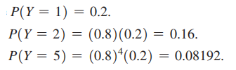
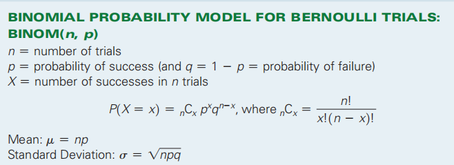
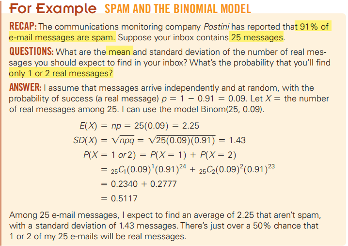
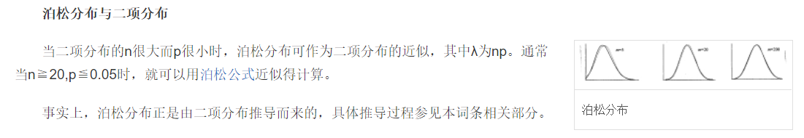
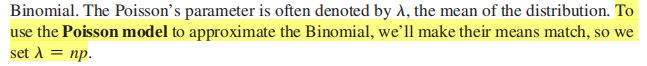
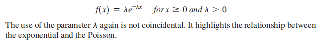
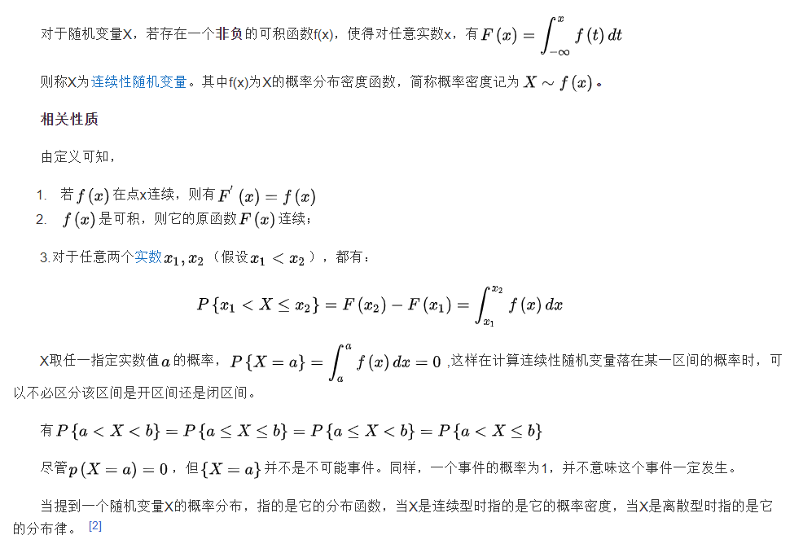

你要抽小卡，已知20%的盒子里有一张希望独奏的照片，30%的盒子是丹尼卡·帕特里克的照片，其余的是布莱克·格里芬的照片。

## 16.1 Bernoulli Trials
假设你是唯粉，你只关系抽到本命，抽到本命的卡的概率0.2
每一次开卡的行为称为一次trail
<table>
<colgroup>
<col style="width: 100%" />
</colgroup>
<thead>
<tr class="header">
<th>
■ There are only two possible outcomes (called success and failure) on each trial. Either

you get Hope’s picture (success), or you don’t (failure).

■ The probability of success, denoted p, is the same on every trial. Here p = 0.20.

■ The trials are independent.
</th>
</tr>
</thead>
<tbody>
</tbody>
</table>
Situations like this occur often and are called Bernoulli trials.
<table>
<colgroup>
<col style="width: 100%" />
</colgroup>
<thead>
<tr class="header">
<th>
伯努利试验（Bernoulli experiment）是在<strong>同样的条件</strong>下<strong>重复地</strong>、<strong>相互独立</strong>地进行的一种随机试验，

其特点是该随机试验<strong>只有两种可能结果：发生或者不发生</strong>。

我们假设该项试验独立重复地进行了n次，那么就称这一系列重复独立的随机试验为n重伯努利试验，或称为伯努利概型。

单个伯努利试验是没有多大意义的，然而，当我们反复进行伯努利试验，去观察这些试验有多少是成功的，多少是失败的，事情就变得有意义了，这些累计记录包含了很多潜在的非常有用的信息
</th>
</tr>
</thead>
<tbody>
</tbody>
</table>

Let’s call this random variable Y = \# boxes and build a probability model for it
<table>
<colgroup>
<col style="width: 57%" />
<col style="width: 42%" />
</colgroup>
<thead>
<tr class="header">
<th>抽一次中，抽两次中，抽第五次才中的概率：</th>
<th>

</th>
</tr>
</thead>
<tbody>
</tbody>
</table>

## 16.2 The Geometric Model
作用：模拟在一系列伯努利试验中取得**第一次成功的概率**
1，几何模型完全由一个==参数p、成功的概率==指定，并表示GEOM(p)。由于在试验编号x上取得第一次成功需要第一次经历x-1失败，所以概率很容易用一个公式来表示。

案例
<table>
<colgroup>
<col style="width: 100%" />
</colgroup>
<thead>
<tr class="header">
<th>假设您的电子邮件，其中91%是垃圾邮件。我们还假设您没有使用垃圾邮件过滤器，因此每条邮件都会转储到收件箱中。而且，由于垃圾邮件来自许多不同的来源，我们将认为您的邮件是独立的</th>
</tr>
</thead>
<tbody>
<tr class="odd">
<td>
一夜之间，你的收件箱就会收集电子邮件。当你在早上第一次检查你的电子邮件时，你在找到真正的邮件之前应该需要丢弃多少垃圾邮件？

收件箱中的第四条邮件是第一个不是垃圾邮件的可能性是多少？
</td>
</tr>
<tr class="even">
<td>

</td>
</tr>
</tbody>
</table>

2，Independence
伯努利试验的一个重要要求是这些试验是独立的。
10%的条件：伯努利试验必须独立的。如果违反了这个假设，只要样本小于10人口的%，仍然可以继续进行

案例
<table>
<colgroup>
<col style="width: 100%" />
</colgroup>
<thead>
<tr class="header">
<th>O阴性血的人被称为“普遍捐赠者”，因为O阴性血可以提供给任何人，不管受试者的血型如何。只有大约6%的人有o-阴性的血。</th>
</tr>
</thead>
<tbody>
<tr class="odd">
<td>
1.ᾏ如果献血者随机排队献血，在你发现有人有o阴性血液之前，你需要检查多少人？

2.ᾏ第一个o阴性供体是前四人之一的可能性是多少？
</td>
</tr>
<tr class="even">
<td>

</td>
</tr>
</tbody>
</table>

## 16.3 The Binomial Model
1，作用：求在n实验中几次成功的概率
<table>
<colgroup>
<col style="width: 55%" />
<col style="width: 44%" />
</colgroup>
<thead>
<tr class="header">
<th></th>
<th>

</th>
</tr>
</thead>
<tbody>
</tbody>
</table>

案例

案例
<table>
<colgroup>
<col style="width: 100%" />
</colgroup>
<thead>
<tr class="header">
<th>
假设有20个捐赠者来这里献血。回想一下，6%的人是“普遍的捐赠者”。“

问题：

1。其中普遍捐助者数量的平均值和标准偏差是多少？

2.有2个或3个普遍捐赠者的可能性是多少？
</th>
</tr>
</thead>
<tbody>
<tr class="odd">
<td>

</td>
</tr>
</tbody>
</table>

## 16.4 Approximating the Binomial with a Normal Model
1，Binom(50, 0.2),

案例

## \*16.5 The Continuity Correction

## 16.6 The Poisson Model
1，泊松分布适合于描述单位时间内随机事件发生的次数。
<table>
<colgroup>
<col style="width: 100%" />
</colgroup>
<thead>
<tr class="header">
<th>
泊松分布：计算一段时间内发生x次的概率

指数分布：是描述泊松过程中的事件之间的时间的概率分布【下一次发生的概率】
</th>
</tr>
</thead>
<tbody>
</tbody>
</table>

2，什么时候用合适呢

## 16.7 Other Continuous Random Variables: The Uniform and the Exponential
### 一、The Uniform Distribution,
<table>
<colgroup>
<col style="width: 65%" />
<col style="width: 34%" />
</colgroup>
<thead>
<tr class="header">
<th>在概率论和统计学中，均匀分布也叫矩形分布，它是对称概率分布，在相同长度间隔的分布概率是等可能的。 均匀分布由两个参数a和b定义，它们是数轴上的最小值和最大值，通常缩写为U（a，b）。</th>
<th>

</th>
</tr>
</thead>
<tbody>
<tr class="odd">
<td>

<h3 id="section"></h3></td>
<td><h3 id="section-1"></h3></td>
</tr>
<tr class="even">
<td>

<h3 id="section-2"></h3></td>
<td><h3 id="section-3"></h3></td>
</tr>
<tr class="odd">
<td>

</td>
<td></td>
</tr>
</tbody>
</table>
1，对于连续均匀性，我们希望所有相同长度的时间间隔都具有相同的概率

2，案例
例如，假设您到达一个公交车站，并想要模拟您等待下一辆公交车的时间。标志上写着公交车大约每20分钟就到一次，但没有提供其他信息。你可能会假设到达同样可能是在未来20分钟内的任何地方，所以概率模型将是

### 二、The Exponential Model
指数模型用于泊松模型计算时间段的时候
<table>
<colgroup>
<col style="width: 100%" />
</colgroup>
<thead>
<tr class="header">
<th>在概率理论和统计学中，<a href="https://baike.baidu.com/item/%E6%8C%87%E6%95%B0%E5%88%86%E5%B8%83/776702?fr=aladdin">指数分布</a>（也称为负指数分布）是描述泊松过程中的事件之间的时间的概率分布，即事件以<strong>恒定平均速率连续且独立地发生的过程</strong>。 这是伽马分布的一个特殊情况。 它是几何分布的<strong>连续模拟</strong>，它具有无记忆的关键性质。</th>
</tr>
</thead>
<tbody>
<tr class="odd">
<td>

</td>
</tr>
<tr class="even">
<td></td>
</tr>
<tr class="odd">
<td>

</td>
</tr>
<tr class="even">
<td></td>
</tr>
</tbody>
</table>

1，我们已经看到，泊松模型是事件的到达或发生的一个很好的模型。例如，假设我们使用泊松来建模x在下一分钟内访问我们的网站的概率。然后，可以使用参数为l的指数模型来模拟这些事件之间的时间。因为时间是一个连续的量，所以它有一个连续的模型，它的形式为：

总结

补充
Continuous random variable

