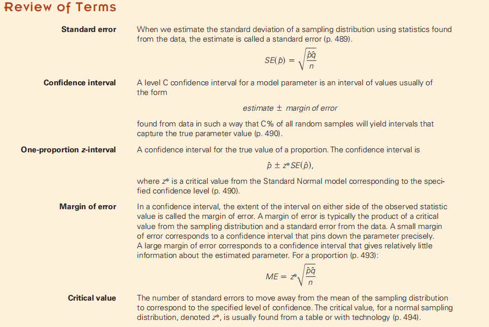

背景：在156名18岁到22岁的受访者中，有48人说，他们至少每天都会更新自己的状态。报告的作者讨论了这一发现，就好像这156名受访者告诉了我们，这个年龄段的数百万Facebook用户的行为一样。当然，这比了解156个Facebook用户更有趣，不管他们的采样是多么仔细。像这样的研究能告诉我们关于18到22岁的Facebook用户的什么呢？

## 18.1 A Confidence Interval
因为

不知道p,但是为了标准差，所以

得到sampling model for p尖

<table>
<colgroup>
<col style="width: 57%" />
<col style="width: 42%" />
</colgroup>
<thead>
<tr class="header">
<th></th>
<th>

</th>
</tr>
</thead>
<tbody>
</tbody>
</table>

请注意表述，“哔哩哔哩xx%confident哔哩哔哩”

又名

## 18.2 Interpreting Confidence Intervals: What Does 95% Confidence Really Mean?
“we are 95% confident that the true proportion lies in our interval.”

我们知道不同样本的比例也不同。如果其他研究人员选择自己每天更新状态的Facebook用户的样本，每个人的样本比例几乎肯定会有所不同。当他们都试图估计整个人群的真实状态更新率时，他们将把置信区间集中在在自己样本中观察到的比例上。我们每个人都会有一个不同的间隔。

案例

CLT中心极限定理告诉我们，95%的随机样本将产生捕获真实值的区间。这就是我们所说的95%的自信程度。

## 18.3 Margin of Error: Certainty vs. Precision
1，ME

公式
|   |    |
|-------------------------------------------------------------------------------------------------------------------------|-----|
|  |    |

案例

2，Critical Values
2.1 定义

2.2 常用的z\*的值

注：**ME=z\*SE**
案例

## 18.4 Assumptions and Conditions
1，
Independence Assumption
- Randomization Condition:
- 10% Condition:

Sample Size Assumption:
- Success/Failure Condition 10胜10负

案例
<table>
<colgroup>
<col style="width: 100%" />
</colgroup>
<thead>
<tr class="header">
<th>
2010年10月，盖洛普民意调查7问了510名随机抽样的成年人一个问题：“一般来说，你认为今天死刑在这个国家是公平还是不公平？”其中58%的人回答“公平”，36%的人说“不公平”，7%的人说他们不知道（由于四舍五入，百分比高达101%）。

从这个调查中，我们可以对所有成年人的意见得出什么结论呢？为了回答这个问题，我们将为所有相信死刑被公平适用的美国成年人的比例建立一个信任区间。建立一个针对比例的置信区间有四个步骤：计划、模型、力学和结论。
</th>
</tr>
</thead>
<tbody>
<tr class="odd">
<td><table>
<colgroup>
<col style="width: 48%" />
<col style="width: 51%" />
</colgroup>
<thead>
<tr class="header">
<th>
Check condition

</th>
<th>

</th>
</tr>
</thead>
<tbody>
</tbody>
</table></td>
</tr>
</tbody>
</table>

2，Choosing Your Sample Size
假设一个候选人正在计划进行投票，并希望以95%的信心将选民的支持率估计在3%以内。她需要一个多大的样本？

案例

案例

总结

